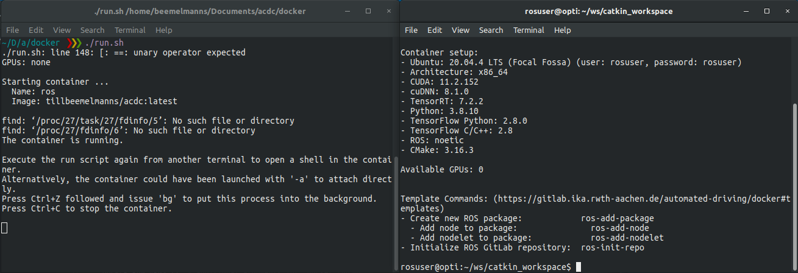
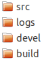
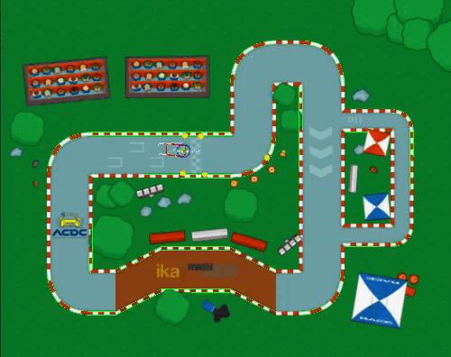

# ROS Setup


Welcome to the initial exercise in our [ROS](https://ros.org) series, which is designed to be executed locally on your computer. It is assumed that you have successfully completed the preliminary steps of [operating system setup](https://github.com/ika-rwth-aachen/acdc/wiki/Setup-OS) and [ROS coding environment configuration](https://github.com/ika-rwth-aachen/acdc/wiki/Setup-ROS-Coding-Environment). This introductory exercise provides practical experience with the Robot Operating System (ROS), a widely utilized software framework for robotic and autonomous vehicle applications.

In this first exercise, you will learn how to:

* Use the Docker environment to **build** our ROS workspace.
* **Source** the build binaries and **launch** a sample ROS node.
* Stop running ROS nodes.

## Docker Environment

Building complex code often requires many libraries and frameworks. Managing and installing code dependencies can be cumbersome and time-consuming. [Docker](https://www.docker.com/) provides a convenient virtual environment where all necessary dependencies are pre-installed, allowing you to start using ROS immediately.

If you haven’t downloaded our Docker image yet, use the following command to **pull** (download) the image:

```bash
docker pull rwthika/acdc:ros1
```

## Start the Docker Environment

Start the Docker environment by running the provided `run.sh` script located in the `docker` directory. This script starts an instance of the Docker image (called a Docker container) and **mounts** the `acdc` directory into the environment at the internal path `/home/rosuser/ws`. Changes to the files are mirrored between your local machine and the container.

### Steps:
1. Open two terminals on your Linux system.
2. Navigate to the `docker` directory inside the cloned `acdc` repository.
3. Start the container by running the following command in the first terminal:

   ```bash
   ${REPOSITORY}/docker$ ./ros1_run.sh
   ```

4. Run the `./ros1_run.sh` command in the second terminal to connect to the container. The setup should resemble the following image:



The left terminal starts the container, while the right terminal is for executing commands inside the container. Additional terminals can be opened as needed to run other ROS tools like [RVIZ](https://wiki.ros.org/rviz).

## Build the Workspace

Upon starting, your current directory will be `catkin_workspace`. Build the workspace by typing the following command:

```bash
rosuser: ~/ws/catkin_workspace$ catkin build
```

The build process may take some time. After a successful build, the following directories will be created inside your workspace:



* `src`: Contains the source code of your packages.
* `devel`: Contains the compiled libraries, executable tools, and the important `setup.bash` script.
* `build`: Contains temporary build files.
* `logs`: Contains log files of the build process.

### Cleaning Build Artifacts

If the build process fails, try cleaning the build artifacts by running:

```bash
catkin clean
```

This command removes all build artifacts, allowing you to rebuild the workspace from scratch.

### Sourcing the Workspace

Each terminal that uses the newly built packages needs to **source** the `setup.bash` script:

```bash
rosuser: ~/ws/catkin_workspace$ source devel/setup.bash
```

For more details about sourcing files, read [this article](https://www.theunixschool.com/2012/04/what-is-sourcing-file.html).

## Launch Your First ROS Package

To test the packages, start a [flatland](https://github.com/avidbots/flatland) simulation and a vehicle controller using prepared launch files.

### Steps:
1. In the first terminal, execute the following command:

   ```bash
   roslaunch racing flatland_simulation.launch
   ```

2. In the second terminal, ensure the workspace is sourced and run:

   ```bash
   roslaunch racing racing_controller.launch
   ```

If successful, a racing cart will drive through a circuit:




### Stopping Programs

Stop any running program in a terminal by pressing <kbd>Ctrl</kbd>+<kbd>C</kbd>. If you stop the initial terminal where the container was started, the entire container will shut down, terminating all processes.

## Wrap-up

- [ ] You learned to use Docker to build and execute the ROS workspace.
- [ ] You used multiple terminals inside the Docker environment to execute programs simultaneously.
- [ ] You built the ROS workspace using `catkin build`.
- [ ] You sourced the workspace in each terminal to use the built packages.
- [ ] You stopped programs using <kbd>Ctrl</kbd>+<kbd>C</kbd>.

If you encountered errors, refer to the **Troubleshooting** section.

## Troubleshooting

### Hardware Acceleration Issue

If LiDAR points are barely visible, turn off hardware acceleration by adding the following to your `.bashrc` file:

```bash
echo "export LIBGL_ALWAYS_SOFTWARE=1" >> ~/.bashrc
```

### Compilation Fails with libGL.so Error

If you encounter an error related to `libGL.so`, it might be due to a misplaced NVIDIA driver file. For NVIDIA graphics cards, fix this by executing:

```bash
sudo rm /usr/lib/x86_64-linux-gnu/libGL.so
sudo ln -s /usr/lib/libGL.so.1 /usr/lib/x86_64-linux-gnu/libGL.so
```

### Sources:
1. [ROS Official Website](https://ros.org)
2. [Operating System Setup Guide](https://github.com/ika-rwth-aachen/acdc/wiki/Setup-OS)
3. [ROS Coding Environment Configuration](https://github.com/ika-rwth-aachen/acdc/wiki/Setup-ROS-Coding-Environment)

