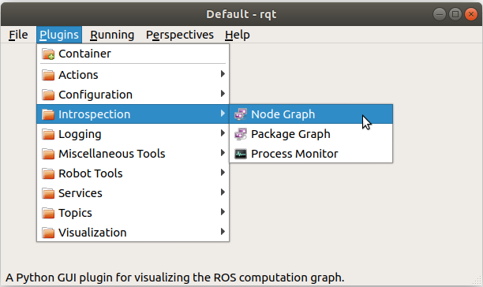
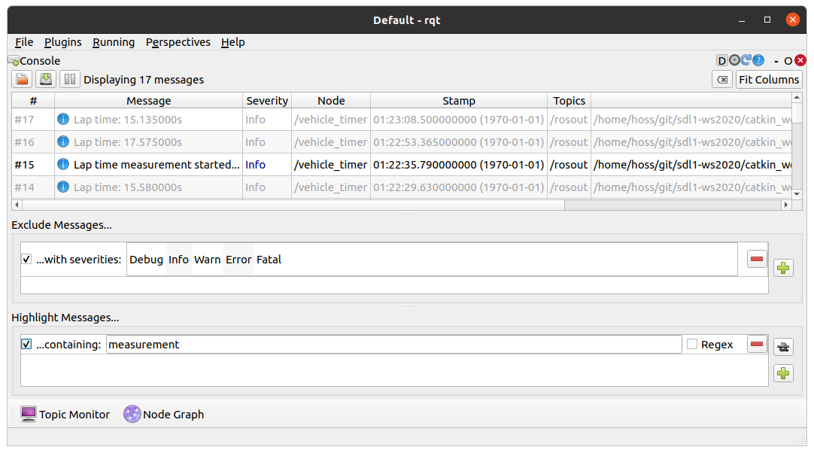
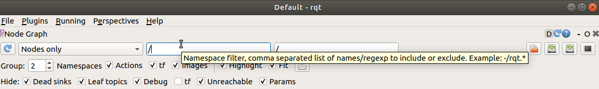
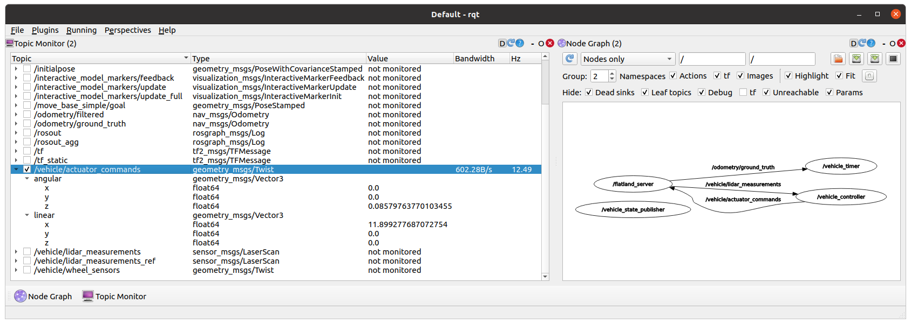
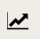
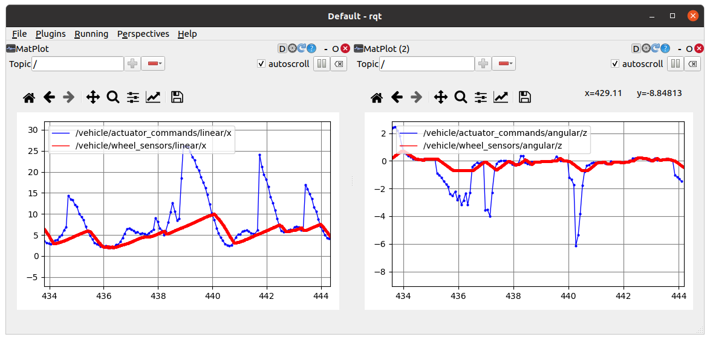
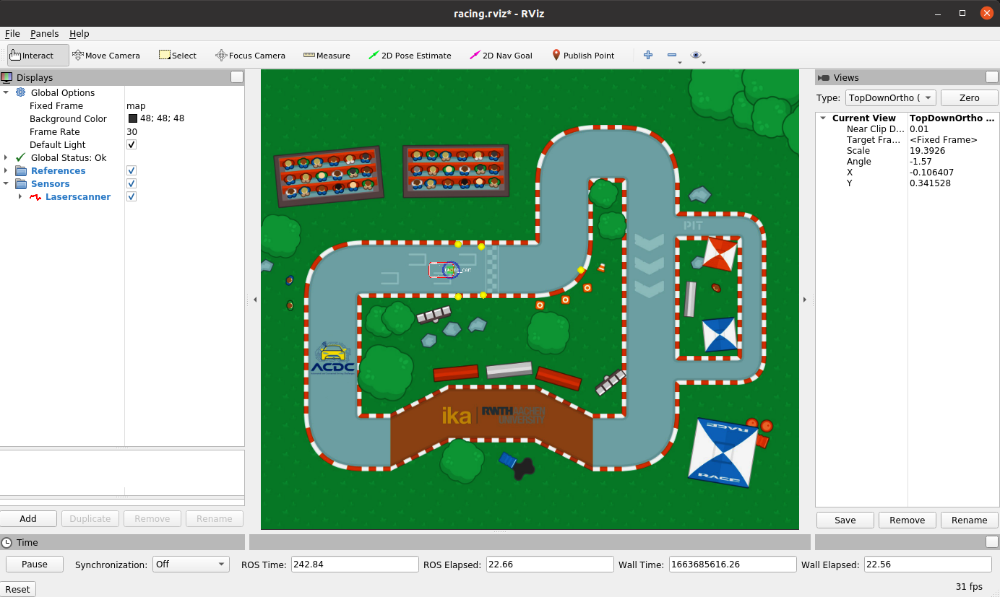
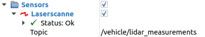
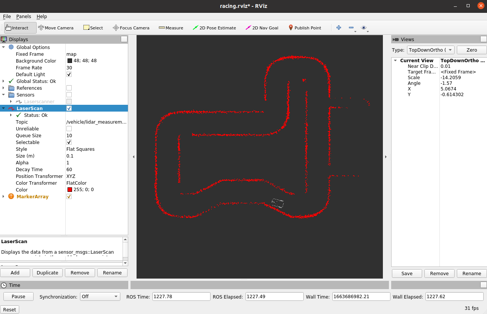

# ROS GUI Tools


In the previous exercise, you familiarized yourself with the basic and fundamental terminal commands essential for working with ROS. Fortunately, the ROS community offers a plethora of graphical tools with graphical user interfaces (GUIs) that complement terminal commands, enhancing debugging, visualization, and development processes. This documentation delves into the primary GUI tools in ROS: **rqt** and **RViz**.

- **[RQT](https://wiki.ros.org/rqt):** A Qt-based framework for developing GUIs in ROS.
- **[RViz](https://wiki.ros.org/rviz):** A 3D visualization tool tailored for ROS.

## Prerequisites

Before diving into the GUI tools, ensure that your ROS environment is correctly set up and running the necessary nodes. Follow these steps:

1. **Start Multiple Terminals:** Open several terminal windows within your `acdc` Docker container.
2. **Launch ROS Core and Essential Nodes:**
   - Start `roscore` to initiate the ROS master.
   - Launch the Flatland simulation.
   - Start the vehicle controller.

   You can achieve this by executing one of the two launch scripts provided or using the new `combined.launch` file from the previous unit:

   ```bash
   roslaunch racing combined.launch
   ```

## RQT

**RQT** is a versatile Qt-based framework that facilitates the development and integration of GUI tools in ROS through a plugin-based architecture. These plugins can be executed in two primary ways:

- **Command Line:** Directly invoke a specific plugin, e.g., `rqt_graph`.
- **RQT Main Window:** Access and manage plugins within the RQT interface.

### Launching RQT

To start RQT, open one of your available terminals and execute:

```bash
rqt
```

Once launched, you'll have access to a myriad of plugins. For a comprehensive list, refer to the [RQT Plugins](https://wiki.ros.org/rqt/Plugins) page. This documentation focuses on the most pertinent plugins:

- **Essential Plugins:**
  - `rqt_graph`
  - `rqt_topic`
  - `rqt_console`
  - `rqt_plot`
- **Advanced Plugins:** Explored individually in the practical tasks at the end of this unit.
- **Less Relevant Plugins:** Omitted for brevity.

**Accessing Plugins:**

Navigate to the plugins via the GUI as illustrated below:



### RQT Node Graph

The **RQT Node Graph** visualizes the active ROS nodes and their interconnections through topics. To initiate `rqt_graph`:

1. In RQT, select **Plugins** → **Introspection** → **Node Graph**.

   [rqt_graph Documentation](https://wiki.ros.org/rqt_graph)

2. **Understanding the Graph:**
   - **Vertices:** Represent ROS nodes.
   - **Edges:** Depict the topics that nodes publish to or subscribe from.

   For instance, in our project:
   - The **simulation node** (`/flatland_server`) publishes sensor measurements to `/vehicle/lidar_measurements`.
   - The **controller node** (`/vehicle_controller`) subscribes to this topic, computes target velocity and steering angles, and publishes these to `/vehicle/actuator_commands`.
   - The **simulation node** subscribes to `/vehicle/actuator_commands` to simulate the vehicle's response.

   

3. **Interactive Features:**
   - **Hovering:** Highlights connected nodes and topics for clarity.
   - **Filtering:** Utilize the namespace filter to focus on specific nodes or topics, e.g., entering `/vehicle_controller` narrows the visualization.
   - **View Options:** Toggle options such as "Nodes Only" to adjust the scope of the graph, aiding in managing larger projects.

4. **Tooltips:** Hover over GUI elements to reveal tooltips that explain their functionality.

   

### RQT Topic Monitor

The **Topic Monitor** offers a graphical representation of ROS topics, providing insights akin to `rostopic list`, `rostopic info`, or `rostopic echo`.

1. **Launching the Topic Monitor:**
   - In RQT, navigate to **Plugins** → **Topics** → **Topic Monitor**.

2. **Interface Layout:**
   - Arrange multiple plugins side by side by dragging, dropping, docking, or floating them to create a personalized workspace.

   

3. **Analyzing Topics:**
   - **Fields Displayed:**
     - **Topic:** Name and variables of the transmitted message.
     - **Type:** Data types and sub-types.
     - **Value:** Numerical values of primitive types.
     - **Bandwidth:** Data rate transmitted.
     - **Hz:** Frequency of data transmission.

   - **Example Analysis:**
     - **/vehicle/actuator_commands:**
       - Message Type: `geometry_msgs/Twist`
       - Focus on `linear.x` and `angular.z` for velocity and steering control.
     - **Frequency Comparison:**
       - Both `/vehicle/actuator_commands` and `/vehicle/lidar_measurements` transmit at 12.5 Hz, indicating a data-triggered operation by the `vehicle_controller`.
       - Other topics, such as `/vehicle/wheel_sensors`, may exhibit higher frequencies due to independent publishing mechanisms.

4. **Cross-Referencing:**
   - Utilize the **Node Graph** to identify publishers or subscribers of specific topics, enhancing your understanding of node interactions.

### RQT Console

**RQT Console** provides a comprehensive view of log messages published to `/rosout`, offering enhanced filtering and highlighting capabilities compared to terminal-based logs.

1. **Launching RQT Console:**
   - In RQT, go to **Plugins** → **Logging** → **Console**.

   [rqt_console Documentation](https://wiki.ros.org/rqt_console)

2. **Features:**
   - **Log Display:** Shows log messages, including severity levels.
   - **Filtering:** Exclude or highlight messages based on specific criteria.
   - **Highlighting Example:**
     - After restarting the vehicle controller, a distinct log message is generated when the cart crosses the start/finish line.
     - To highlight:
       1. Navigate to **Highlight Messages...** → Click the "Plus" button → Select **...containing**.
       2. Enter "measurement" in the filter.
       3. Adjust column spacing using the **Fit Columns** button.
       4. Remove the checkmark to reset highlighting.

   

3. **Excluding Messages:**
   - Filter out less relevant log messages to focus on critical information, especially useful when multiple nodes publish logs simultaneously.

### RQT Plot

**RQT Plot** enables the visualization of numeric data over time, facilitating real-time monitoring of various signals.

#### Producing Plots

1. **Launching RQT Plot:**
   - In RQT, select **Plugins** → **Visualization** → **Plot**.

   [rqt_plot Documentation](https://wiki.ros.org/rqt_plot)

2. **Creating Plots:**
   - **Velocity Signals:**
     - Enter `/vehicle/actuator_commands/linear/x` and `/vehicle/wheel_sensors/linear/x` individually into the "*Topic*" field, clicking "*Plus*" after each entry.
   - **Steering Angle Signals:**
     - Open a second instance of RQT Plot.
     - Enter `/vehicle/actuator_commands/angular/z` and `/vehicle/wheel_sensors/angular/z`.

3. **Adjusting Plot Appearance:**
   - Click the  to modify plot settings:
     - **Axes:** Adjust the X-Axis range for better temporal visualization.
     - **Curves:** Add markers to plotted points by increasing their size relative to the line width.

   

#### Explaining the Plots

- **Actuator Commands vs. Wheel Sensors:**
  - The **actuator_commands** represent the target values from the controller.
  - The **wheel_sensors** reflect the actual values, showcasing a delayed and smoothed response due to actuator inertia.
  - The frequency of signal changes is evident from the spacing between markers, illustrating the system's responsiveness.

## RViz

**RViz** is a powerful 3D visualization tool for ROS, offering a wide array of plugins to visualize custom data types and robot states.

### Launching RViz

1. **Start RViz Manually:**
   - Close any existing RViz instances.
   - Launch RViz from the terminal:

     ```bash
     rviz
     ```

2. **Loading a Configuration:**
   - If the default view is empty, load the project's specific RViz configuration:
     - Navigate to **File** → **Open Config**.
     - Browse to `~/ws/catkin_workspace/src/workshops/section_1/racing/rviz/racing.rviz`.

   ```plaintext
   Activate the following Panels: Tools, Displays, Views, Time.
   ```

   

### RViz Panels and Features

1. **Time Panel (Bottom):**
   - Displays timing information, including:
     - **/clock Topic:** Synchronizes simulation time.
     - **Frames Per Second (FPS):** Indicates the visualization's refresh rate.

2. **Displays Panel (Left):**
   - Manages how data is rendered in the 3D space.
   - **Adding Displays:**
     - Click **Add** → **By Topic** to introduce new visual elements.
     - For example, adding a "LaserScan" display by selecting `/vehicle/lidar_measurements`.
   - **Grouping:**
     - Organize displays into groups or sub-groups, such as "References" or "Sensor," for better management.

   

3. **Views Panel (Right):**
   - Configures the camera perspective within the 3D environment.
   - **View Types:**
     - **TopDownOrtho:** Orthographic top-down view.
     - **Follow:** Camera follows the robot, similar to a video game.
     - **Free:** Unrestricted camera movement for custom viewpoints.

4. **Tools Panel (Top):**
   - Hosts additional tools for interaction and manipulation within RViz, such as selection and measurement tools.

### Saving and Loading Configurations

- **Save Configuration:**
  - Press <kbd>Ctrl</kbd>+<kbd>S</kbd> to save your current RViz setup as a `.rviz` file.
- **Load Configuration:**
  - Load previously saved configurations to restore specific visualization setups.

## Practical Tasks

### Task 1: Customizing RViz Configuration

**Objective:** Gain deeper familiarity with RViz by creating a custom configuration that mirrors a provided screenshot.

**Steps:**

1. **Launch RViz:**
   - Ensure all necessary ROS nodes are running.
   - Start RViz and load the base configuration if necessary.

2. **Create New RViz Configuration:**
   - Navigate to **File** → **New Config**.

3. **Add Visual Elements:**
   - Use **Add** → **By Topic** to introduce new visuals such as LaserScans, Robot Models, etc.
   - Specifically, add the `/vehicle/lidar_measurements` topic as a LaserScan display.

4. **Customize Appearance:**
   - Adjust colors and styles for clarity:
     - Select the LaserScan display.
     - Modify the color settings to enhance visibility.

5. **Arrange Panels:**
   - Organize the **Displays**, **Views**, **Tools**, and **Time** panels to resemble the target layout.

6. **Save Configuration:**
   - Press <kbd>Ctrl</kbd>+<kbd>S</kbd> and save the configuration with an appropriate name.

   

**Hints:**

- Utilize the **Add** → **By Topic** feature to streamline adding visual elements.
- Experiment with color settings to differentiate between various data streams effectively.

### Task 2: Exploring RQT Plugins

**Objective:** Enhance your understanding of RQT by interacting with various plugins and observing their functionalities in real-time.

**Steps:**

1. **Launch Simulation and Controller:**
   - Ensure the ROS simulation and vehicle controller nodes are active.

2. **Explore Plugins:**
   - **Configuration:**
     - **Launch Plugin:** Manage and launch ROS nodes and configurations.
   - **Introspection:**
     - **Package Graph:** Visualize package dependencies (note: may throw errors in ROS Noetic).
     - **Process Monitor:** Monitor active processes and their resource usage.
   - **Miscellaneous Tools:**
     - **Python Console:** Execute Python commands within the ROS environment.
     - **Web:** Access web-based tools or dashboards integrated with ROS.
   - **Robot Tools:**
     - **Robot Steering:** Control the robot manually using `/vehicle/actuator_commands`.
   - **Services:**
     - **Service Caller:** Invoke ROS services such as `/toggle_pause` or `/move_model` with parameters like `name="racing_cart"`.
     - **Service Type Browser:** Browse and inspect available service types.
   - **Topics:**
     - **Message Publisher:** Publish custom messages to topics.
     - **Message Type Browser:** Explore the structure and types of messages being transmitted.
   - **Visualization:**
     - **RViz (Embedded in RQT):** Launch RViz within the RQT environment.
     - **TF Tree:** Visualize the transformation frames, e.g., between `map` and `base` (the cart's coordinate system).

3. **Hands-On Interaction:**
   - Manipulate each plugin to understand its capabilities.
   - For example, use the **Robot Steering** plugin to manually adjust the cart's movement and observe the effects in real-time.

4. **Refer to Official Documentation:**
   - If uncertain about a plugin's functionality, consult the [official RQT Plugins documentation](https://wiki.ros.org/rqt/Plugins) for detailed guidance.

5. **Be Creative:**
   - Experiment with different configurations and settings within each plugin to discover advanced features and customizations.

## Wrap-up

Throughout this documentation, you have explored essential GUI tools in ROS that significantly enhance development and debugging workflows:

- **RQT:**
  - Launch using the `rqt` command.
  - Integrates numerous plugins for visualization, debugging, and development.
  - Facilitates a customizable and interactive ROS environment.

- **RViz:**
  - Launch using the `rviz` command.
  - Offers a rich 3D visualization platform for ROS data.
  - Supports saving and loading configurations for consistent visualization setups.

By leveraging these tools, you can achieve a more intuitive and efficient development process within the ROS ecosystem, catering to both beginners and advanced users alike.