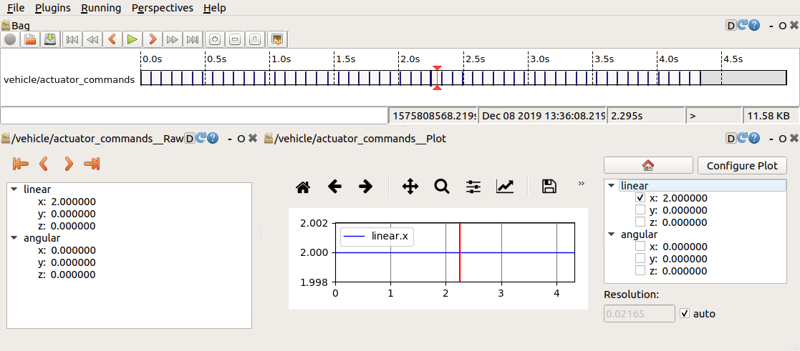
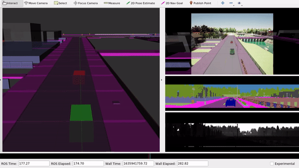

# ROS Bags


This subsection shows how to record and play back data from ROS topics such that you can store them.  

In this exercise you will learn
* how to use rosbag record to save data from ROS topics
* to analysis rosbags with rosbag info and the rqt logging feature
* how to play back data from a robag with to hands-on examples

## Prerequisites

Start multiple terminals in an `acdc` docker container and start: 
```bash
roscore
``` 
## ROS bag command line tool

From official ROS documentation: A [bag](https://wiki.ros.org/Bags) is a file format in ROS for storing ROS message data. Bags - so named because of their `.bag` extension - have an important role in ROS, and a variety of tools have been written to allow you to store, process, analyze, and visualize them. 

The command line tool for dealing with bags is [rosbag](https://wiki.ros.org/rosbag). Check out its functionalities:

```bash
rosbag
``` 
We will use rosbag `record`, `info`, and `play`.

### Rosbag record
In the following, we will record all messages from the `/vehicle/actuator_commands` topic. Therefore, first start the flatland simulation:
```bash
roslaunch racing flatland_simulation.launch
```
In another terminal, find out how to use `rosbag record`:
```bash
rosbag record --help
```
We see that the command expects topic names to be recorded as arguments. Besides that, there are many useful options which are not important now. `rosbag record` stores the recorded `.bag` file in the current directory of the terminal in which it is executed. Therefore, navigate into the racing package:

```bash
roscd racing
```

Record all messages that are published to the `/vehicle/actuator_commands` topic from now on:
```bash
rosbag record /vehicle/actuator_commands
```

So far, nobody publishes to this topic yet. Therefore, open a new terminal window and execute the vehicle controller so actual messages are available for recording:
```bash
roslaunch racing racing_controller.launch
``` 

Once the cart is stuck, stop the recording by hitting <kbd>Ctrl</kbd>+<kbd>C</kbd> in the "rosbag record" terminal. Also terminate the controller and the flatland simulation for now.

### Rosbag info
In your "rosbag record" terminal, you can now see the recorded `.bag` file with a time stamp in its name:
```
ls
```
In a real-world project, bag files usually become too large (multiple GB) for tracking them inside a git repository. Therefore, the `*.bag` extension has been added to the so-called `.gitignore` file of this branch. This means that even though you now have a new file in your git repository, its status is still "clean":
```bash
git status
``` 

Now, we analyze the newly recorded file:
```bash
rosbag info 20<<< HIT TAB FOR AUTO-COMPLETION >>>
```
Useful information are especially "topics" and "types". Note that "duration" is probably shorter than the time span during which `rosbag record` was just running because the initial interval without available messages has been automatically truncated. 

### Rosbag play
We will now steer the cart from the bag file without a running controller node. Therefore, start the simulation again:
```bash
roslaunch racing flatland_simulation.launch
```

Find out how to use `rosbag play`:
```bash
rosbag play --help
```

It expects the bag file name (or path) as an argument and accepts a number of further options. Make sure you are in the recorded bag file's directory and execute:

```bash
rosbag play -l 20<<< HIT TAB FOR AUTO-COMPLETION >>>
```
The `-l` option means "loop", so we have the messages available for more than just a few seconds. You should see the cart moving just like before. Pause and resume the playback using <kbd>Space</kbd>.


## RQT bag GUI
You can record, analyze, and play back bag files also in the rqt plugin [rqt_bag](https://wiki.ros.org/rqt_bag).

```bash
rqt
```
Select *Plugins --> Logging --> Bag*. If there are other open plugins from a config you may have used before, close them, e.g. using *Running --> Close [...]*.

Use  to open the bag file you have just recorded, which brings something like this:


Similar to `rosbag play`, you can right-click on the topic name and check "publish". Only then, the play symbol  will actually publish this recorded topic. 


If you only want to analyze the bag file *within* `rqt_bag`, you can unselect the "Publish" option and instead:
*  *Right-click the topic name --> View --> Raw* (similar to "Topic Monitor")
*  *Right-click the topic name --> View --> Plot* (similar to "Plot")

The main advantage of these `rqt_bag` plugins over the similar general rqt plugins is the possibility to easily stop and go forward or back in time.

Select `linear.x` for plotting and play back the file:



## CARLA Application: Combination of ROS Bag, RViz, ROS Launch
In a last step, we observe the provided bag file `carla.bag`, which was recorded within the [CARLA simulator environment](https://github.com/carla-simulator). CARLA is a well known, widely used, open-source simulation software, based on Unreal Engine. It comes with a built in [ROS bridge](https://github.com/carla-simulator/ros-bridge), allowing the usage and visualization within ROS. In this Unit, we will visualize some simulation results, contained in the provided `carla.bag` file.

Download the bag file from the Sciebo project folder and save the file to the local directory `${REPOSITORY}/bag` on your host. 

```bash
wget -O ${REPOSITORY}/bag/carla.bag https://rwth-aachen.sciebo.de/s/LJoX6lL8gdvO2e2/download
```

Alternatively, you can download the bag file for this Unit here [**Link**](https://rwth-aachen.sciebo.de/s/LJoX6lL8gdvO2e2) (approx. 700 MB). (In case you have not done yet)

We can use the provided launch file `carla.launch` in the `workshops/section_1/carla/` folder to play the `rosbag` together with the provided `carla_ad_demo.rviz` configuration in Rviz.

```bash
cd src/workshops/section_1/carla
roslaunch carla.launch
```
Note: Using `roslaunch` is possible outside of a defined ROS package, but we have to launch it from the corresponding folder.

The launch file replays all recorded topics from the bag file and visualizes them inside of RViz. 


We can observe the different sensor data which are captured for the simulated scene in CARLA. Within ROS, we could use those sensor topics for further data processing.


## Wrap-up
* You learned to use the `rosbag` command to record, analyze, or play data within rosbags
* You learned how to analyze rosbag data in more detail with rqt
