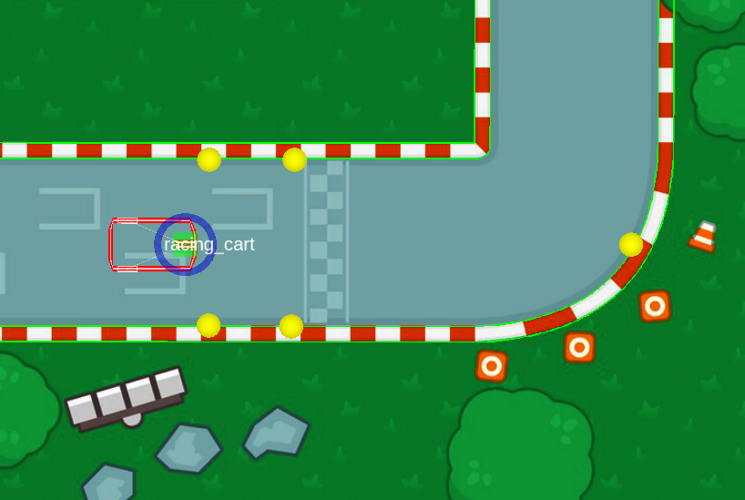
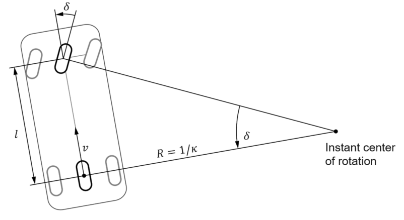

# ROS Application


Now we already learned some basic concepts about C++ and ROS and should be able to solve our first real automated driving challenge. Hence, we consider again the simple vehicle controller from the previous units and finally try to improve the laptimes of the race car in the simulation environment.

In this exercise you will
* learn the theory behind our implementation for the vehicle controller
* try to improve the target velocity and steering functions for improving the laptime


## Task

**Implement your own version of the vehicle controller** in the file

* `~/ws/catkin_workspace/src/workshops/section_1/racing/src/VehicleController.cpp`.

In particular:
*  Implement an improved longitudinal control rule in `computeTargetVelocity()`
*  Implement an improved lateral control rule in `computeTargetSteeringAngle()`

Try to achieve **at least one lap without major wall crashes**. Be creative and use any sort of scaling factors or mathematical functions that help you implement a fast and smooth vehicle behavior. You can also have a look to the [background information](#background-information) below.

:information_source: Do not forget to *save* your source files and *build* your source code in between making changes and trying them out:

```bash
catkin build racing --no-deps  # only build racing package (faster)
```

After that you can start again the simulation environment as well as the vehicle controller with the already known commands:
```bash
roslaunch racing flatland_simulation.launch
roslaunch racing racing_controller.launch
```

## Lap time challenge

Visit [Lap Time Challenge](https://github.com/ika-rwth-aachen/acdc/wiki/Section-1-Lap-Time-Challenge) to submit your code and participate in the lap time challenge.


## Background information

This task is an extreme simplification of a real-world automated driving function. The simplifications here are explained in the following.

### Lidar measurements input data

Both of your functions should make use of the available sensor data, whose definition you can look up in `racing/include/VehicleController.h`:
```cpp
float sensor_distances_[5] = {0.0f, 0.0f, 0.0f, 0.0f, 0.0f}; ///< order: right, front-right, front, front-left, left
```



- The current implementation only uses three of the five available LiDAR points. Using more sensor data could naturally improve the driving behavior.
- Base the longitudinal control on the front measurement, and the lateral control on the left and right measurements.
- There is artificial noise on the measurement data, which may lead to unreproducible vehicle behavior and different lap times.

### Vehicle model and output data

Your task is to set *target* values for

|          | name in figure below | name in code | positive orientation | unit |
| ---      |  ------              |  ------      |---------------------:|------|
| velocity   | $v $             | `this->target_velocity_`   | forward | m/s |
| steering angle   | $\delta $  | `this->target_steering_angle_`   | counterclockwise | rad |

These two values are part of the **kinematic single track model**, which is illustrated in the picture below.



This **vehicle model** assumes:
*  wheel orientations exactly determine the direction of motion of the vehicle
*  wheels of an axle can be represented by a single wheel in the middle 
*  wheels roll without slipping and friction

Furthermore, an **actuator model** is employed to take into account that the actuators cannot immediately realize any target value we specify. The currently implemented constraints are (from `racing/resources/racing_cart.yaml`):
```yaml
    max_angular_velocity: 1.5
    max_steering_angle: 0.7
    max_forward_velocity: 30
    max_backward_velocity: 5
    max_linear_acceleration: 3.0
    max_linear_deceleration: 8.0
```

### Our Implementation

We use the $\mathrm{tanh()}$ function to get a behavior from input to output that is similar to proportional, but limits the output for large input values:


Image source: [Wikipedia](https://de.wikipedia.org/wiki/Datei:Hyperbolic_Tangent.svg), from Geek3 ([CC BY-SA 3.0](https://creativecommons.org/licenses/by-sa/3.0/deed.en)) 


## Wrap-up
* You learned some theory about the kinematic single track model
* You learned how we implemented desired target velocity and target steering angle 
* You learned some alternatives ways to improve the vehicle model's behavior 
