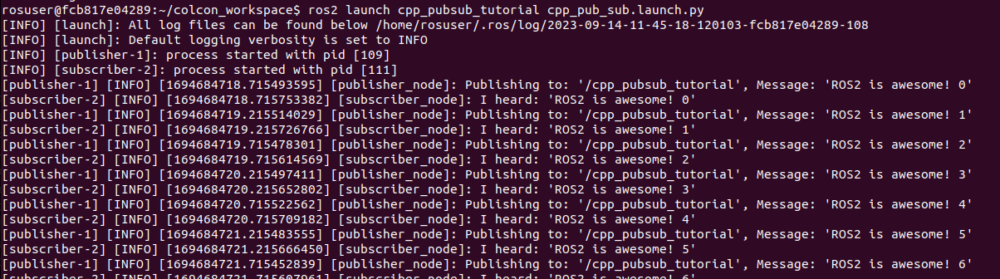

# ROS2 Tutorial in C++


In this tutorial, we'll walk you through creating `ROS2 C++` nodes. These nodes will exchange data via string messages on a specific topic. We'll be working on a basic "`talker`" and "`listener`" setup, where one node acts as the `publisher` and the other as the `subscriber`. The publisher sends out data, and the subscriber listens to the topic to receive this information.

The tutorial is referenced from the [C++ Writing a simple publisher and subscriber (C++)](https://docs.ros.org/en/foxy/Tutorials/Beginner-Client-Libraries/Writing-A-Simple-Cpp-Publisher-And-Subscriber.html) page.

In this tutorials you will
* examine how to configure a ROS2 C++ package
* learn the rough concepts about ROS2, ROS2 launch and config files
* be able to write simple Publisher & Subscriber nodes in C++


## Installation of ROS2

We already installed all necessary dependencies for ROS2 Humble inside of the provided docker image. Have a look into the official [ROS2 Installation Tutorial](https://docs.ros.org/en/humble/Installation/Ubuntu-Install-Debians.html) for further information.

## Start the Docker Environment

Navigate to the local directory `${REPOSITORY}/docker` and execute `./ros2_run.sh`. This will start the Docker container, in which ROS and all required libraries are preinstalled. You can stop the container by pressing <kbd>Ctrl</kbd>+<kbd>C</kbd> in the terminal. If everything is setup correctly you will see the following:

```
Starting new container...
================================================================================

=== CONTAINER INFORMATION ======================================================
Architecture: x86_64
Ubuntu: 22.04.2 LTS (Jammy Jellyfish)
Python: 3.10.6
ROS: humble
CMake: 3.22.1
CUDA: 12.1.105
cuDNN: 8.9.2
TensorRT: 8.6.1
TensorFlow Python: 2.13.0
TensorFlow C/C++: 
PyTorch Python: 
PyTorch C/C++: 
Available GPUs: 1
  name               driver_version   utilization.gpu [%]   utilization.memory [%]   memory.used [MiB]   memory.total [MiB]
  NVIDIA TITAN RTX   470.182.03       0 %                   2 %                      552 MiB             24217 MiB
===============================================================================

root@******:/home/rosuser/ws/colcon_workspace# 
```
The `acdc` folder is mounted from your host into the container. Note that your current working directory inside the container is `/home/rosuser/ws/colcon_workspace`.

## Build and source the package
The code for the image segmentation inference node can be found in the directory `colcon_workspace/src/section_1/cpp_pubsub_tutorial`. The structure of this __C++ package__ is illustrated in the following:

```
cpp_pubsub_tutorial/
├── CMakeLists.txt
├── config
|   └── params.yaml
├── include
├── launch
|   └── cpp_pub_sub.launch.py
├── package.xml
└── src
    ├── publisher_node.cpp
    └── subscriber_node.cpp
```

The main source codes is located in the directory `src`, the launch file are located in directory `launch` and parameters are located in `config`. Feel free to read all the code, parameters and launch files.

```bash
cd /home/rosuser/ws/colcon_workspace
source /opt/ros/humble/setup.bash
colcon build --packages-select cpp_pubsub_tutorial --symlink-install
```
## Publisher Node (Talker)
`publisher_node.cpp` is a simple example of a ROS 2 publisher node using the `rclcpp` library. The code creates a ROS 2 publisher node that publishes messages to a specified topic at a fixed rate of 500ms. The message data is a base message with a count appended to it, and the `base message` and  `topic name` can be set as parameters.

Let's breakdown and examine the code:

- __1. Headers and Namespace:__
  ```cpp
  #include <chrono>
  #include <memory>
  #include "rclcpp/rclcpp.hpp"
  #include "std_msgs/msg/string.hpp"
  using namespace std::chrono_literals;
  ```
  - Standard library headers like ```<chrono>``` and ```<memory>``` are included.
  - ROS 2 headers (rclcpp/rclcpp.hpp and std_msgs/msg/string.hpp) are included.
    The using namespace std::chrono_literals allows for the use of time literals like 500ms.

These lines depict the dependencies of the node. Remember that in the next section, you will need to include these dependencies in both the `package.xml` and `CMakeLists.txt` files.

- __2. MinimalPublisher Class:__
  ```cpp
    class MinimalPublisher : public rclcpp::Node
    {
    public:
    // Constructor
    MinimalPublisher()
    : Node("minimal_publisher"), count_(0)  // Initialize the node with the name "minimal_publisher" and set count_ to 0
    {
        // Decleare and Load the parameters
        declareParameters();
        loadParameters();

        // Create a publisher with the topic name "topic", using String messages, and a queue size of 10
        publisher_ = this->create_publisher<std_msgs::msg::String>(topic_name, 10);
        
        // Create a timer that fires every 500ms and binds it to the timer_callback function
        timer_ = this->create_wall_timer(
        500ms, std::bind(&MinimalPublisher::timer_callback, this));
    }

    private:

    void declareParameters()
    {
        // Declare the parameters with a default value
        this->declare_parameter<std::string>("base_message", "default_message");
        this->declare_parameter<std::string>("topic", "default_topic");
    }

    void loadParameters()
    {
        // Load the parameter values
        base_message = this->get_parameter("base_message").as_string();
        topic_name = this->get_parameter("topic").as_string();
    }

    // This function is called every 500ms by the timer
    void timer_callback()
    {
        // Create a new String message
        auto message = std_msgs::msg::String();
        
        // Set the message data to be the base message + the current count
        message.data = base_message + " " + std::to_string(count_++);
        
        // Log the published message for the user to see
        RCLCPP_INFO(this->get_logger(), "Publishing to: '%s', Message: '%s'", publisher_->get_topic_name(), message.data.c_str());

        // Publish the message
        publisher_->publish(message);
    }
    
    // Private member variables
    rclcpp::TimerBase::SharedPtr timer_;  // Timer triggering the publishing
    rclcpp::Publisher<std_msgs::msg::String>::SharedPtr publisher_;  // Publisher object
    size_t count_;  // Counter for the messages
    std::string base_message; // Base message to be published
    std::string topic_name; // Topic name to publish to
    };
  ```
  - This class inherits from `rclcpp::Node`, which means it represents a node in the ROS system. Every this in the code is referring to the node.
  - In the constructor (`MinimalPublisher()`), the node is initialized with a name (`minimal_publisher`), a publisher is created for a topic, and a timer is set up to call a callback function (`timer_callback`) every 500 milliseconds.
  - The `declareParameters()` function declares parameters with default values. Parameters in ROS 2 can be thought of as configurable settings for the node that can be set externally.
  - The `loadParameters()` function retrieves the values of the parameters.
  - The `RCLCPP_INFO` macro ensures every published message is printed to the console.
  - The `timer_callback()` function is the main part of the publisher. Every 500ms, it creates a message with a counter appended to a base message and then publishes it on a specified topic. 
- __3. Main Function:__
    ```cpp
    // Main function
    int main(int argc, char * argv[])
    {
    // Initialize the ROS 2 communication
    rclcpp::init(argc, argv);

    // Create an instance of MinimalPublisher and keep it responsive to callbacks
    rclcpp::spin(std::make_shared<MinimalPublisher>());

    // Clean up and shut down the ROS 2 communication
    rclcpp::shutdown();

    return 0;
    }
    ```
  - Initializes ROS 2 communications.
  - Creates and runs the MinimalPublisher node.
  - Once the node is done, the ROS 2 communications are shut down.

## Subscriber Node (Listener)
`subscriber_node.cpp` is a simple example of a ROS 2 subscriber node using the `rclcpp` library. The code creates a ROS 2 subscriber node that listens to messages on a specified topic. Upon receiving a message, the node processes and acts on the data based on its internal logic, with specifics like the `topic_name` being configurable via parameters.

Let's breakdown and examine the code:

- __1. Headers and Namespace:__
    It is identical to the publisher node.
    ```cpp
    #include <memory>
    #include "rclcpp/rclcpp.hpp"
    #include "std_msgs/msg/string.hpp"
    using std::placeholders::_1;
    ```
- __2. MinimalSubscriber Class:__
    ```cpp
    class MinimalSubscriber : public rclcpp::Node
    {
    public:
        // Constructor
        MinimalSubscriber()
        : Node("minimal_subscriber")  // Initialize the node with the name "minimal_subscriber"
        {

        // Decleare and Load the parameters
        declareParameters();
        loadParameters();

        // Create a subscription to the "topic" with a queue size of 10.
        // The std::bind function is used to bind the topic_callback function 
        // to this subscription, with the placeholder _1 being replaced by the received message.
        subscriber_ = this->create_subscription<std_msgs::msg::String>(
            topic_name, 10, std::bind(&MinimalSubscriber::topic_callback, this, _1));
        }

    private:
        void declareParameters()
        {
            // Declare the parameters with a default value
            this->declare_parameter<std::string>("topic", "default_topic");
        }
        void loadParameters()
        {
            // Load the parameter values
            topic_name = this->get_parameter("topic").as_string();
        }
        // Callback function for when a message is received on the  subscribed topic
        void topic_callback(const std_msgs::msg::String::SharedPtr msg) const
        {
            // Log the received message for the user to see
            RCLCPP_INFO(this->get_logger(), "I heard: '%s'", msg->data.c_str());
        } 
        // Private member variable to store the subscription object
        rclcpp::Subscription<std_msgs::msg::String>::SharedPtr subscriber_;
        std::string topic_name; // Topic name to publish to
    };

    ```
    - Derived from rclcpp::Node, the base class for all ROS 2  nodes.
    - Load and Decleare parameter methos to get `topic` parameter.
     - Initializes the node with the name "`minimal_subscriber`". Creates a subscription to a topic named "topic". Sets the queue size to 10.Binds the `topic_callback` function to process incoming messages.


- __3. Main Function:__
    It is identical to the publisher node.
    ```cpp
    rclcpp::init(argc, argv);
    rclcpp::spin(std::make_shared<MinimalSubscriber>());
    rclcpp::shutdown();
    return 0;
    ```
## Package.xml
In ROS 2 (Robot Operating System 2), the package.xml file is a crucial part of any ROS 2 package. It provides metadata about the package, such as its name, version, authors, dependencies, and more.

- Let's examine the code:
```xml
<?xml version="1.0"?>
<?xml-model href="http://download.ros.org/schema/package_format3.xsd" schematypens="http://www.w3.org/2001/XMLSchema"?>
<package format="3">
  <name>cpp_pubsub_tutorial</name>
  <version>0.0.0</version>
  <description>This package is a publisher subscriber tutorial for ROS2 with Cpp </description>
  <maintainer email="acdc@ika.rwth-aachen.de">ACDC</maintainer>
  <license>MIT</license>

  <buildtool_depend>ament_cmake</buildtool_depend>
  <depend>rclcpp</depend>
  <depend>std_msgs</depend>

  <test_depend>ament_lint_auto</test_depend>
  <test_depend>ament_lint_common</test_depend>

  <export>
    <build_type>ament_cmake</build_type>
  </export>
</package>

```
  - As mentioned in the Publisher node we should add dependincies. In package.xml file, we use `<depend>package<depend>`
  - In this package, we add [rclpp](https://docs.ros2.org/foxy/api/rclcpp/index.html) and [std_msgs](https://docs.ros2.org/galactic/api/std_msgs/index-msg.html). This declares the package needs `rclcpp` and `std_msgs` when its code is built and executed. 

## CMakeLists.txt
`CMakeLists.txt` defines how the packages are built, dependencies are linked, executables are created, and how messages/services are generated, especially when working with C++ projects in ROS 2.

- Let's examine the crucial part of the code:
```cmake
#Package name
project(cpp_pubsub_tutorial)
# find dependencies
find_package(ament_cmake REQUIRED)
find_package(rclcpp REQUIRED)
find_package(std_msgs REQUIRED)
# uncomment the following section in order to fill in
# further dependencies manually.
# find_package(<dependency> REQUIRED)

#Executables for publisher and subscriber
add_executable(publisher src/publisher_node.cpp)
ament_target_dependencies(publisher 
    rclcpp 
    std_msgs)

add_executable(subscriber src/subscriber_node.cpp)
ament_target_dependencies(subscriber 
    rclcpp 
    std_msgs)

# Set the install directories to the correct locations
install(
    DIRECTORY include launch config
    DESTINATION share/${PROJECT_NAME}/
)

# Install the executables
install(TARGETS
  publisher
  subscriber
  DESTINATION lib/${PROJECT_NAME}
)
```
  - __Package Name__: `project(cpp_pubsub_tutorial)`
  - __Find Dependincies__: `find_package` searches for packages specified by their names. For ROS 2 packages, these will often be ROS 2 middleware packages or message/service packages.
  - __Executables__:
    - `publisher`: Compiled from the source file `src/publisher_node.cpp`.
    - `subscriber`: Compiled from the source file `src/subscriber_node.cpp`.
    - `ament_target_dependencies` specifies which ROS 2 packages the executables are dependent on. Both the publisher and subscriber are dependent on `rclcpp` and `std_msgs`.
-  __Install Directories__: This section specifies which directories and their contents are to be installed.
   -  `include`: Often used for header files in C++ projects.
   -  `launch`: Contains launch files that determine how nodes are started and configured.
   -  `config`: Might contain configuration files such as parameters.
   -  The installed directories are placed in `share/${PROJECT_NAME}/`, where `${PROJECT_NAME}` is a variable holding the name of the project as specified earlier in the CMakeLists.txt with the `project()` command.

- __Install Executables__: 
  - This section specifies that the `publisher` and `subscriber` executables should be installed. The install location for these executables is `lib/${PROJECT_NAME}`, which is standard for ROS 2 nodes.
  
## Start the ROS2 nodes
In your fist terminal, `source` the colcon workspace.

```bash
source /home/rosuser/ws/colcon_workspace/install/setup.bash
```
cpp_pub_sub.launchcpp_pub_sub.launch
Then, start the publisher and subscriber node using `ros2 launch`.
```bash
ros2 launch cpp_pubsub_tutorial cpp_pub_sub.launch.py 
```
### Note about ROS2 launch files
This script defines a ROS 2 launch file that starts both a publisher node and a subscriber node from the cpp_pubsub_tutorial package, using a shared configuration file named `params.yaml`.

Contents of the file `cpp_pub_sub.launch.py`:

```python
# 'os' is for file and directory operations
import os
# 'get_package_share_directory' is used to find a package's shared directory in a ROS2 environment.
from ament_index_python.packages import get_package_share_directory
# 'LaunchDescription' helps describe the nodes to be launched in a ROS2 system.
from launch import LaunchDescription
# 'Node' is an action that represents a node in the ROS2 graph.
from launch_ros.actions import Node

def generate_launch_description():
    # Fetching the shared directory path for the 'racing' package.
    cpp_pubsub_tutorial_dir = get_package_share_directory('cpp_pubsub_tutorial')
    # Constructing the path to the configuration file 'params.yaml'.
    config = os.path.join(cpp_pubsub_tutorial_dir, 'config', 'params.yaml')

    # Defining a node for the publisher.
    publisher_node = Node(package='cpp_pubsub_tutorial', 
                                   executable='publisher',
                                   name='publisher_node', 
                                   output='screen',
                                   parameters=[config])
    
    # Defining a node for the subscriber.
    subscriber_node = Node(package='cpp_pubsub_tutorial', 
                              executable='subscriber',
                              name='subscriber_node',
                              output='screen',
                              parameters=[config])

    # Creating a LaunchDescription object to store the nodes.
    ld = LaunchDescription()

    # Adding both nodes to the launch description.
    ld.add_action(publisher_node)
    ld.add_action(subscriber_node)

    # Returning the launch description, which is used by the ROS2 launch system.
    return ld
```

Hence, we perform the following tasks:

- __1. Imports__
  - `os`: Used for file and directory operations.
  - `get_package_share_directory`: Gets the shared directory of a given ROS 2 package.
  - `LaunchDescription`: Allows you to define a set of nodes to be launched together.
  - `Node`: Represents a node action in the ROS 2 graph that will be launched.
- __Function: `generate_launch_description`():__ 
    This function generates the description of what needs to be launched.

  - It first determines the shared directory for the `cpp_pubsub_tutorial` package.

  - Constructs the full path to a configuration file (`params.yaml`) which is located inside a `config` folder in the cpp_pubsub_tutorial package's shared directory.

  - Defines a publisher node with the following specifications:
    - Package name: `cpp_pubsub_tutorial`
    - Executable name (the node's binary): `publisher`
    - Node name in the ROS 2 graph: `publisher_node`
    - Output logs to: `screen`
    - Configuration parameters: From the `params.yaml` file

  - Similarly, it defines a subscriber node.

  - Creates a `LaunchDescription` object. This object will hold all the nodes that are to be launched together.

  - Adds both the publisher and subscriber nodes to the LaunchDescription object.

   - Finally, it returns the `LaunchDescription` object, which tells the ROS 2 launch system what nodes to start when this launch file is invoked.


The default configuration `params.yaml` is held in an external `.yaml` file instead of the launch file itself.
```yaml
publisher_node:
  ros__parameters:
    base_message: "ROS2 is awesome!"
    topic: "cpp_pubsub_tutorial"

subscriber_node:
  ros__parameters:
    topic: "cpp_pubsub_tutorial"
```
When you launch the file you should see in the screen:
  - Talker logging the what topic to and message published
  - Listener logging the message published by talker


  

## Wrap-up
* You are introduced to the creation of ROS2 C++ nodes, specifically focusing on the "talker" and "listener" setup.
* You gained an understanding of the publisher-subscriber model in ROS2, where one node sends data (publisher) and another receives it (subscriber).
* You've explored the configuration of a ROS2 C++ package.
* You examined into the foundational concepts surrounding ROS2, including ROS2 launch and config files.
