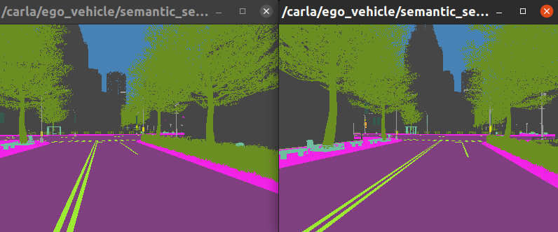
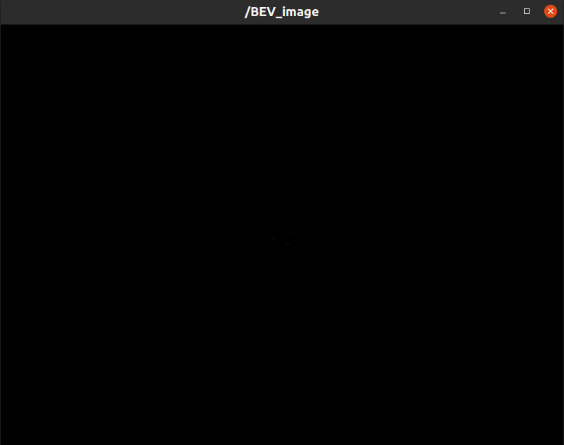
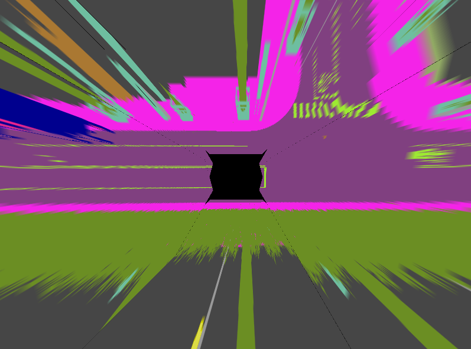

# Camera-based Semantic Grid Mapping

##   Instructions

**Perform Camera-based Semantic Grid Mapping using geometry-based inverse perspective mapping**

In this workshop, we will perform __semantic grid mapping__ based on images taken by vehicle-mounted cameras. 
The approach will make use of inverse perspective mapping (IPM).

We will use a recording from a simulation containing images from eight cameras.  

The learning goals of this workshop are ...
- Inspecting a rosbag which contains camera data
- Learn about the ROS2 message format for camera images and camera infos
- Learn about synchronized subscribers
- Learn how to use the tf2 library
- Learn how to visualize the output of semantic grid mapping

### Introduction to this workshop

We prepared a rosbag with camera data for you to use.

Download the file `semantic_8_cams.db3` from [__here (684.1 MB)__](https://rwth-aachen.sciebo.de/s/Fzsu2uLpqApG1ru).

Save this file to your local directory `${REPOSITORY}/bag`. This directory will be mounted into the docker container to the path `/home/rosuser/ws/bag`.


After the download, navigate to the local directory `${REPOSITORY}/docker` on your host and execute `./ros2_run.sh` to start the ACDC docker container.


Inside the container, you can navigate to `/home/rosuser/ws/bag` and execute `ros2 bag info semantic_8_cams.db3` to inspect the rosbag:

```
Files:             semantic_8_cams.db3
Bag size:          684.1 MiB
Storage id:        sqlite3
Duration:          7.450s
Start:             Jan  1 1970 01:00:26.592 (26.592)
End:               Jan  1 1970 01:00:34.42 (34.42)
Messages:          4622

Topic information: Topic: /carla/ego_vehicle/rgb_view/camera_info | Type: sensor_msgs/msg/CameraInfo | Count: 149 | Serialization Format: cdr

Topic: /carla/ego_vehicle/rgb_view/image | Type: sensor_msgs/msg/Image | Count: 149 | Serialization Format: cdr

Topic: /carla/ego_vehicle/semantic_segmentation_back_left_1/camera_info | Type: sensor_msgs/msg/CameraInfo | Count: 149 | Serialization Format: cdr

Topic: /carla/ego_vehicle/semantic_segmentation_back_left_1/image | Type: sensor_msgs/msg/Image | Count: 149 | Serialization Format: cdr

Topic: /carla/ego_vehicle/semantic_segmentation_back_left_2/camera_info | Type: sensor_msgs/msg/CameraInfo | Count: 149 | Serialization Format: cdr

Topic: /carla/ego_vehicle/semantic_segmentation_back_left_2/image | Type: sensor_msgs/msg/Image | Count: 149 | Serialization Format: cdr

Topic: /carla/ego_vehicle/semantic_segmentation_back_right_1/camera_info | Type: sensor_msgs/msg/CameraInfo | Count: 149 | Serialization Format: cdr

Topic: /carla/ego_vehicle/semantic_segmentation_back_right_1/image | Type: sensor_msgs/msg/Image | Count: 149 | Serialization Format: cdr

Topic: /carla/ego_vehicle/semantic_segmentation_back_right_2/camera_info | Type: sensor_msgs/msg/CameraInfo | Count: 149 | Serialization Format: cdr

Topic: /carla/ego_vehicle/semantic_segmentation_back_right_2/image | Type: sensor_msgs/msg/Image | Count: 149 | Serialization Format: cdr

Topic: /carla/ego_vehicle/semantic_segmentation_front_left_1/camera_info | Type: sensor_msgs/msg/CameraInfo | Count: 149 | Serialization Format: cdr

Topic: /carla/ego_vehicle/semantic_segmentation_front_left_1/image | Type: sensor_msgs/msg/Image | Count: 149 | Serialization Format: cdr

Topic: /carla/ego_vehicle/semantic_segmentation_front_left_2/camera_info | Type: sensor_msgs/msg/CameraInfo | Count: 149 | Serialization Format: cdr

Topic: /carla/ego_vehicle/semantic_segmentation_front_left_2/image | Type: sensor_msgs/msg/Image | Count: 149 | Serialization Format: cdr

Topic: /carla/ego_vehicle/semantic_segmentation_front_right_1/camera_info | Type: sensor_msgs/msg/CameraInfo | Count: 149 | Serialization Format: cdr

Topic: /carla/ego_vehicle/semantic_segmentation_front_right_1/image | Type: sensor_msgs/msg/Image | Count: 149 | Serialization Format: cdr

Topic: /carla/ego_vehicle/semantic_segmentation_front_right_2/camera_info | Type: sensor_msgs/msg/CameraInfo | Count: 149 | Serialization Format: cdr

Topic: /carla/ego_vehicle/semantic_segmentation_front_right_2/image | Type: sensor_msgs/msg/Image | Count: 149 | Serialization Format: cdr

Topic: /clock | Type: rosgraph_msgs/msg/Clock | Count: 150 | Serialization Format: cdr

Topic: /rosout | Type: rosgraph_msgs/msg/Log | Count: 2 | Serialization Format: cdr

Topic: /tf | Type: tf2_msgs/msg/TFMessage | Count: 1788 | Serialization Format: cdr
```

You can see that the rosbag has a duration of 7.5 seconds and contains segmented images of type `sensor_msgs/msg/Image` and corresponding `sensor_msgs/msg/CameraInfo` messages. 
We will use these camera images in this assignment in order to apply semantic grid mapping.

### ROS2's `sensor_msgs/msg/Image` Message

The message definition [sensor_msgs/msg/Image](https://docs.ros2.org/latest/api/sensor_msgs/msg/Image.html) is ROS2's standard image message format. It is used for all kind of camera image message types and can be used seamlessly with many different ROS2 visualization and image processing tools. Please read the documentation about the [detailed message format](https://docs.ros2.org/latest/api/sensor_msgs/msg/Image.html) and it's content.
Message

### ROS2's `sensor_msgs/msg/CameraInfo` Message

The message definition [sensor_msgs/msg/CameraInfo](hhttps://docs.ros2.org/latest/api/sensor_msgs/msg/CameraInfo.html) is ROS2's standard camera info message format. It is send together with `sensor_msgs/msg/Image` to provide additional information about the current camera image such as __camera calibration parameters__. Feel free to read the documentation about the [detailed message format](https://docs.ros2.org/latest/api/sensor_msgs/msg/CameraInfo.html).


### Task 1: Explore the semantic grid mapping package and build and source the package

The code for the camera-based semantic grid mapping node can be found in the directory `colcon_workspace_src/section_2/camera_based_semantic_grid_mapping_r2`. 

The main source code is located in the directory `camera_based_semantic_grid_mapping_r2`. The launch file are located in directory `launch`and parameters are located in `config`. Feel free to read all the code, parameters and launch files.

Now, in the container, navigate to `colcon_workspace` and build the package with with `colcon build` 
```bash
colcon build --packages-select camera_based_semantic_grid_mapping_r2 --symlink-install
```

and source the workspace

```bash
source install/setup.bash
```

Perfect! Now you will be able to perform semantic grid mapping using camera images with this package. Let's go to the next task.


### Task 2: Replay rosbag and run the camera-based grid mapping node

We have already prepared a launch file for you to execute the camera-based semantic grid mapping package. Please read through the following lines of code carefully. 

Contents of the file `semantic_grid_mapping.launch.py`:
```py
import os
from launch import LaunchDescription
from launch_ros.actions import Node
from launch.actions import DeclareLaunchArgument, ExecuteProcess
from ament_index_python.packages import get_package_share_directory

def generate_launch_description():

    # Get the package and params directory
    semantic_grid_mapping_dir = get_package_share_directory('camera_based_semantic_grid_mapping_r2')
    config = os.path.join(semantic_grid_mapping_dir, 'config', 'params.yaml')

    # Declare launch arguments
    use_sim_time = DeclareLaunchArgument(
        'use_sim_time',
        default_value='true',
        description='Use simulation clock time')

    # ROSBAG PLAY node
    rosbag_play_node = ExecuteProcess(
        cmd=['ros2', 'bag', 'play', '--rate', '0.1', '-l',
             '/home/rosuser/bag/semantic_8_cams.db3'],
        output='screen'
    )

    # SEMANTIC GRID MAPPING NODE
    semantic_grid_mapping_node = Node(
        package='camera_based_semantic_grid_mapping_r2',
        name='camera_based_semantic_grid_mapping',
        executable='semantic_grid_mapping',
        output='screen',
        parameters=[config]
    )

    # NODES FOR VISUALIZATION
    front_left_segmented_image_node = Node(
        package='image_view',
        executable='image_view',
        name='front_left_segmented_image',
        remappings=[('image', 'carla/ego_vehicle/semantic_segmentation_front_left_1/image')],
    )

    front_right_segmented_image_node = Node(
        package='image_view',
        executable='image_view',
        name='front_right_segmented_image',
        remappings=[('image', 'carla/ego_vehicle/semantic_segmentation_front_right_1/image')],
    )

    segmentation_viewer_node = Node(
        package='image_view',
        executable='image_view',
        name='segmentation_viewer',
        remappings=[('image', 'BEV_image')],
            parameters=[
                {'autosize': True},
        ]
    )

    # Create the launch description and populate
    ld = LaunchDescription()

    # Add the actions to the launch description
    ld.add_action(use_sim_time)
    ld.add_action(rosbag_play_node)
    ld.add_action(semantic_grid_mapping_node)
    ld.add_action(front_left_segmented_image_node)
    ld.add_action(front_right_segmented_image_node)
    ld.add_action(segmentation_viewer_node)

    return ld

```

Hence, we perform the following tasks:
- __Replay the rosbag__ with a speed of 0.1. Note, that we set the speed to a very low value here, because your computer might be very slow. You can increase this value if your computer is fast enough to compute the semantic grid map at a higher speed. If necessary, you may also reduce the value.

- __Start the `camera_based_semantic_grid_mapping ` Node__ and load the parameters(camera image and info topic names, output image size etc.) that are necessary for the node.
- __Start a visualization node__ to show the result

The node `camera_based_semantic_grid_mapping ` performs the following tasks on the data provided in the bag file:
- __subscribe__ to 8 `CameraInfo` and 8 `Image` topics
- __synchronize the subscribers__
- __apply `inverse perspective mapping`__ on single images.
- __stitches__  the result into a BEV image


We can now start the launch file with:

```bash
ros2 launch camera_based_semantic_grid_mapping_r2 semantic_grid_mapping.launch.py 
```

The `image_view` node should show you the semantically segmented images of the right and left forward facing cameras. They are sufficient for testing the node, for now.




However, the Bird's Eye View (BEV) image is not shown. This is because the node doesn't yet subscribe to the correct images and cameras info topics yet.   

In the following tasks, you will need to modify code in __"semantic_grid_mapping.py"__. After finishing all tasks, you will have completed the semantic grid mapping node.


### Task 3: Synchronize the subscribers

As we want to combine images from multiple cameras to produce a BEV image, these images need to be from the same time step.

For the purpose of synchronizing the image topics, we will use __`message_filters`__.

`message_filters` is a utility library that provides filtering algorithms for commonly used messages.

The following lines of code in __"semantic_grid_mapping.py"__ are responsible for subscribing to the different `CameraInfo` and `Image` topics.
```python
PLACE_HOLDER_1 = "NONEXISTENT_CAMERA_IMAGE_TOPIC"
PLACE_HOLDER_2 = "NONEXISTENT_CAMERA_INFO_TOPIC"
# setup subscribers
subs = []  # array with all subscribers that should be synchronized
for image_topic, info_topic in zip(self.image_topics_in, self.info_topics_in):
    ### START Task 3 CODE HERE ###
    # create subscriber for topic
    image_sub = message_filters.Subscriber(self, Image,PLACE_HOLDER_1, qos_profile=qos_profile)
    # create a subscriber for camera info topic
    info_sub = message_filters.Subscriber(self, CameraInfo, PLACE_HOLDER_2, qos_profile=qos_profile)
    ### END Task 3 CODE HERE ###
    # add subscribers to array
    subs.append(image_sub)
    subs.append(info_sub)

# synchronized subscriber
self.sync_sub = message_filters.ApproximateTimeSynchronizer(subs, queue_size=5., slop=0.01)
```
In the above code snippet, we iterate over all `Image` topics and their corresponding `CameraInfo`. These are defined in `config/params.yaml` und loaded in the node's function `load_parameters()`.

Note that we use `message_filters.Subscriber()` instead of normal ROS subscribers. 

`message_filters` provides subscriber policies that allow subscribing to messages from multiple topics and outputting them in a single callback. Here, we will use `message_filters.ApproximateTimeSynchronizer()`. The policy synchronizes the topics based on their time stamp (given in the header of the messages). It is capable of synchronizing topics even if messages' time stamps differ from each other. More information can be found in the [documentation](https://wiki.ros.org/message_filters), [ROS2 documentation](https://github.com/ros2/message_filters.git). There also exist an `ExactTime Policy.` , which is not covered here.

`message_filters.ApproximateTimeSynchronizer()` takes three parameters: 
- an array of subscribers (we save our subscribers in the array __subs__)
- __queue_size__ and  __slop__ (we use  __queue_size=5__ and  __slop=0.01__)

The `slop` parameter defines the maximum delay (in seconds) with which messages can be synchronized.

Your task is to __replace__ `PLACE_HOLDER_1` and `PLACE_HOLDER_2` with the correct variables to subscribe to the `Image`and `CameraInfo` topics.
```python
# create subscriber for topic
    image_sub = message_filters.Subscriber(self, Image,PLACE_HOLDER_1, qos_profile=qos_profile)
    # create a subscriber for camera info topic
    info_sub = message_filters.Subscriber(self, CameraInfo, PLACE_HOLDER_2, qos_profile=qos_profile)
```
After this adjustment, you can **rerun the node**:
```bash
ros2 launch camera_based_semantic_grid_mapping_r2 semantic_grid_mapping.launch.py 
```
A visualization window for the BEV image should appear.
However, the BEV image looks like this: 



Some parts of the code are still missing!

### Task 4: Extract the camera intrinsic matrix from the CameraInfo message

The goal of this task is to get the intrinsic matrices `K` of the cameras. 

For this purpose, you have to modify the following lines in the function __compute_bev__ by __replacing__ `PLACE_HOLDER_INTRINSIC` with your code.


```python
# extract intrinsic matrix k (3x3) from CameraInfo topic
PLACE_HOLDER_INTRINSIC = [100., 0., 0., 0., 100., 0., 0., 0., 100.] # comment this line in your solution
K = np.reshape(PLACE_HOLDER_INTRINSIC, (3,3)) # replace the placeholder and use the actual camera intrinsics
```
##### hints:
- The `CameraInfo` message is provided in the variable `cam_info_msg`. 
- In the __CameraInfo__ message, the intrinsic matrix is named __k__.


### Task 5: Calculate the camera extrinsic matrix
The goal of this task is to compute extrinsic matrices of the cameras based on information in the `CameraInfo` messages.

The extrinsic matrix transforms the camera's coordinate frame to the vehicle's coordinates frame.
For this, we will use ros [__tf2__](https://wiki.ros.org/tf2). This library allows to maintain multiple coordinate frames and their relationship over time.  


__Part 1: Look up the transformation between the vehicle's base link and the camera frames__


To get the transformation between coordinate frames, you will use the function [`tfBuffer.lookup_transform()`](http://docs.ros.org/en/noetic/api/tf2_ros/html/c++/classtf2__ros_1_1Buffer.html) which takes a target frame and a source frame as parameters and returns the transformation between them.
Replace the `None` placeholders in the function `compute_bev()` in __"semanctic_grid_mapping.py"__, then uncomment the line to define `transform`.

```python
# use tfBuffer to look up the transformation from the vehicle's base link frame to the camera frame.
# transform = self.tfBuffer.lookup_transform(None, None, None) # uncomment and adjust
```

##### Hints:
- The vehicle's base link frame name is saved in `self.vehicle_base_link`.
- The camera frame name can be found in the `CameraInfo` topic.
- Look up the transformation at the common time `common_time`.
- The function `lookup_transform()` can take four arguments: `target_frame`, `source_frame`, `time` at which the value of the transform is desired, and an optional `timeout`.

__Part 2: Convert a Transform into a homogeneous matrix__

The function `tfBuffer.lookup_transform()` returns a transform of the type [`geometry_msgs/TransformStamped`](http://docs.ros.org/en/noetic/api/geometry_msgs/html/msg/TransformStamped.html). 
The goal of this task is to convert this transform into a (4x4) __homogeneous transformation matrix__, the extrinsic matrix `E` in our case.

`geometry_msgs/TransformStamped` contains a [`geometry_msgs/Transform`](http://docs.ros.org/en/noetic/api/geometry_msgs/html/msg/Transform.html), which contains a __quaternion__ and a __translation vector__. 
[__Quaternions__](https://en.wikipedia.org/wiki/Quaternion) provide another way to represent rotations.
In this task, we will extract the quaternion from the variable `transform`. Then, we will convert it to __(roll, pitch, yaw)__ angles. At the end, we will convert __(roll, pitch, yaw)__ into a rotation matrix.  

**Uncomment** and **adjust** the following lines to extract a __quaternion__ out of the `transform` and convert it into `(roll, pitch, yaw)`.

The conversion uses [`tf_transformations`](https://github.com/DLu/tf_transformations/). You can find the correct function for converting quaternions to `(roll, pitch, yaw)`- also called euler angles - [__here__](https://github.com/DLu/tf_transformations/blob/main/tf_transformations/__init__.py).

```python
# extract quaternion from transform and transform it into a list
# quaternion = transform.transform.REPLACE_ME # adjust and uncomment
# quaternion = [REPLACE_ME.x, REPLACE_ME.y , REPLACE_ME.z, REPLACE_ME.w] # adjust and uncomment

# convert quaternion to (roll,pitch,yaw)
# roll, pitch, yaw = REPLACE_ME # uncomment and adjust
```
Now, you can can convert `(roll, pitch, yaw)` into a rotation matrix. 

**Replace** the `None` placeholders with your code.
```python
# compute rotation matrix
Rz = None # Replace with actual matrix
Ry = None # Replace with actual matrix
Rx = None # Replace with actual matrix
R = None # Replace with actual matrix (combination of Rx, Ry, Rz)
```

Refer to the documentation of [`geometry_msgs/TransformStamped`](http://docs.ros.org/en/noetic/api/geometry_msgs/html/msg/TransformStamped.html) and extract the translation vector by **adjusting** the `REPLACE_ME` placeholder. Then, uncomment the next to line to save the `x`, `y` and `z` components in a list. Last, convert the list to a NumPy array.
```python
# extract translation from transform 
# t = transform.transform.REPLACE_ME # uncomment and adjust
# t = [t.x, t.y, t.z]  # uncomment

# convert t to a numpy array
# t = REPLACE_ME # uncomment and adjust
```

**Combine** the determined (3x3) rotation matrix `R` and the (3x1) translation vector `t` into a (4x4) homogeneous transformation representing the extrinsic matrix `E`.

```python
# first combine R and t
# E = np.REPLACE_ME([REPLACE_ME, REPLACE_ME]) # uncomment and adjust
# then add 1 row ([0., 0., 0., 1.]) to complete the transform
# E = np.row_stack([E, REPLACE_ME]) # uncomment and adjust
```


Then, use `E` and **replace** the placeholder `PLACE_HOLDER_EXTRINSIC` by commenting the following two lines.
```python
PLACE_HOLDER_EXTRINSIC = np.array([[1., 0., 0., 1.],[0., 1., 0., 1.],[0., 0., 1., 1.],[0., 0., 0., 1.]]) # comment when done with task 5
E = PLACE_HOLDER_EXTRINSIC # comment when done with task 5
```

Rerun the node :
```bash
ros2 launch camera_based_semantic_grid_mapping_r2 semantic_grid_mapping.launch.py 
```

### Result

After completing the `compute_bev` function and restarting the node, you should see the following output.



Congratulations!

**Optional additional task**: Create an RVIZ configuration and a launch file that starts the semantic grid mapping node and RVIZ with your RVIZ configuration. Display all 8 images from the camera persepctive and the BEV image, if the performance of your computer permits!

### Wrap-up
- You learned how to synchronize subscribers.
- You learned how `CameraInfo` messages can be used to extract the camera parameters.
- You learned how to perform coordinate transformations using ROS libraries like `tf2` and `tf_conversions`. 
- You have completed a simple Python ROS package for camera-based semantic grid mapping.
- Feel free to explore the rest of the code for a deeper understanding of the semantic grid mapping package.

---

##  Instructions


In this workshop, we will perform __semantic grid mapping__ based on images taken by vehicle-mounted cameras. 
The approach will make use of inverse perspective mapping (IPM).

We will use a recording from a simulation containing images from eight cameras.  

The learning goals of this workshop are ...
- Inspecting a rosbag which contains camera data
- Learn about the ROS message format for camera images and camera infos
- Learn about synchronized subscribers
- Learn how to use the tf2 library
- Learn how to visualize the output of semantic grid mapping


### Introduction to this workshop

We prepared a rosbag with camera data for you to use.

Download the file `semantic_8_cams.bag` from [__here (683.6 MB)__](https://rwth-aachen.sciebo.de/s/bHan8XNDB9ijlCz).

Save this file to your local directory `${REPOSITORY}/bag`. This directory will be mounted into the docker container to the path `/home/rosuser/ws/bag`.


After the download, navigate to the local directory `${REPOSITORY}/docker` on your host and execute `./ros1_run.sh` to start the ACDC docker container.


Inside the container, you can navigate to `/home/rosuser/ws/bag` and execute `rosbag info semantic_8_cams.bag` to inspect the rosbag:

```
path:        semantic_8_cams.bag
version:     2.0
duration:    7.5s
start:       Jan 01 1970 01:00:26.59 (26.59)
end:         Jan 01 1970 01:00:34.04 (34.04)
size:        683.6 MB
messages:    4622
compression: none [718/718 chunks]
types:       rosgraph_msgs/Clock    [a9c97c1d230cfc112e270351a944ee47]
             rosgraph_msgs/Log      [acffd30cd6b6de30f120938c17c593fb]
             sensor_msgs/CameraInfo [c9a58c1b0b154e0e6da7578cb991d214]
             sensor_msgs/Image      [060021388200f6f0f447d0fcd9c64743]
             tf2_msgs/TFMessage     [94810edda583a504dfda3829e70d7eec]
topics:      /carla/ego_vehicle/rgb_view/camera_info                               149 msgs    : sensor_msgs/CameraInfo
             /carla/ego_vehicle/rgb_view/image                                     149 msgs    : sensor_msgs/Image     
             /carla/ego_vehicle/semantic_segmentation_back_left_1/camera_info      149 msgs    : sensor_msgs/CameraInfo
             /carla/ego_vehicle/semantic_segmentation_back_left_1/image            149 msgs    : sensor_msgs/Image     
             /carla/ego_vehicle/semantic_segmentation_back_left_2/camera_info      149 msgs    : sensor_msgs/CameraInfo
             /carla/ego_vehicle/semantic_segmentation_back_left_2/image            149 msgs    : sensor_msgs/Image     
             /carla/ego_vehicle/semantic_segmentation_back_right_1/camera_info     149 msgs    : sensor_msgs/CameraInfo
             /carla/ego_vehicle/semantic_segmentation_back_right_1/image           149 msgs    : sensor_msgs/Image     
             /carla/ego_vehicle/semantic_segmentation_back_right_2/camera_info     149 msgs    : sensor_msgs/CameraInfo
             /carla/ego_vehicle/semantic_segmentation_back_right_2/image           149 msgs    : sensor_msgs/Image     
             /carla/ego_vehicle/semantic_segmentation_front_left_1/camera_info     149 msgs    : sensor_msgs/CameraInfo
             /carla/ego_vehicle/semantic_segmentation_front_left_1/image           149 msgs    : sensor_msgs/Image     
             /carla/ego_vehicle/semantic_segmentation_front_left_2/camera_info     149 msgs    : sensor_msgs/CameraInfo
             /carla/ego_vehicle/semantic_segmentation_front_left_2/image           149 msgs    : sensor_msgs/Image     
             /carla/ego_vehicle/semantic_segmentation_front_right_1/camera_info    149 msgs    : sensor_msgs/CameraInfo
             /carla/ego_vehicle/semantic_segmentation_front_right_1/image          149 msgs    : sensor_msgs/Image     
             /carla/ego_vehicle/semantic_segmentation_front_right_2/camera_info    149 msgs    : sensor_msgs/CameraInfo
             /carla/ego_vehicle/semantic_segmentation_front_right_2/image          149 msgs    : sensor_msgs/Image     
             /clock                                                                150 msgs    : rosgraph_msgs/Clock   
             /rosout                                                                 2 msgs    : rosgraph_msgs/Log     
             /tf                                                                  1788 msgs    : tf2_msgs/TFMessage
```

You can see that the rosbag has a duration of 7.5 seconds and contains segmented images of type `sensor_msgs/Image` and corresponding `sensor_msgs/CameraInfo` messages. 
We will use these camera images in this assignment in order to apply semantic grid mapping.


#### ROS `sensor_msgs/Image` Message

The message definition [sensor_msgs/Image](https://docs.ros.org/en/noetic/api/sensor_msgs/html/msg/Image.html) is ROS' image message format. This message type provides a way to send images `sensor_msgs/Image` that can be used seamlessly with many different ROS visualization and image processing tools. Please read the documentation about the [detailed message format](https://docs.ros.org/en/noetic/api/sensor_msgs/html/msg/Image.html) and its content.


#### ROS `sensor_msgs/CameraInfo`

The message definition [sensor_msgs/CameraInfo](https://docs.ros.org/en/noetic/api/sensor_msgs/html/msg/CameraInfo.html) is ROS' standard camera info message format. It is sent together with `sensor_msgs/Image` or `sensor_msgs/CompressedImage` to provide additional information about the current camera image such as __camera calibration parameters__. Please read the documentation about the [detailed message format](https://docs.ros.org/en/melodic/api/sensor_msgs/html/msg/CameraInfo.html).


### Task 1: Explore the semantic grid mapping package and build and source the package

The code for the camera-based semantic grid mapping node can be found in the directory `workshops/section_2/camera_based_semantic_grid_mapping`. 

The main source code is located in the directory `src`. The launch file and parameters are located in directory `launch`. Feel free to read all the code, parameters and launch files.

Now, in the container, navigate to `catkin_workspace` and build the package with with `catkin build` 
```bash
catkin build camera_based_semantic_grid_mapping
```

and source the workspace

```bash
source devel/setup.bash
```

Perfect! Now you will be able to perform semantic grid mapping using camera images with this package. Let's go to the next task.


### Task 2: Replay rosbag and run the camera-based grid mapping node

We have already prepared a launch file for you to execute the camera-based semantic grid mapping package. Please read through the following lines of code carefully. 

Contents of the file `start_all.launch`:
```xml
<launch>

    <param name ="/use_sim_time" value="true"/>
    
    <!-- ROSBAG PLAY -->
    <node pkg="rosbag" 
          type="play"
          name="player"
          output="screen"
          args="--rate 0.1 -l --clock $/home/rosuser/ws/bag/semantic_8_cams.bag">
    </node>

    <!--- Semantic Grid Mapping Node -->
    <rosparam
      command="load"
      file="$(find camera_based_semantic_grid_mapping)/launch/params.yaml"
    />

    <node
        name="camera_based_semantic_grid_mapping"
        pkg="camera_based_semantic_grid_mapping"
        type="semantic_grid_mapping.py"
        output="screen">
    </node>

    <!--- NODES FOR VISUALIZATION -->
    <node pkg="image_view"
          type="image_view"
          name="front_left_segmented_image"
          args="image:=/carla/ego_vehicle/semantic_segmentation_front_left_1/image">
    </node>
    <!--- NODES FOR VISUALIZATION -->
    <node pkg="image_view"
          type="image_view"
          name="front_right_segmented_image"
          args="image:=/carla/ego_vehicle/semantic_segmentation_front_right_1/image">
    </node>
    
    <node pkg="image_view"
          type="image_view"
          name="segmentation_viewer"
          args="image:=/BEV_image">
    </node>
   


</launch>
```

Hence, we perform the following tasks:
- __Replay the rosbag__ with a speed of 0.1. Note, that we set the speed to a very low value here, because your computer might be very slow. You can increase this value if your computer is fast enough to compute the semantic grid map at a higher speed. If necessary, you may also reduce the value.

- __Load the parameters__ that are necessary for the `camera_based_semantic_grid_mapping` node (camera image and info topic names, output image size etc.)

- __Start the `camera_based_semantic_grid_mapping ` Node__
- __Start a visualization node__ to show the result

The node `camera_based_semantic_grid_mapping ` performs the following tasks on the data provided in the bag file:
- __subscribe__ to 8 `CameraInfo` and 8 `Image` topics
- __synchronize the subscribers__
- __apply `inverse perspective mapping`__ on single images.
- __stitches__  the result into a BEV image


We can now start the launch file with:

```bash
roslaunch camera_based_semantic_grid_mapping start_all.launch
```

The `image_view` node should show you the semantically segmented images of the right and left forward facing cameras. They are sufficient for testing the node, for now.


However, the Bird's Eye View (BEV) image is not shown. This is because the node doesn't yet subscribe to the correct images and cameras info topics yet.   

In the following tasks, you will need to modify code in __"semantic_grid_mapping.py"__. After finishing all tasks, you will have completed the semantic grid mapping node.


### Task 3: Synchronize the subscribers 
As we want to combine images from multiple cameras to produce a BEV image, these images need to be from the same time step.

For the purpose of synchronizing the image topics, we will use __`message_filters`__.

`message_filters` is a utility library that provides filtering algorithms for commonly used messages.

The following lines of code in __"semantic_grid_mapping.py"__ are responsible for subscribing to the different `CameraInfo` and `Image` topics.
```python
PLACE_HOLDER_1 = "NONEXISTENT_CAMERA_IMAGE_TOPIC"
PLACE_HOLDER_2 = "NONEXISTENT_CAMERA_INFO_TOPIC"
# setup subscribers
subs = []  # array with all subscribers that should be synchronized
for image_topic, info_topic in zip(self.image_topics_in, self.info_topics_in):
    ### START Task 3 CODE HERE ###
    # create subscriber for topic
    image_sub = message_filters.Subscriber(PLACE_HOLDER_1, Image, queue_size=1)
    # create a subscriber for camera info topic
    info_sub = message_filters.Subscriber(PLACE_HOLDER_2, CameraInfo, queue_size=1)
    ### END Task 3 CODE HERE ###
    # add subscribers to array
    subs.append(image_sub)
    subs.append(info_sub)

# synchronized subscriber
self.sync_sub = message_filters.ApproximateTimeSynchronizer(subs, queue_size=5., slop=0.01)
```
In the above code snippet, we iterate over all `Image` topics and their corresponding `CameraInfo`. These are defined in `launch/params.yaml` und loaded in the node's function `load_parameters()`.

Note that we use `message_filters.Subscriber()` instead of normal ROS subscribers. 

`message_filters` provides subscriber policies that allow subscribing to messages from multiple topics and outputting them in a single callback. Here, we will use `message_filters.ApproximateTimeSynchronizer()`. The policy synchronizes the topics based on their time stamp (given in the header of the messages). It is capable of synchronizing topics even if messages' time stamps differ from each other. More information can be found in the [documentation](https://wiki.ros.org/message_filters). There also exist an `ExactTime Policy.` , which is not covered here.

`message_filters.ApproximateTimeSynchronizer()` takes three parameters: 
- an array of subscribers (we save our subscribers in the array __subs__)
- __queue_size__ and  __slop__ (we use  __queue_size=5__ and  __slop=0.01__)

The `slop` parameter defines the maximum delay (in seconds) with which messages can be synchronized.

Your task is to __replace__ `PLACE_HOLDER_1` and `PLACE_HOLDER_2` with the correct variables to subscribe to the `Image`and `CameraInfo` topics.
```python
# create subscriber for topic
image_sub = message_filters.Subscriber(PLACE_HOLDER_1, Image, queue_size=1)
# create a subscriber for camera info topic
info_sub = message_filters.Subscriber(PLACE_HOLDER_2, CameraInfo, queue_size=1)
```
After this adjustment, you can **rerun the node**:
```bash
roslaunch camera_based_semantic_grid_mapping start_all.launch
```
A visualization window for the BEV image should appear.
However, the BEV image looks like this: 


Some parts of the code are still missing!


### Task 4: Extract the camera intrinsic matrix from the CameraInfo message
The goal of this task is to get the intrinsic matrices `K` of the cameras. 

For this purpose, you have to modify the following lines in the function __compute_bev__ by __replacing__ `PLACE_HOLDER_INTRINSIC` with your code.

```python
# extract intrinsic matrix K (3x3) from CameraInfo topic
PLACE_HOLDER_INTRINSIC = [100., 0., 0., 0., 100., 0., 0., 0., 100.] # comment this line in your solution
K = np.reshape(PLACE_HOLDER_INTRINSIC, (3,3)) # replace the placeholder and use the actual camera intrinsics
```

##### hints:
- The `CameraInfo` message is provided in the variable `cam_info_msg`. 
- In the __CameraInfo__ message, the intrinsic matrix is named __K__.


### Task 5: Calculate the camera extrinsic matrix
The goal of this task is to compute extrinsic matrices of the cameras based on information in the `CameraInfo` messages.

The extrinsic matrix transforms the camera's coordinate frame to the vehicle's coordinates frame.
For this, we will use ros [__tf2__](https://wiki.ros.org/tf2). This library allows to maintain multiple coordinate frames and their relationship over time.  


__Part 1: Look up the transformation between the vehicle's base link and the camera frames__


To get the transformation between coordinate frames, you will use the function [`tfBuffer.lookup_transform()`](http://docs.ros.org/en/noetic/api/tf2_ros/html/c++/classtf2__ros_1_1Buffer.html) which takes a target frame and a source frame as parameters and returns the transformation between them.
Replace the `None` placeholders in the function `compute_bev()` in __"semanctic_grid_mapping.py"__, then uncomment the line to define `transform`.

```python
# use tfBuffer to look up the transformation from the vehicle's base link frame to the camera frame.
# transform = self.tfBuffer.lookup_transform(None, None, None) # uncomment and adjust
```
<!-- omit in toc -->
##### Hints:
- The vehicle's base link frame name is saved in `self.vehicle_base_link`.
- The camera frame name can be found in the `CameraInfo` topic.
- Look up the transformation at the common time `common_time`.
- The function `lookup_transform()` can take four arguments: `target_frame`, `source_frame`, `time` at which the value of the transform is desired, and an optional `timeout`.

__Part 2: Convert a Transform into a homogeneous matrix__

The function `tfBuffer.lookup_transform()` returns a transform of the type [`geometry_msgs/TransformStamped`](http://docs.ros.org/en/noetic/api/geometry_msgs/html/msg/TransformStamped.html). 
The goal of this task is to convert this transform into a (4x4) __homogeneous transformation matrix__, the extrinsic matrix `E` in our case.

`geometry_msgs/TransformStamped` contains a [`geometry_msgs/Transform`](http://docs.ros.org/en/noetic/api/geometry_msgs/html/msg/Transform.html), which contains a __quaternion__ and a __translation vector__. 
[__Quaternions__](https://en.wikipedia.org/wiki/Quaternion) provide another way to represent rotations.
In this task, we will extract the quaternion from the variable `transform`. Then, we will convert it to __(roll, pitch, yaw)__ angles. At the end, we will convert __(roll, pitch, yaw)__ into a rotation matrix.  

**Uncomment** and **adjust** the following lines to extract a __quaternion__ out of the `transform` and convert it into `(roll, pitch, yaw)`.

The conversion uses [`tf_conversions`](https://wiki.ros.org/tf_conversions). You can find the correct function for converting quaternions to `(roll, pitch, yaw)`- also called euler angles - [__here__](https://github.com/ros/geometry/blob/noetic-devel/tf/src/tf/transformations.py).

```python
# extract quaternion from transform and transform it into a list
# quaternion = transform.transform.REPLACE_ME # adjust and uncomment
# quaternion = [REPLACE_ME.x, REPLACE_ME.y , REPLACE_ME.z, REPLACE_ME.w] # adjust and uncomment

# convert quaternion to (roll,pitch,yaw)
# roll, pitch, yaw = REPLACE_ME # uncomment and adjust
```
Now, you can can convert `(roll, pitch, yaw)` into a rotation matrix. 

**Replace** the `None` placeholders with your code.
```python
# compute rotation matrix
Rz = None # Replace with actual matrix
Ry = None # Replace with actual matrix
Rx = None # Replace with actual matrix
R = None # Replace with actual matrix (combination of Rx, Ry, Rz)
```

Refer to the documentation of [`geometry_msgs/TransformStamped`](http://docs.ros.org/en/noetic/api/geometry_msgs/html/msg/TransformStamped.html) and extract the translation vector by **adjusting** the `REPLACE_ME` placeholder. Then, uncomment the next to line to save the `x`, `y` and `z` components in a list. Last, convert the list to a NumPy array.
```python
# extract translation from transform 
# t = transform.transform.REPLACE_ME # uncomment and adjust
# t = [t.x, t.y, t.z]  # uncomment

# convert t to a numpy array
# t = REPLACE_ME # uncomment and adjust
```

**Combine** the determined (3x3) rotation matrix `R` and the (3x1) translation vector `t` into a (4x4) homogeneous transformation representing the extrinsic matrix `E`.

```python
# first combine R and t
# E = np.REPLACE_ME([REPLACE_ME, REPLACE_ME]) # uncomment and adjust
# then add 1 row ([0., 0., 0., 1.]) to complete the transform
# E = np.row_stack([E, REPLACE_ME]) # uncomment and adjust
```


Then, use `E` and **replace** the placeholder `PLACE_HOLDER_EXTRINSIC` by commenting the following two lines.
```python
PLACE_HOLDER_EXTRINSIC = np.array([[1., 0., 0., 1.],[0., 1., 0., 1.],[0., 0., 1., 1.],[0., 0., 0., 1.]]) # comment when done with task 5
E = PLACE_HOLDER_EXTRINSIC # comment when done with task 5
```

Rerun the node :
```bash
roslaunch camera_based_semantic_grid_mapping start_all.launch
```
<!-- omit in toc -->
### Result
After completing the `compute_bev` function and restarting the node, you should see the following output.


**Optional additional task**: Create an RVIZ configuration and a launch file that starts the semantic grid mapping node and RVIZ with your RVIZ configuration. Display all 8 images from the camera persepctive and the BEV image, if the porformance of your computer permits!

### Wrap-up
- You learned how to synchronize subscribers.
- You learned how `CameraInfo` messages can be used to extract the camera parameters.
- You learned how to perform coordinate transformations using ROS libraries like `tf2` and `tf_conversions`. 
- You have completed a simple Python ROS package for camera-based semantic grid mapping.
- Feel free to explore the rest of the code for a deeper understanding of the semantic grid mapping package.