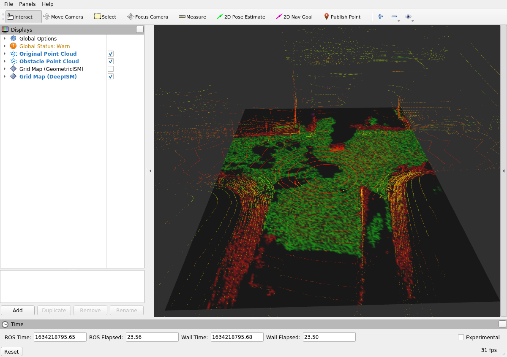

# Deep Learning-based Point Cloud Occupancy Grid Mapping


In the previous task, you have completed and used a geometric approach to create occupancy grid maps from lidar point clouds. Now, we will use the **deep learning-based inverse sensor model** instead.

## Task 5: Convert Tensor to Grid Map

A TensorFlow model that was trained on synthetic data is already included in the repository at `pointcloud_ogm/models/`. The ROS nodelet `pointcloud_ogm/DeepISM` receives point clouds and uses the TensorFlow model to predict occupancy grid maps. Start the nodelet and Rviz:

```bash
roslaunch pointcloud_ogm DeepISM.launch
```

Rviz will show the lidar point cloud. If you enable the checkbox next to "Grid Map (DeepISM)" you will also see an occupancy grid map, but **there is something wrong**.




Have a look at the code in `workshops/section_2/pointcloud_ogm/src/DeepISM.cpp`. The node performs the following steps:

1. On start, size and resolution of the predicted grid map is obtained from the loaded TensorFlow model.
2. When a point cloud is received, the `messageCallback()` method is executed.
    1. The point cloud is converted into input tensors for the neural network using the PointPillars approach.
    2. The TensorFlow model is used to predict occupancy evidences from the input tensors.
    3. The method `tensor_to_grid_map()` converts the predicted tensor into an occupancy grid map.
    4. The occupancy grid map is published as ROS message.

```cpp
void DeepISM::tensor_to_grid_map(const float* prediction, grid_map::GridMap& grid_map)
{
  // TASK 5 START: Find the bug in the following code.
  const auto& rows = grid_map.getSize()(0);
  const auto& cols = grid_map.getSize()(1);
  for (int row = 0; row < rows; row++)
  {
    for (int col = 0; col < cols; col++)
    {
      const auto& evidence_free = prediction[0 + row*cols*2 + col*2 + 0];
      const auto& evidence_occupied = prediction[0 + row*cols*2 + col*2 + 1];
      auto& m_occupied = grid_map.at("m_occupied", grid_map::Index(row, col));
      auto& m_free = grid_map.at("m_free", grid_map::Index(row, col));
      auto& occupancy_color = grid_map.at("occupancy_color", grid_map::Index(row, col));

      const auto& S = (1 + evidence_occupied) + (1 + evidence_free);
      m_occupied = evidence_occupied;
      m_free = evidence_free;

      // create occupancy color for visualization (m_occupied = red, m_free = green)
      grid_map::colorVectorToValue(Eigen::Vector3f(m_occupied, m_free, 0), occupancy_color);
    }
  }
  // TASK 5 END
}
```

There is a bug in the `tensor_to_grid_map()` method. Make sure that the belief masses are computed correctly, then compile the ROS workspace and re-execute the launch file (after killing it with `CTRL-C`).

```bash
catkin build pointcloud_ogm
roslaunch pointcloud_ogm DeepISM.launch
```
