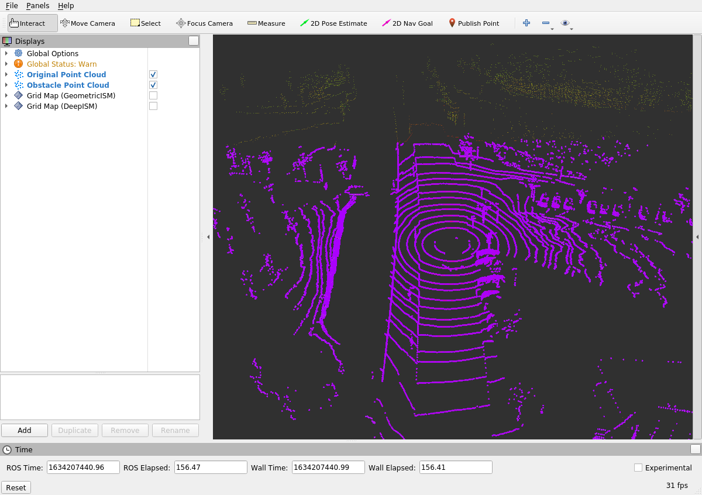

# Geometric Point Cloud Occupancy Grid Mapping


## Overview

Occupancy grid mapping is a cornerstone technique in autonomous vehicle perception systems, enabling the creation of a probabilistic representation of the environment. By converting raw LiDAR point clouds into structured grid maps, vehicles can efficiently navigate, detect obstacles, and make informed decisions. This workshop delves into **geometric inverse sensor models** for generating occupancy grids from LiDAR data within the **Robot Operating System (ROS)** framework. Participants will gain hands-on experience in implementing and visualizing occupancy grid maps, understanding the nuances of sensor data processing, and leveraging ROS tools for effective perception.

## Learning Objectives

By the end of this workshop, participants will be able to:

- **Understand Object Definitions in ROS:** Comprehend how objects are defined and structured within ROS messages.
- **Visualize LiDAR Point Clouds in RViz:** Utilize RViz to visualize and interpret raw LiDAR data.
- **Launch and Operate ROS Nodes:** Execute ROS nodes that apply occupancy grid mapping algorithms to raw sensor data.
- **Implement Geometric Inverse Sensor Models:** Develop and integrate simple geometric inverse sensor models for occupancy grid mapping.
- **Separate Ground from Obstacles:** Use existing ROS packages to preprocess point clouds by distinguishing ground points from obstacles.

## Prerequisites

- **Basic Knowledge of ROS:** Familiarity with ROS concepts, including nodes, topics, and messages.
- **C++ Programming Skills:** Ability to read and modify C++ code.
- **Understanding of LiDAR Technology:** Basic comprehension of LiDAR sensors and point cloud data.
- **Experience with RViz:** Prior experience using RViz for visualization is beneficial but not mandatory.

## Setup Instructions

### 1. Clone the Repository and Navigate to the Workspace

Ensure you have access to the necessary ROS workspace. Navigate to your workspace directory:

```bash
cd ~/catkin_workspace/src
```

### 2. Clone the Necessary Packages

Clone the `pointcloud_ogm` package along with its dependencies:

```bash
git clone https://github.com/ika-rwth-aachen/acdc.git
cd acdc/catkin_workspace/src
git clone https://github.com/ika-rwth-aachen/acdc.git
```

### 3. Download the Required Bag File

Download the LiDAR data recording from Campus Melaten in Aachen:

```bash
wget -O lidar_campus_melaten.bag https://rwth-aachen.sciebo.de/s/udlMYloXpCdVtyp/download
```

Alternatively, access the bag file directly [**here**](https://rwth-aachen.sciebo.de/s/udlMYloXpCdVtyp) (approx. 1.5 GB). Save the file to the local directory `${REPOSITORY}/bag` on your host machine, which is mounted to `~/bag` within the Docker container.

### 4. Build the Workspace

Navigate to your workspace and build the packages:

```bash
cd ~/catkin_workspace
catkin build
source devel/setup.bash
```

*Note:* If you encounter a compilation error similar to `g++: internal compiler error: Killed (program cc1plus)`, it indicates excessive resource consumption. To resolve this, disable parallel building:

```bash
catkin build -j 1
source devel/setup.bash
```

### 5. Launch the ROS Environment with RViz and Rosbag

To streamline the process of launching `roscore`, `rviz`, and `rosbag play` simultaneously, utilize the provided launch file:

```bash
roslaunch pointcloud_ogm GeometricISM.launch
```

This command performs the following actions:

- **Rosbag Playback:** Plays the `lidar_campus_melaten.bag` file.
- **RViz Visualization:** Launches RViz with pre-configured displays for point clouds and occupancy grids.

#### Expected Terminal Output:

```bash
rosuser@******:~/ws/catkin_workspace$ roslaunch pointcloud_ogm GeometricISM.launch
... logging to /home/rosuser/.ros/log/52caca3c-4495-11ec-82b7-b49691b9ac50/roslaunch-I2102656-linux-14791.log
Checking log directory for disk usage. This may take a while.
Press Ctrl-C to interrupt
Done checking log file disk usage. Usage is <1GB.

started roslaunch server http://******:34069/
ros_comm version 1.15.11
...
started core service [/rosout]
rosbag play --loop ../bag/lidar_campus_melaten.bag
[ INFO] [1636816879.584949638]: Opening ../bag/lidar_campus_melaten.bag

Waiting 0.2 seconds after advertising topics... done.

Hit space to toggle paused, or 's' to step.
 [RUNNING]  Bag Time: 1580916332.230592   Duration: 0.820823 / 119.955245
```

#### Expected RViz Visualization:



- **Original Point Cloud:** Colored by the intensity of reflections.
- **Obstacle Point Cloud:** Colored in purple.
- **Ground Points:** Visualized separately (de-)activated via the RViz interface.

*Note:* Adjust visualization settings such as `Size`, `Style`, `Decay Time`, and `Color Transformer` in the `PointCloud2` tab for enhanced clarity.

#### RViz Navigation Controls:

- **Left Mouse Button:** Rotate the view around the Z-axis.
- **Middle Mouse Button:** Pan the camera along the XY plane.
- **Right Mouse Button:** Zoom in and out.
- **Scroll Wheel:** Incremental zoom in and out.

**Congratulations!** You have successfully visualized the raw LiDAR data and are ready to implement the occupancy grid mapping algorithms in the subsequent tasks.

## Definitions

### ROS Object Definitions

Understanding how objects are defined and structured within ROS is crucial for effective communication between nodes and for processing detection results.

#### ika ROS Object Definition

The **ika** definitions for ROS messages and internal utilities are located in the [*definitions*](https://github.com/ika-rwth-aachen/acdc/blob/main/catkin_workspace/src/dependencies/definitions) package. Specifically:

- **ROS Message Files:** Located in `definitions/msg`.
- **Internal Definitions:** Found in `~/ws/catkin_workspace/src/dependencies/definitions/include/definitions/utility`.

##### IkaObject.msg

Defines the structure of a single 3D object detected by the LiDAR sensor.

```bash
float32[] fMean               # State vector, containing attributes based on the chosen motion model
float32[] fCovariance         # Covariance matrix, representing uncertainties in the state vector
```

- **fMean:** Represents the object's bounding box attributes such as position, velocity, acceleration, and orientation.
- **fCovariance:** Captures the uncertainties associated with each attribute in `fMean`, essential for tasks like object fusion.

*Note:* This assignment focuses solely on 3D object detection, thus only the `fMean` vector is utilized to describe an object's bounding box.

##### object_definitions.h

Defines the enumeration of object types recognized by the system.

```c++
enum ika_object_types {
  UNCLASSIFIED = 0,
  PEDESTRIAN = 1,
  BICYCLE = 2,
  MOTORBIKE = 3,
  CAR = 4,
  TRUCK = 5,
  VAN = 6,
  BUS = 7,
  ANIMAL = 8,
  ROAD_OBSTACLE = 9,
  TRAILER = 10,
  TYPES_COUNT = 11
};
```

- **Key Object Classes:** For simplicity, this workshop focuses on the following classes:
  - `CAR` (ID: 4)
  - `PEDESTRIAN` (ID: 1)
  - `TRUCK` (ID: 5)
  - `BICYCLE` (ID: 2)

*Example Usage:* Access the `CAR` type in code using `definitions::ika_object_types::CAR`.

#### ika ROS Object Lists Definition

Handling multiple objects efficiently is essential for real-time applications. The `IkaObjectList.msg` facilitates this by aggregating multiple `IkaObject` messages into a single list.

##### IkaObjectList.msg

```bash
std_msgs/Header header

# List meta information
uint8 IdSource    # See definitions/utility/object_definitions.h for enum of sensors

# Actual objects
IkaObject[] objects
```

- **header:** Contains timestamp and frame information.
- **IdSource:** Identifies the sensor source of the object detections.
- **objects:** An array of `IkaObject` messages, allowing the transmission of multiple detected objects simultaneously.

*Benefits:*

- **Efficiency:** Reduces the overhead of publishing individual object messages.
- **Organization:** Simplifies the management and processing of multiple detections from various sources.

## Tasks

### Task 1: Set Up and Test the ROS Workspace

**Objective:** Initialize the ROS workspace, build the necessary packages, and launch the geometric inverse sensor model to visualize LiDAR point clouds and occupancy grids.

#### Steps:

1. **Start the Docker Container:**

   If not already running, start the Docker container by executing the `docker/run.sh` script:

   ```bash
   ./docker/run.sh
   ```

2. **Open a Shell in the Container:**

   Execute the `docker/run.sh` script again from another terminal to open a new shell within the container.

3. **Build the ROS Package and Source the Workspace:**

   Inside the Docker container, navigate to the ROS workspace and build the `pointcloud_ogm` package:

   ```bash
   catkin build pointcloud_ogm
   source devel/setup.bash
   ```

4. **Start `roscore` and Play the Rosbag:**

   Launch `roscore` in the background and start playing the recorded LiDAR data:

   ```bash
   roscore&
   rosbag play --loop ../bag/lidar_campus_melaten.bag
   ```

   **Expected Terminal Output:**

   ```bash
   rosuser@:/home/rosuser/bag# rosbag info lidar_campus_melaten.bag 
   path:        lidar_campus_melaten.bag 
   version:     2.0
   duration:    1:59s (119s)
   start:       Feb 05 2020 15:25:31.41 (1580916331.41)
   end:         Feb 05 2020 15:27:31.37 (1580916451.37)
   size:        1.5 GB
   messages:    1200
   compression: none [1199/1199 chunks]
   types:       sensor_msgs/PointCloud2 [1158d486dd51d683ce2f1be655c3c181]
                tf2_msgs/TFMessage      [94810edda583a504dfda3829e70d7eec]
   topics:      /points2     1199 msgs    : sensor_msgs/PointCloud2
                /tf_static      1 msg     : tf2_msgs/TFMessage
   ```

5. **Launch the Geometric Inverse Sensor Model:**

   Open another shell within the Docker container and execute the launch file to start the geometric inverse sensor model:

   ```bash
   source devel/setup.bash
   roslaunch pointcloud_ogm GeometricISM.launch
   ```

   **Expected RViz Visualization:**

   

   - **Original Point Cloud:** Colored by reflection intensity.
   - **Obstacle Point Cloud:** Colored in purple.
   - **Ground Points:** Visualized separately, toggleable via RViz interface.

*Note:* Adjust visualization settings in RViz to enhance clarity and focus on specific aspects of the point cloud data.

### Task 2: Separate Obstacles from Ground

**Objective:** Utilize the `PassThrough` filter from the PointCloudLibrary (PCL) to preprocess LiDAR point clouds by distinguishing ground points from obstacles, enhancing the accuracy of occupancy grid mapping.

#### Steps:

1. **Understand the Data Structure:**

   The LiDAR point clouds are published as ROS messages of type `sensor_msgs/PointCloud2`, containing points described by `x`, `y`, `z` coordinates, `intensity` of reflection, and the vertical sensor `ring` number.

   

2. **Use the `PassThrough` Filter:**

   The `PassThrough` filter allows setting parameters to determine which points to retain or discard based on specified criteria.

3. **Locate the Filter Configuration:**

   The `PassThrough` filter is configured in the `GeometricISM.launch` file:

   ```xml
   <node pkg="nodelet" type="nodelet" name="GroundExtraction" args="load pcl/PassThrough $(arg nodelet_manager)" output="screen">
     <remap from="~input" to="/points2" />
     <remap from="~output" to="/points2_obstacles" />
     <rosparam>
       filter_limit_negative: False
       filter_field_name: x
       filter_limit_min: -50
       filter_limit_max: 50
     </rosparam>
   </node>
   ```

4. **Adjust Filter Parameters:**

   Modify the parameters to effectively extract ground points while retaining obstacle points:

   - **filter_field_name:** Determines the axis to filter on (`x`, `y`, or `z`).
   - **filter_limit_min & filter_limit_max:** Define the range of values to retain.

   **Example Configuration:**

   To filter out ground points based on the `z` axis:

   ```xml
   <node pkg="nodelet" type="nodelet" name="GroundExtraction" args="load pcl/PassThrough $(arg nodelet_manager)" output="screen">
     <remap from="~input" to="/points2" />
     <remap from="~output" to="/points2_obstacles" />
     <rosparam>
       filter_limit_negative: False
       filter_field_name: z
       filter_limit_min: 0.2
       filter_limit_max: 10.0
     </rosparam>
   </node>
   ```

   - **filter_field_name:** `z` to target vertical positioning.
   - **filter_limit_min:** 0.2 meters to exclude points very close to the ground.
   - **filter_limit_max:** 10.0 meters to include points within a reasonable detection range.

5. **Apply the Changes:**

   - **Kill the Running Launch File:** Press `CTRL-C` in the terminal where the launch file is running.
   - **Restart the Launch File:** Apply the updated filter parameters by relaunching:

     ```bash
     roslaunch pointcloud_ogm GeometricISM.launch
     ```

6. **Verify in RViz:**

   - **Toggle Point Clouds:** In RViz, (de-)activate the visualization of ground and obstacle point clouds by toggling the checkboxes.
   - **Assess Filtering Effectiveness:** Ensure that ground points are effectively separated from obstacle points, reducing noise and enhancing occupancy grid accuracy.

   

*Note:* Fine-tuning filter parameters may require iterative adjustments based on the specific environment and LiDAR characteristics.

### Task 3: Complete the Geometric Inverse Sensor Model (ISM)

**Objective:** Implement a simple geometric inverse sensor model to generate occupancy grid maps from preprocessed LiDAR point clouds using a binary Bayes filter.

#### Understanding the Inverse Sensor Model

The **inverse sensor model (ISM)** translates sensor measurements (LiDAR point clouds) into a probabilistic occupancy grid. The geometric ISM relies on geometric relationships between the sensor and detected points to infer occupancy probabilities of grid cells.

#### Steps:

1. **Navigate to the ISM Implementation:**

   Open the `GeometricISM.src` file located in `~/ws/catkin_workspace/src/workshops/section_2/pointcloud_ogm/src/`.

2. **Understand the Processing Pipeline:**

   The ISM implementation follows these steps:

   1. **Point Cloud Reception:** Receives a point cloud and triggers the `messageCallback()` method.
   2. **Grid Map Initialization:** Initializes a grid map with all cells set to an occupancy probability of `0.5` (indicating unknown occupancy).
   3. **Point Evaluation:**
      - **Line Formation:** For each point in the cloud, a line is drawn from the sensor to the point.
      - **ISM Application:** The ISM determines occupancy probabilities for all grid cells along the line.
      - **Bayes Filter Integration:** Combines ISM-derived probabilities with existing grid cell probabilities using a binary Bayes filter.
   4. **Grid Map Publication:** Publishes the updated occupancy grid map for visualization.

3. **Implement the Geometric ISM:**

   Locate the marked section in the code where the geometric ISM needs to be implemented:

   ```cpp
       int cell = 0;
       for (grid_map::LineIterator iterator(grid_map_measurement, start_position, end_position); !iterator.isPastEnd(); ++iterator) {
         auto& occupancy_probability = grid_map_measurement.at("occupancy_probability", *iterator);

         /* inverse sensor model:
             - cell containing reflection point: 90% occupancy probability
             - next two cells towards sensor: 80%, 50% occupancy probability
             - remaining cells towards sensor: 10% occupancy probability
         */
         double p_ism;
         // TASK 2 BEGIN
         // ADD YOUR CODE HERE...

         // TASK 2 END
         
         // combine probability from ism with previous probability in cell using binary Bayes filter
         occupancy_probability = (p_ism*occupancy_probability) /
                                 (p_ism*occupancy_probability + (1-p_ism)*(1-occupancy_probability));

         cell++;
       }
   ```

4. **Define the ISM Logic:**

   Implement the ISM based on the specified probabilities:

   - **Cell with Reflection Point:** 90% occupancy.
   - **Next Two Cells Towards Sensor:** 80% and 50% occupancy.
   - **Remaining Cells Towards Sensor:** 10% occupancy.

   **Implementation Example:**

   ```cpp
         // TASK 2 BEGIN
         // Determine the relative position of the current cell to the reflection point
         if (cell == 0) {
           p_ism = 0.9; // Cell containing the reflection point
         } else if (cell == 1) {
           p_ism = 0.8; // First cell towards the sensor
         } else if (cell == 2) {
           p_ism = 0.5; // Second cell towards the sensor
         } else {
           p_ism = 0.1; // Remaining cells towards the sensor
         }
         // TASK 2 END
   ```

   - **Explanation:**
     - **`cell == 0`:** The first cell on the line (closest to the reflection point) is highly likely to be occupied.
     - **`cell == 1` & `cell == 2`:** The next two cells are less likely to be occupied but still have a significant probability.
     - **`else`:** All other cells further towards the sensor have a low probability of being occupied.

5. **Rebuild the ROS Workspace:**

   After implementing the ISM logic, rebuild the `pointcloud_ogm` package:

   ```bash
   cd ~/catkin_workspace
   catkin build pointcloud_ogm
   source devel/setup.bash
   ```

6. **Launch the Geometric ISM:**

   Restart the launch file to apply the changes:

   ```bash
   roslaunch pointcloud_ogm GeometricISM.launch
   ```

7. **Visualize the Occupancy Grid:**

   - **Enable Grid Map Visualization:** In RViz, ensure that the "Grid Map (GeometricISM)" display is activated.
   - **Assess Occupancy Map:** The grid map should now display occupied cells (inferred from LiDAR reflections) and free cells, reflecting the environment's layout.

   

   *Observation:* The occupancy grid map accurately represents detected obstacles and open spaces, facilitating effective navigation and obstacle avoidance.

*Note:* The geometric ISM has limitations, such as sensitivity to sensor noise and inability to capture semantic information. Future tasks will explore deep learning-based models to address these deficiencies.

## Wrap-up

In this workshop, you have:

- **Learned About Inverse Sensor Models:**
  - Understood the role of inverse sensor models in occupancy grid mapping.
  - Implemented a simple geometric ISM to translate LiDAR point clouds into probabilistic occupancy grids.

- **Utilized PCL Filters:**
  - Applied the `PassThrough` filter to preprocess point clouds by separating ground points from obstacles.

- **Visualized Data with RViz:**
  - Configured RViz to display raw and processed LiDAR data alongside occupancy grids.
  - Enhanced visualization settings to improve data interpretation.

- **Handled ROS Nodes and Launch Files:**
  - Managed multiple ROS nodes using launch files for streamlined execution.
  - Automated the process of playing rosbag files and launching visualization tools.

- **Identified Deficiencies in Geometric ISM:**
  - Noted limitations such as susceptibility to sensor noise and lack of semantic understanding.
  - Recognized the need for advanced models, such as deep learning-based approaches, to overcome these challenges.

These foundational skills are essential for developing robust perception systems in autonomous vehicles, enabling accurate environment mapping and informed decision-making.
