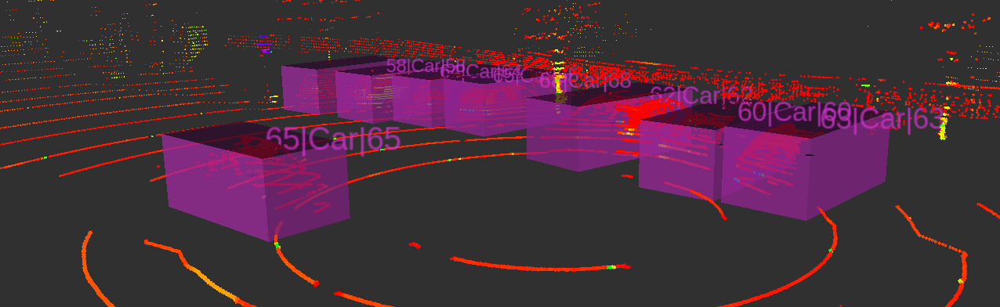
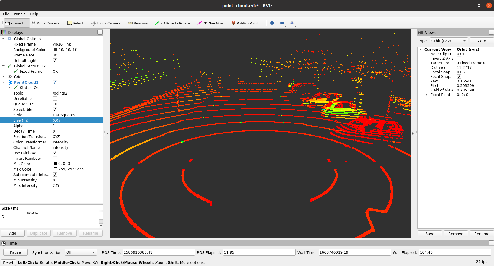
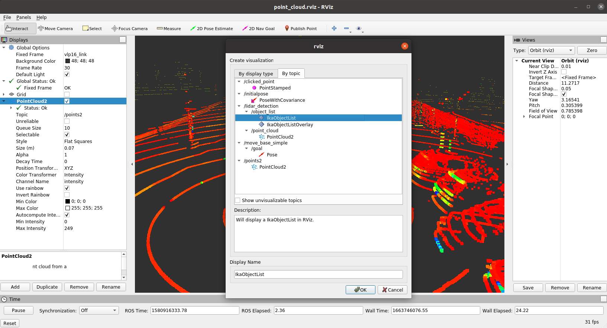
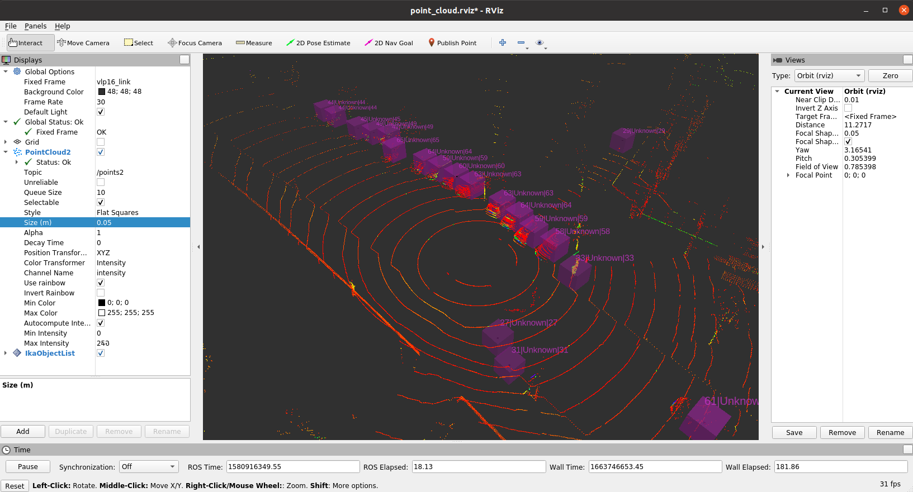
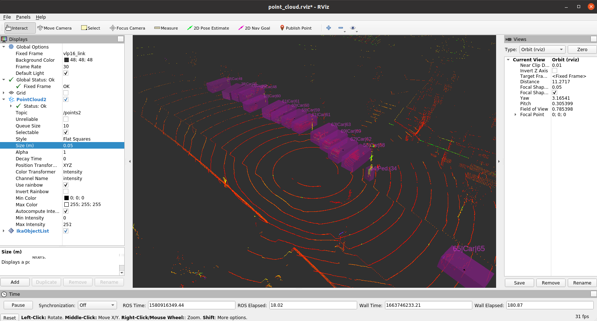

# Object Detection





In this assignment, we will focus on __3D object detection__ for raw LiDAR within ROS. In particular, we consider a recording from our test vehicle which is equipped with a [Velodyne VLP-32C](https://icave2.cse.buffalo.edu/resources/sensor-modeling/VLP32CManual.pdf) and apply a state-of-the art 3D object detection model to predict bounding boxes.

In this exercise you will learn
* how ROS **object definitions** are defined
* to visualize **LiDAR point clouds** within **RViz**
* how to launch a **ROS node** that applies a detection algorithm on the raw sensor data
* to use **RVIZ** to visualize **detected objects**

## Definitions

The ika definitions for the ROS messages and other internal definitions are defined in the package [*definitions*](https://github.com/ika-rwth-aachen/acdc/blob/main/catkin_workspace/src/dependencies/definitions). The ROS message files are located in the subdirectory [definitions/msg](https://github.com/ika-rwth-aachen/acdc/tree/main/catkin_workspace/src/dependencies/definitions/msg) and all other internal definitions can be found in `~/ws/catkin_workspace/src/dependencies/definitions/include/definitions/utility`.

### ika ROS Object Definition 
The files [IkaObject.msg](https://github.com/ika-rwth-aachen/acdc/blob/main/catkin_workspace/src/dependencies/definitions/msg/IkaObject.msg) and [object_definitions.h](https://github.com/ika-rwth-aachen/acdc/blob/main/catkin_workspace/src/dependencies/definitions/include/definitions/utility/object_definitions.h) define the properties of an **3D object**. By the term *object*, we refer to a surround traffic participant which can be assigned to a class (e.g. car, pedestrian, truck) and has an estimated state (e.g. position, velocity, orientation). The ika object definitions distinguish between several classes as shown in the following snipped (excerpt from [object_definitions.h](https://github.com/ika-rwth-aachen/acdc/blob/main/catkin_workspace/src/dependencies/definitions/include/definitions/utility/object_definitions.h#L96)
):

```c++
enum ika_object_types {
  UNCLASSIFIED = 0,
  PEDESTRIAN = 1,
  BICYCLE = 2,
  MOTORBIKE = 3,
  CAR = 4,
  TRUCK = 5,
  VAN = 6,
  BUS = 7,
  ANIMAL = 8,
  ROAD_OBSTACLE = 9,
  TRAILER = 10,
  TYPES_COUNT = 11
};

```
For simplicity, we will focus in this assignment on the classes `CAR`, `PEDESTRIAN`, `TRUCK` and `BIKE`. Note that the [enumeration](https://en.cppreference.com/w/cpp/language/enum) above assigns each type to an unique ID. For example, type `CAR` has ID 4. This association can then be accessed in the code with `definitions::ika_object_types::CAR`.

The following code snippet presents an excerpt from the file [IkaObject.msg](https://github.com/ika-rwth-aachen/acdc/blob/main/catkin_workspace/src/dependencies/definitions/msg/IkaObject.msg). As shown below, each object has a **state vector** which holds current values of the object, such as the **position**, **velocity**, **acceleration** and the **3D bounding box**.

```bash
float32[] fMean               # Statevector, containing attributes depend on chosen motion model
float32[] fCovariance         # Covariance-Matrix, containing attributes depend on chosen motion model
```

As each quantity might be estimated by the AV's sensors and its perception algorithms, which are not perfect, we need to consider uncertainties as well. The **state covariance vector** stores such uncertainties, which are necessary in later processing steps such as the object fusion.

In this assignment we will focus purely on 3D object detection. That means, we will just consider the state vector `fMean`, which basically describe an object's bounding box.

### ika ROS Object Lists Definition 
Sending many single object messages from various sources over the ROS network might be very tedious to handle and organize. Further, sensor's have often a fixed sample rate in which they detect and send several objects. Hence, so called *object lists* are used to handle and send several object messages at once. The [`IkaObjectList.msg`](https://github.com/ika-rwth-aachen/acdc/blob/main/catkin_workspace/src/dependencies/definitions/msg/IkaObjectList.msg) defines such a list. The implementation for the `IkaObjectList` is shown below

```bash
std_msgs/Header header

# List meta information
uint8 IdSource    #see definitions/utility/object_definitions.h for enum of sensors

# Actually objects
IkaObject[] objects
```

As you can see, the message `IkaObjectList` has a field `objects` which is a list (with undefined length) and contains elements of the type `IkaObject`.   

## Measurement Data
We provide real sensor data from our institute's test vehicle which is equipped with a Velodyne VLP-32C. This laser scanner has 32 layers and scans its environment with 10 Hz. The recordings were captured at Campus Melaten in Aachen, Germandy and can be downloaded as follows:

```bash
wget -O lidar_campus_melaten.bag https://rwth-aachen.sciebo.de/s/udlMYloXpCdVtyp/download
```

Alternatively, you can download the bag file for this assignment here [**Link**](https://rwth-aachen.sciebo.de/s/udlMYloXpCdVtyp) (approx. 1.5 GB). 

Save the file to the local directory `${REPOSITORY}/bag` on you host which is mounted to `~/bag` in the docker container. Now, we want to work with the `rosbag` commands inside the container

### Rosbag Inspection
Inspect the bag file with the command `rosbag info`:

```bash
rosuser@:/home/rosuser/bag# rosbag info lidar_campus_melaten.bag 
path:        lidar_campus_melaten.bag 
version:     2.0
duration:    1:59s (119s)
start:       Feb 05 2020 15:25:31.41 (1580916331.41)
end:         Feb 05 2020 15:27:31.37 (1580916451.37)
size:        1.5 GB
messages:    1200
compression: none [1199/1199 chunks]
types:       sensor_msgs/PointCloud2 [1158d486dd51d683ce2f1be655c3c181]
             tf2_msgs/TFMessage      [94810edda583a504dfda3829e70d7eec]
topics:      /points2     1199 msgs    : sensor_msgs/PointCloud2
             /tf_static      1 msg     : tf2_msgs/TFMessage

```
As you can see the bag file contains the topic `/points2` which contains messages of type `sensor_msgs/PointCloud2`. In contrast to the ika ROS message definition, this message type is a standard message which was defined by the ROS community. The message definition can be found [here](http://docs.ros.org/noetic/api/sensor_msgs/html/msg/PointCloud2.html). 

### Rosbag Visualization
Now, we want to visualize the point clouds using RVIZ. 

Instead of starting a `roscore`, `rviz` and `rosbag play`, we suggest to use a launch file to execute all three commands at once. We prepared such a launch file for you here `workshops/section_2/lidar_detection/launch/start_rosbag_play_rviz.launch`:

```xml
<launch>
    <!-- Rosbag -->
    <param name="use_sim_time" value="true"/>
    <node 
        pkg="rosbag"
        type="play"
        args="--clock -l -r 0.5 -d 1 /home/rosuser/bag/lidar_campus_melaten.bag"
        name="player"
        output="screen">
    </node>

    <!-- RViz -->
    <node
        type="rviz"
        name="rviz"
        pkg="rviz"
        args="-d $(find lidar_detection)/rviz/point_cloud.rviz">
    </node>    
</launch>
```

As you can see, `rosbag play` and `rviz` are evoked. The launch file basically bundles all necessary commands to run the nodes with their parameters and executes them simultaneously. Furthermore, `roscore` is called implicitly and it is not necessary to manually execute it.

Since the launch file is in the package `lidar_detection`, you can simply start it with:
```bash
roslaunch lidar detection start_rosbag_play_rviz.launch
```

The RViz window should pop up and you should see something like this



For a better visualization you may alter the display settings. Have a look on tab `PointCloud2`. Here you could increase `Size` to different values. Feel free to play with the settings such as `Style`, `Decay Time` or `Color Transformer`.

#### Recap: Navigation in RVIZ
- Left mouse button: Click and drag to rotate around the Z axis
- Middle mouse button: Click and drag to move the camera along the XY plane
- Right mouse button: Click and drag to zoom the image
- Scrollwheel: Zoom the image

**Congratulations!** We can terminate the previous launch file and focus on the actual lidar detection alorithms in the following.

## Lidar Detection

We already provide a ROS package `lidar_detection` for the detection of 3D objects, where the actual inference of the deep learning model is performed first, before generating the bounding boxes and object lists in a second step. The code is located in `~/ws/catkin_workspace/src/workshops/section_2/lidar_detection`.

```bash
section_2/
└── lidar_detection
    ├── CMakeLists.txt
    ├── include
    │   ├── definitions.h
    │   ├── detector.h
    │   ├── lidar_detection.h
    │   ├── list_creator.h
    │   ├── pillar_utils.h
    ├── launch
    │   ├── static_params.yaml
    │   ├── start_all.launch
    │   ├── start_lidar_detection.launch
    │   └── start_rosbag_play_rviz.launch
    ├── model
    │   ├── lidar_detection.yml
    │   └── FrozenGraphs
    │        └──lidar_detection
    │            └──lidar_detection.pb
    ├── nodelet_plugins.xml
    ├── package.xml
    ├── rviz
    │   └── point_cloud.rviz
    └── src
        ├── definitions.cpp
        ├── detector.cpp
        ├── lidar_detection.cpp
        ├── list_creator.cpp
        └── pillar_utils.cpp
```

Don't be overwhelmed by the amount of code and all the details of this implementation. We do not require you to understand every line of code. As previously mentioned, the 3D Object Detection algorithm is called PointPillars which is based on a Deep Neural Network. We do not explain more details of this model here but we refer interested readers to [https://arxiv.org/abs/1812.05784](https://arxiv.org/abs/1812.05784). 

Now, it's time to launch the `lidar_detection` node. Navigate to `~/ws/catkin_workspace` and build/source your workspace again to ensure that everything is well prepared.
```bash
catkin build
source devel/setup.bash
```

After this you can launch the `lidar_detection` node as well as the previous point cloud visualization. We provide a combined launch file which launches both tasks together.
```bash
roslaunch lidar_detection start_all.launch
```

**Note** that the bag file is being replayed with a rate of `0.1` as the inference of the neural net for object detection is quite time demanding without using a GPU. Depending on the performance of you computer you might increase that factor. 

Now, the `lidar_detection` node should be running and the RVIZ window should have popped up. Let's configure RVIZ to visualize the `ikaObjectLists` messages.

### Visualize Object List

Click on *ADD* --> *By Topic* --> *Select `/lidar_detection/object_list/IkaObjectList`* --> *Ok*



Now, the detections should be visible and you should see something similar to this.




Unfortunately, there's something wrong. The bounding boxes do not fit the objects very well and all objects are classified as `UNKNOWN`, although we can clearly see vehicles and pedestrians in the point clouds. Let's fix this issue in the two upcoming tasks.

## Task 1
As you have seen in the previous task, the output of the object detection has some flaws. We forgot to set the correct size of the object boxes and the heading angle. In this task you will fix that problem and assign the correct values to the `IkaObject` message.

Open the file `list_creator.cpp` and navigate to the following code snipped.
```c++
// set object position
object.fMean[(int)definitions::ca_model::posX] = bounding_box.center(0);
object.fMean[(int)definitions::ca_model::posY] = bounding_box.center(1);

 ...  


// START TASK 1 CODE  

// set object dimensions and fHeading
object.fMean[(int)definitions::ca_model::length] = 2;
object.fMean[(int)definitions::ca_model::width] = 2;
object.fMean[(int)definitions::ca_model::height] = 2;

...
     
// set yaw angle
object.fMean[(int)definitions::ca_model::heading] = 0;

// END TASK 1 CODE 
```

You can see that two different variables are used:
- `object`: Instance of [IkaObject.msg](#ObjectStateDefinition)
- `bounding_box`: Instance of struct `BoundingBoxCenter`. The definition of this struct is given in file `definitions.h`:

```c++
struct BoundingBoxCenter
{
  Eigen::Vector2d center;
  float z;
  float length;
  float width;
  float height;
  float yaw;

  float score;
  int class_idx;
  std::string class_name;
};
``` 
You may have noticed, that position of the object is correctly assigned, but we did not assign the dimensions and heading angle of the object correctly. However, the detection algorithm stores its estimates in `bounding_box`.

Now, fix the problem and assign the quantities of `bounding_box` to `object`. Modify the code just in between the brackets to avoid any problems.

**Note:** After your implementation, you have to rebuild the `lidar_detection` package, before starting everything again:
1. Compile the code: `catkin build`
2. Launch the node: `roslaunch lidar_detection start_all.launch`
3. Reconfigure RVIZ to display the `ikaObjectList`

Note: You may also store the current RVIZ configuration with `File` -> `Save Config` and load the config via the launch file or with `Open Config` in order to avoid the third step.

In case you correctly implemented the code block, you can see that the detected objects are associated with the estimated bounding box dimensions.

## Task 2
In the previous task, you corrected the dimensions and orientation of the bounding box. But the object boxes in RVIZ still do not show a correct classification of the detected objects. All objects are still associated with class `UNKNOWN`. Now, lets tackle this problem:

Inspect the file `detector.cpp` and search for the `TASK 2 CODE` brackets. This snippets calculates the `class_idx` of a bounding box, which should represent the index of the most probable class value, based on all predicted `class_scores`.
```c++
// START TASK 2 CODE

int class_idx = -1;

// END TASK 2 CODE
```
Your task is now to compute the correct value for `class_idx`.

Hints:
- You can use `std::max_element` to find the position of the maximum of an array.
- In this example the position of the maximum can be used as the new `class_idx`.

After your implementation, you have to rebuild the `lidar_detection` package, before starting it again:
1. Compile the code: `catkin build`
2. Launch the node: `roslaunch lidar_detection start_all.launch`
3. Reconfigure RVIZ to display the `ikaObjectList`

Note: You may also store the current RVIZ configuration with `File` -> `Save Config` and load the config via the launch file or with `Open Config` in order to avoid the third step.

In case you correctly implemented the function, you can see that the detected objects are associated with the estimated classes.





**Note**: You will notice that due to the correct class assignment, much less false positive detections occur. This is because the correct score threshold can be applied which improves the overall performance a lot!

## Wrap-up
* You learned the basics about 3D object detection
* You learned about the **IkaObject** and **IkaObjectLists** message definitions
* You learned how to launch a **ROS node**
* You learned to use **RVIZ** to visualize **LiDAR point clouds**
* You learned to use **RVIZ** to visualize **detected objects**