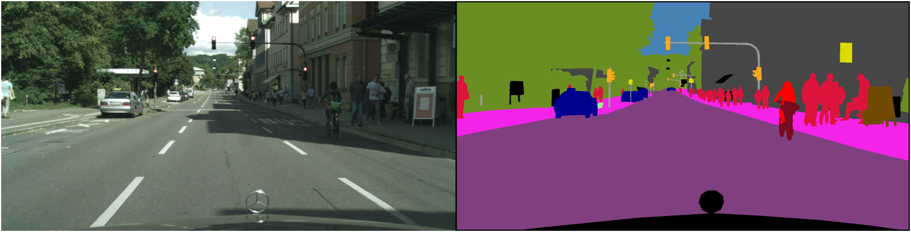
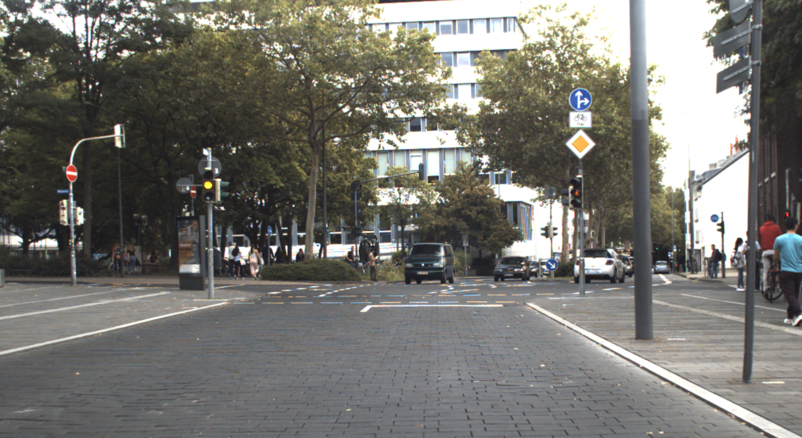
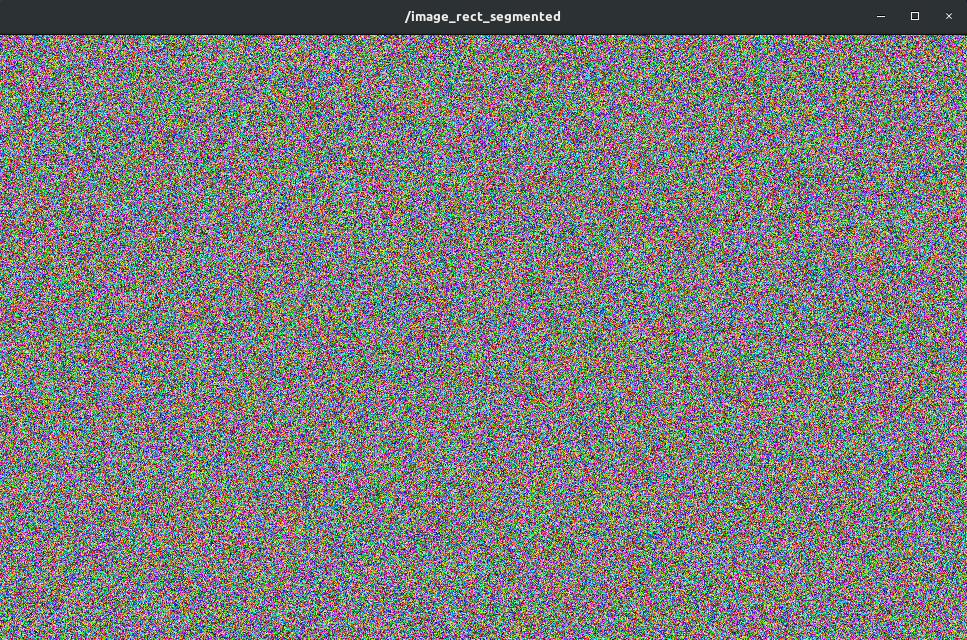
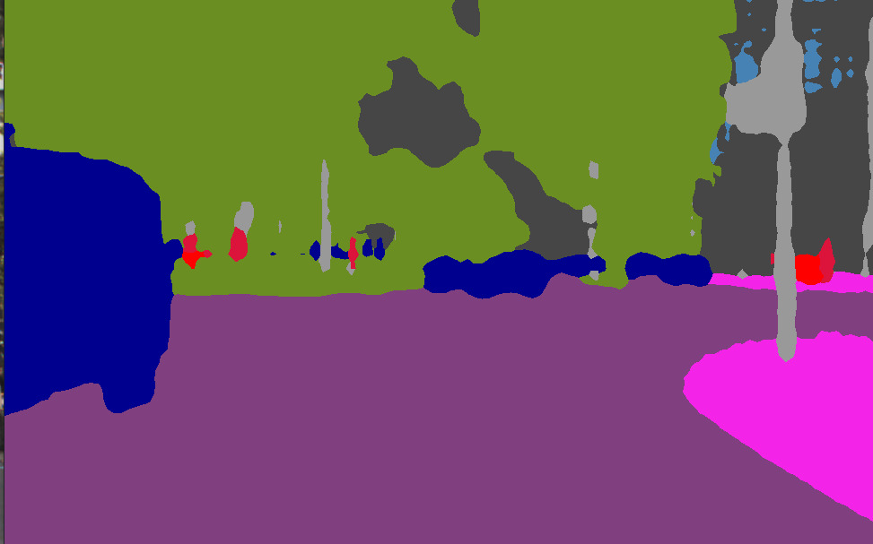

# Semantic Image Segmentation Applied on Camera Images




In this workshop, we will perform __semantic image segmentation__ on raw camera data using a deep learning model. In particular, we will take a recording from our test vehicle which is equipped with a on board camera and we will apply the segmentation model on the sensor data stream.

The learning goals of this workshop are
- Inspect a rosbag which contains camera data
- Learn about ROS2 standard camera and camera info message format
- Learn about a simple Python inference node for semantic image segmentation
- Learn to visualize the output of semantic image segmentation

## Start the Docker Environment

Navigate to the local directory `${REPOSITORY}/docker` and execute `./ros2_run.sh`. This will start the Docker container, in which ROS and all required libraries are preinstalled. You can stop the container by pressing <kbd>Ctrl</kbd>+<kbd>C</kbd> in the terminal. If everything is setup correctly you will see the following:

```
Starting new container...
================================================================================

=== CONTAINER INFORMATION ======================================================
Architecture: x86_64
Ubuntu: 22.04.2 LTS (Jammy Jellyfish)
Python: 3.10.6
ROS: humble
CMake: 3.22.1
CUDA: 12.1.105
cuDNN: 8.9.2
TensorRT: 8.6.1
TensorFlow Python: 2.13.0
TensorFlow C/C++: 
PyTorch Python: 
PyTorch C/C++: 
Available GPUs: 1
  name               driver_version   utilization.gpu [%]   utilization.memory [%]   memory.used [MiB]   memory.total [MiB]
  NVIDIA TITAN RTX   470.182.03       0 %                   2 %                      552 MiB             24217 MiB
===============================================================================

root@******:/home/rosuser/ws/colcon_workspace# 
```

The `acdc` folder is mounted from your host into the container. Note that your current working directory inside the container is `/home/rosuser/ws/colcon_workspace`.


## Download and Inspect Bag file

Download the rosbag `left_camera_templergraben.db3` from [__here (1.2 GB)__](https://rwth-aachen.sciebo.de/s/QxGbpvIQF4Mk8Uo).

Save this file to your local directory `${REPOSITORY}/bag`. This directory will be mounted into the docker container to the path `/home/rosuser/ws/bag`.

You can start the docker container now with `./ros2_run.sh` (if you haven't already).

Inside the container, you can navigate to `/home/rosuser/ws/bag` and execute `ros2 bag info left_camera_templergraben.db3` to inspect the rosbag:

```
~/bag$ ros2 bag info lef_camera_templegraben
Files:             left_camera_templergraben.db3
Bag size:          1.2 GiB
Storage id:        sqlite3
Duration:          17.999s
Start:             Aug  9 2019 10:59:01.823 (1565341141.823)
End:               Aug  9 2019 10:59:19.823 (1565341159.823)
Messages:          2881
Topic information: 
    Topic: /tf | Type: tf2_msgs/msg/TFMessage | Count: 1801 | Serialization Format: cdr
    Topic: /sensors/camera/left/camera_info | 
    Type: sensor_msgs/msg/CameraInfo | Count: 540 | Serialization 
    Format: cdr
    Topic: /sensors/camera/left/image_raw | 
    Type: sensor_msgs/msg/Image | Count: 540 |  Serialization 
    Format: cdr
```

You can see that the rosbag has a duration of 18 seconds and contains 540 image frames of type `sensor_msgs/Image` and 540 corresponding `sensor_msgs/CameraInfo` messages. We will use these camera images in this assignment in order to apply image segmentation.

## ROS2's `sensor_msgs/msg/Image` Message

The message definition [sensor_msgs/msg/Image](https://docs.ros2.org/latest/api/sensor_msgs/msg/Image.html) is ROS2's standard image message format. It is used for all kind of camera image message types and can be used seamlessly with many different ROS2 visualization and image processing tools. Please read the documentation about the [detailed message format](https://docs.ros2.org/latest/api/sensor_msgs/msg/Image.html) and it's content.
Message
## ROS2's `sensor_msgs/msg/CameraInfo` Message

The message definition [sensor_msgs/msg/CameraInfo](hhttps://docs.ros2.org/latest/api/sensor_msgs/msg/CameraInfo.html) is ROS2's standard camera info message format. It is send together with `sensor_msgs/msg/Image` to provide additional information about the current camera image such as __camera calibration parameters__. Feel free to read the documentation about the [detailed message format](https://docs.ros2.org/latest/api/sensor_msgs/msg/CameraInfo.html).

## Build and source the package
The code for the image segmentation inference node can be found in the directory `colcon_workspace/src/section_2/image_segmentation_r2`. The structure of this __Python package__ is illustrated in the following:

```
image_segmentation_r2/
├── package.xml
├── setup.cfg
│   └── params.yaml
├── image_segmentation_r2
│   ├── image_segmentation.py
│   ├── img_utils.py
│   └── __init__.py
├── launch
│   └── image_segmentation_r2.launch.py
├── models
│   ├── convert_cityscapes_to_ika_reduced.xml
│   ├── mobilenet_v3_large_968_608_os8.pb
│   └── mobilenet_v3_small_968_608_os8.pb
├── resource
└── test
```

The main source code is located in the directory `image_segmentation_r2`, the pretrained segmentation models are located in `models` and the launch file are located in directory `launch`and parameters are located in `config`. Feel free to read all the code, parameters and launch files.

Note, that we provide here two image segmentation models for you. Both rely on the MobilnetV3 architecture:  
- `mobilenet_v3_large_968_608_os8.pb`: Larger model, slower inference, more RAM needed
- `mobilenet_v3_small_968_608_os8.pb`: Smaller model, faster inference, less RAM needed

These models are trained on a much larger dataset compared to the model you have trained in the exercise, but the overall training pipeline and additional augmentation methods applied during the training are almost identical. 

You might change the model in the `params.yaml` configuration file depending on the capabilities of your computer.

Now, let's build the package with with `colcon build`
```bash
colcon build --packages-select image_segmentation_r2 --symlink-install
```

and source the workspace

```bash
source install/setup.bash
```
Perfect! Now you will be able to perform inference on camera images with this package. Let's go to the next section.

## Replay rosbag and run image segmentation

We have already prepared a launch file for you to execute the image segmentation. Please read carefully through the following lines of code. 

Contents of the file `image_segmentation_r2.launch.py`:

```py
import os

from ament_index_python.packages import get_package_share_directory
from launch import LaunchDescription
from launch.actions import DeclareLaunchArgument
from launch_ros.actions import Node
from launch.actions import ExecuteProcess

def generate_launch_description():

    # Get the package and params directory
    image_segmentation_dir = get_package_share_directory('image_segmentation_r2')
    config = os.path.join(image_segmentation_dir, "config","params.yaml")

    # Declare launch arguments
    use_sim_time = DeclareLaunchArgument(
        'use_sim_time',
        default_value='true',
        description='Use simulation clock time')

    # ROSBAG PLAY node
    rosbag_play_node = ExecuteProcess(
        cmd=['ros2', 'bag', 'play', '--rate', '0.05', '-l',
             '/home/rosuser/ws/bag/left_camera_templergraben',
             '--topics', '/sensors/camera/left/image_raw',
             '/sensors/camera/left/camera_info'],
        output='screen'
    )

    # IMAGE_PROC node
    image_proc_node = Node(
        package='image_proc',
        name='image_proc',
        executable='image_proc',
        namespace='sensors/camera/left',
        output='screen',
        remappings=[
            ('image', 'image_raw'),
        ],
    )
        # CAMERA SEGMENTATION NODE
    camera_segmentation_node = Node(
        package='image_segmentation_r2',
        name='image_segmentation',
        executable='image_segmentation',
        output='screen',
        parameters=[config],
        remappings=[
            ('image_color', 'sensors/camera/left/image_color')
        ]
    )

        # NODES FOR VISUALIZATION
    segmentation_viewer_node = Node(
        package='image_view',
        executable='image_view',
        name='segmentatibashon_viewer',
        remappings=[
            ('image', 'image_segmented'),ros2 launch image_segmentation_py start_all.launch
        ],
    )

    camera_node = Node(
        package='image_view',
        executable='image_view',
        name='camera_viewer',
        remappings=[
            ('image', 'sensors/camera/left/image_color'),
        ],
        parameters=[
                {'autosize': True},
        ]
    )

    # Create the launch description and populate
    ld = LaunchDescription()

    # Add the actions to the launch description
    ld.add_action(use_sim_time)
    ld.add_action(rosbag_play_node)
    ld.add_action(image_proc_node)
    ld.add_action(camera_node)
    ld.add_action(camera_segmentation_node)
    ld.add_action(segmentation_viewer_node)

    return ld
```

Hence, we perform the following tasks:

- __Replay the rosbag__ with a speed of 0.05. Note, that we set the speed to a very low value here, because your computer might be very slow. You can adapt this values if your computer is fast enough to compute the segmentation at a higher speed.
- __Apply `image_proc`__ to the raw sensor data. The topic `/sensors/camera/left/image_raw` was recorded in the raw data format. With `image_proc` we convert it to a RGB encoding. Read more [here](https://wiki.ros.org/image_proc) about it.
- __Start the `image_segmentation`__ node and feed it with the correct topic name and load the parameters that are necessary for the node.
- Start two __nodes for visualization__

Note: You can also use RVIZ to visualize the RGB camera image and the segmented camera image.


We can now start the launch file with:

```bash
ros2 launch image_segmentation_r2 image_segmentation_r2.launch.py 
```

The `image_view` node should show you directly the camera image as shown in this image:




However, the segmented image looks like this 



Something is wrong. We have apparently a bug in the code !!! Let's solve this problem.

## Review of file image_segmentation.py
Before we start with the task, let's try to understand what happens in the file [`image_segmentation.py`](https://github.com/ika-rwth-aachen/acdc/blob/main/colcon_workspace/src/section_2/image_segmentation_r2/image_segmentation_r2/image_segmentation.py).

The file `image_segmentation.py` contains the inference node for the image segmentation task. The inference node is implemented as a Python class called `ImageSegmentation`. The class has the following member functions. We will give here a short description of each class so you can understand what each class is doing.

- __class ImageSegmentation__

    *Class which implements image segmentation inference applied on images send as ROS2 MSG of type `sensor_msgs/msg/Image`*

    - __`__init__(self)`__

    *Initializes the class by initializing it with a ROS Node. Calls
 `setup()` and `load_parameters()` to load the model and necessary parameters.*

    - __load_parameters(self)__

    *Loads the ROS params and stores them into the current instance of ImageSegmentation*

    - __setup(self)__

    *Loads the image segmentation model which are stored in the directory `models`. Also creates a `cv_bridge` which allows to convert `sensor_msgs/msg/Image` into an image which can be processed by the neural network. Also registers subscribers and publishers.*

    - __predict(self, img_color_msg)__


    *This is the so called callback function. This function is triggered, when the subscriber `self.sub_image` receives a message on topic `"/image_color"`. This function performs the actual inference of the neural network. It converts the `sensor_msgs/msg/Image` message into a format that can be processed by the neural network, then performs the inference and then converts the output, a segmentation maps, into a RGB encoding which is then send as an image using publisher `self.pub_seg`*


    - __load_frozen_graph(path_to_frozen_graph)__

    *Takes the path to one of the models stored in the directory `models` and converts the frozen graph into an executable Python function. Uses helper function `wrap_frozen_graph()`*

    - __wrap_frozen_graph(graph_def, inputs, outputs, print_graph=False)__

    *Helper function that converts a frozen graph, which is a type how a neural network can be stored using Tensorflow, into an executable Python function*

    - __segmentation_map_to_rgb(segmentation_map)__

    *A function which converts a segmentation map into RGB encoded image*

    - __parse_convert_xml(conversion_file_path)__

    *Reads a xml file which is located in `models` and which contains information which class ID is associated with which RGB value and vice versa. It processes the xml file in such a way that it can be used to convert a segmentation map in to an RGB encoded image.*


## Task 1: Implement conversion from segmentation map to RGB encoding 
Unfortunately, the function `segmentation_map_to_rgb()` in the file [`image_segmentation.py`](https://github.com/ika-rwth-aachen/acdc/blob/main/catkin_workspace/src/workshops/section_2/image_segmentation_py/src/image_segmentation.py) wasn't implemented correctly. Open this file with your favorite code editor and let's have a look on this function.

```python
def segmentation_map_to_rgb(self, segmentation_map):
    """
    Converts segmentation map to a RGB encoding according to self.color_palette
    Eg. 0 (Class 0) -> Pixel value [128, 64, 128] which is on index 0 of self.color_palette
        1 (Class 1) -> Pixel value [244, 35, 232] which is on index 1 of self.color_palette

    self.color_palette has shape [256, 3]. Each index of the first dimension is associated
    with an RGB value. The index corresponds to the class ID.

    :param segmentation_map: ndarray numpy with shape (height, width)
    :return: RGB encoding with shape (height, width, 3)
    """
    ### START CODE HERE ###
    
    # Replace the following command
    rgb_encoding = np.random.randint(
        low=0,
        high=255,
        size=[self.resize_height, self.resize_width, 3]
    )

    ### END CODE HERE ###
    return rgb_encoding
```

Instead of computing the RGB encoding from the segmentation map, the function generates only a random image. __Your task__ is now to implement the function correctly.  Note that `self.color_palette` is here not a function parameter but a class attribute of the class `ImageSegmentation`. 

__Hints__
* There are several approaches how to convert from segmentation map to the color encoding
* __Loop approach:__ Iterate over all class IDs in segmentation map and retrieve the corresponding RGB value for each class and place this triplet (R,G,B) at the correct location of the returned RGB image.
* __Advanced vectorized approach:__ Should be the faster and more efficient implementation. Avoid using a loop, but rather rely on numpy's vectorized indexing operations!


### Expected output
After fixing the function `segmentation_map_to_rgb()`, you will see that the inference node now will publish correct RGB encoded segmentations of the camera image. You will obtain segmented images as shown here: 



## Wrap-up
- You learned about the ROS2 definitions for camera images and camera info messages
- You learned about a simple Python ROS2 package for semantic image segmentation
- You learned about encoding the segmentation map to the RGB encoding
- You learned about `image_view`, a node for visualizing image data

## ROS1 Instructions


#### Perform Deep Learning based semantic image segmentation applied on camera images

In this workshop, we will perform __semantic image segmentation__ on raw camera data using a deep learning model. In particular, we will take a recording from our test vehicle which is equipped with a on board camera and we will apply the segmentation model on the sensor data stream.

The learning goals of this workshop are
- Inspect a rosbag which contains camera data
- Learn about ROS' standard camera and camera info message format
- Learn about a simple Python inference node for semantic image segmentation
- Learn to visualize the output of semantic image segmentation

### Start the Docker Environment

Navigate to the local directory `${REPOSITORY}/docker` and execute `./ros1_run.sh`. This will start the Docker container, in which ROS and all required libraries are preinstalled. You can stop the container by pressing <kbd>Ctrl</kbd>+<kbd>C</kbd> in the terminal. If everything is setup correctly you will see the following:

```
Starting container ...
Starting container in mode: gpu
non-network local connections being added to access control list
Container setup:
- Ubuntu: 20.04.2 LTS (Focal Fossa) (user: rosuser, password: rosuser)
- CUDA: Cuda compilation tools, release 11.2, V11.2.152
- cuDNN: 8.1.0
- TensorRT: 8.0.3
- TensorFlow Python3: 2.6.0 (GPUs available: 1)
- TensorFlow C/C++: 2.6
- ROS: noetic
- CMake: cmake version 3.12.3

Template Commands:
- Create new ROS package:            ros-add-package
  - Add node to package:               ros-add-node
  - Add nodelet to package:            ros-add-nodelet
- Initialize ROS GitLab repository:  ros-init-repo


The container is running. Execute the run script again from another terminal to open a shell in the container or press `CTRL-C` to stop the container.
```

From another terminal, execute `./ros1_run.sh` again to open a shell in the running container. You should see this:

```
Attaching to running container ...
===================================================================
= ROS Docker Container                                            =
===================================================================

This is the image.
rosuser@******:~/ws/catkin_workspace$
```

The `acdc` folder is mounted from your host into the container. Note that your current working directory inside the container is `/home/rosuser/ws/catkin_workspace`.

## Download and Inspect Bag file

Download the file `left_camera_templergraben.bag` from [__here (1.2 GB)__](https://rwth-aachen.sciebo.de/s/sbSBamXYCfQw9kM).

Save this file to your local directory `${REPOSITORY}/bag`. This directory will be mounted into the docker container to the path `/home/rosuser/ws/bag`.

You can start the docker container now with `./ros1_run.sh` (if you haven't already).


Inside the container, you can navigate to `/home/rosuser/ws/bag` and execute `rosbag info left_camera_templergraben.bag` to inspect the rosbag:

```
rosuser@i2000033:~/ws/bag$ rosbag info left_camera_templergraben.bag 
path:        left_camera_templergraben.bag
version:     2.0
duration:    18.0s
start:       Aug 09 2019 10:59:01.82 (1565341141.82)
end:         Aug 09 2019 10:59:19.82 (1565341159.82)
size:        1.2 GB
messages:    2881
compression: none [541/541 chunks]
types:       sensor_msgs/CameraInfo [c9a58c1b0b154e0e6da7578cb991d214]
             sensor_msgs/Image      [060021388200f6f0f447d0fcd9c64743]
             tf2_msgs/TFMessage     [94810edda583a504dfda3829e70d7eec]
topics:      /sensors/camera/left/camera_info    540 msgs    : sensor_msgs/CameraInfo
             /sensors/camera/left/image_raw      540 msgs    : sensor_msgs/Image     
             /tf                                1801 msgs    : tf2_msgs/TFMessage

```

You can see that the rosbag has a duration of 18 seconds and contains 540 image frames of type `sensor_msgs/Image` and 540 corresponding `sensor_msgs/CameraInfo` messages. We will use these camera images in this assignment in order to apply image segmentation.

## ROS' `sensor_msgs/Image` Message

The message definition [sensor_msgs/Image](https://docs.ros.org/en/melodic/api/sensor_msgs/html/msg/Image.html) is ROS' standard image message format. It is used for all kind of camera image message types and can be used seamlessly with many different ROS visualization and image processing tools. Please read the documentation about the [detailed message format](https://docs.ros.org/en/melodic/api/sensor_msgs/html/msg/Image.html) and it's content.


## ROS' `sensor_msgs/CameraInfo`

The message definition [sensor_msgs/CameraInfo](https://docs.ros.org/en/melodic/api/sensor_msgs/html/msg/CameraInfo.html) is ROS' standard camera info message format. It is send together with `sensor_msgs/Image` to provide additional information about the current camera image such as __camera calibration parameters__. Feel free to read the documentation about the [detailed message format](https://docs.ros.org/en/melodic/api/sensor_msgs/html/msg/CameraInfo.html).


## Build and source the package
The code for the image segmentation inference node can be found in the directory `workshops/section_2/image_segmentation_py`. The structure of this __Python package__ is illustrated in the following:

```
image_segmentation_py/
├── package.xml
├── CMakeLists.txt
├── launch
│   ├── params.yaml
│   └── start_all.launch
├── models
│   ├── convert_cityscapes_to_ika_reduced.xml
│   ├── mobilenet_v3_large_968_608_os8.pb
│   └── mobilenet_v3_small_968_608_os8.pb
└── src
    ├── image_segmentation.py
    ├── img_utils.py
```

The main source code is located in the directory `src`, the pretrained segmentation models are located in `models` and the launch file and parameters are located in directory `launch`. Feel free to read all the code, parameters and launch files.

Note, that we provide here two image segmentation models for you. Both rely on the MobilnetV3 architecture:  
- `mobilenet_v3_large_968_608_os8.pb`: Larger model, slower inference, more RAM needed
- `mobilenet_v3_small_968_608_os8.pb`: Smaller model, faster inference, less RAM needed

These models are trained on a much larger dataset compared to the model you have trained in the exercise, but the overall training pipeline and additional augmentation methods applied during the training are almost identical. 

You might change the model in the `params.yaml` configuration file depending on the capabilities of your computer.

Now, let's build the package with with `catkin build`
```bash
catkin build image_segmentation_py
```

and source the workspace

```bash
source devel/setup.bash
```
Perfect! Now you will be able to perform inference on camera images with this package. Let's go to the next section.

## Replay rosbag and run image segmentation

We have already prepared a launch file for you to execute the image segmentation. Please read carefully through the following lines of code. 

Contents of the file `start_all.launch`:
```xml
<launch>
    <param name ="/use_sim_time" value="true"/>
    
    <!-- ROSBAG PLAY -->
    <node pkg="rosbag" 
          type="play"
          name="player"
          output="screen"
          args="--rate 0.05 -s 0 --clock /home/rosuser/bag/left_camera_templergraben.bag
                --topics /sensors/camera/left/image_raw
                         /sensors/camera/left/camera_info">
    </node>

    <!-- STEREO IMAGE PROC -->
    <node name="stereo_image_proc"
          pkg="stereo_image_proc"
          type="stereo_image_proc"
          ns="sensors/camera/"
          output="screen">
    </node>


    <!--- CAMERA SEGMENTATION NODE -->
    <rosparam
      command="load"
      file="$(find image_segmentation_py)/launch/params.yaml"
    />

    <node
        name="image_segmentation"
        pkg="image_segmentation_py"
        type="image_segmentation.py"
        output="screen">
        <remap from="/image_rect_color" to="/sensors/camera/left/image_rect_color"/>
    </node>


    <!--- NODES FOR VISUALIZATION -->
    <node pkg="image_view"
          type="image_view"
          name="segmentation_viewer"
          args="image:=/image_rect_segmented">
    </node>

    <node pkg="image_view"
          type="image_view"
          name="camera_left"
          args="image:=/sensors/camera/left/image_rect_color">
    </node>
</launch>
```

Hence, we perform the following tasks:

- __Replay the rosbag__ with a speed of 0.05. Note, that we set the speed to a very low value here, because your computer might be very slow. You can adapt this values if your computer is fast enough to compute the segmentation at a higher speed.
- __Apply `stereo_image_proc`__ to the raw sensor data. The topic `/sensors/camera/left/image_raw` was recorded in the raw data format. With `stereo_image_proc` we convert it to a RGB encoding. Read more [here](https://wiki.ros.org/stereo_image_proc) about it.
- __Load the parameters__ that are necessary for the `image_segmentation_py` node
- __Start the `image_segmentation_py`__ node and feed it with the correct topic name
- Start two __nodes for visualization__

Note: You can also use RVIZ to visualize the RGB camera image and the segmented camera image.


We can now start the launch file with:

```bash
roslaunch image_segmentation_py start_all.launch
```

The `image_view` node should show you directly the camera image as shown in this image:


However, the segmented image looks like this 


Something is wrong. We have apparently a bug in the code !!! Let's solve this problem.

## Review of file image_segmentation.py
Before we start with the task, let's try to understand what happens in the file [`image_segmentation.py`](https://github.com/ika-rwth-aachen/acdc/blob/main/catkin_workspace/src/workshops/section_2/image_segmentation_py/src/image_segmentation.py).

The file `image_segmentation.py` contains the inference node for the image segmentation task. The inference node is implemented as a Python class called `ImageSegmentation`. The class has the following member functions. We will give here a short description of each class so you can understand what each class is doing.

- __class ImageSegmentation__

    *Class which implements image segmentation inference applied on images send as ROS MSG of type `sensor_msgs/Image`*

    - __`__init__(self)`__

    *Initializes the class by initializing it with a ROS Node. Calls `setup()` and `load_parameters()` to load the model and necessary parameters.*

    - __load_parameters(self)__

    *Loads the ROS params and stores them into the current instance of ImageSegmentation*

    - __setup(self)__

    *Loads the image segmentation model which are stored in the directory `models`. Also creates a `cv_bridge` which allows to convert `sensor_msgs/Image` into an image which can be processed by the neural network. Also registers subscribers and publishers.*

    - __predict(self, img_rect_color_msg)__


    *This is the so called callback function. This function is triggered, when the subscriber `self.sub_image` receives a message on topic `"/image_rect_color"`. This function performs the actual inference of the neural network. It converts the `sensor_msgs/Image` message into a format that can be processed by the neural network, then performs the inference and then converts the output, a segmentation maps, into a RGB encoding which is then send as an image using publisher `self.pub_seg`*


    - __load_frozen_graph(path_to_frozen_graph)__

    *Takes the path to one of the models stored in the directory `models` and converts the frozen graph into an executable Python function. Uses helper function `wrap_frozen_graph()`*

    - __wrap_frozen_graph(graph_def, inputs, outputs, print_graph=False)__

    *Helper function that converts a frozen graph, which is a type how a neural network can be stored using Tensorflow, into an executable Python function*

    - __segmentation_map_to_rgb(segmentation_map)__

    *A function which converts a segmentation map into RGB encoded image*

    - __parse_convert_xml(conversion_file_path)__

    *Reads a xml file which is located in `models` and which contains information which class ID is associated with which RGB value and vice versa. It processes the xml file in such a way that it can be used to convert a segmentation map in to an RGB encoded image.*


## Task 1: Implement conversion from segmentation map to RGB encoding 

Unfortunately, the function `segmentation_map_to_rgb()` in the file [`image_segmentation.py`](https://github.com/ika-rwth-aachen/acdc/blob/main/catkin_workspace/src/workshops/section_2/image_segmentation_py/src/image_segmentation.py) wasn't implemented correctly. Open this file with your favorite code editor and let's have a look on this function.

```python
def segmentation_map_to_rgb(self, segmentation_map):
    """
    Converts segmentation map to a RGB encoding according to self.color_palette
    Eg. 0 (Class 0) -> Pixel value [128, 64, 128] which is on index 0 of self.color_palette
        1 (Class 1) -> Pixel value [244, 35, 232] which is on index 1 of self.color_palette

    self.color_palette has shape [256, 3]. Each index of the first dimension is associated
    with an RGB value. The index corresponds to the class ID.

    :param segmentation_map: ndarray numpy with shape (height, width)
    :return: RGB encoding with shape (height, width, 3)
    """
    ### START CODE HERE ###
    
    # Replace the following command
    rgb_encoding = np.random.randint(
        low=0,
        high=255,
        size=[self.resize_height, self.resize_width, 3]
    )

    ### END CODE HERE ###
    return rgb_encoding
```

Instead of computing the RGB encoding from the segmentation map, the function generates only a random image. __Your task__ is now to implement the function correctly.  Note that `self.color_palette` is here not a function parameter but a class attribute of the class `ImageSegmentation`. 

__Hints__
* There are several approaches how to convert from segmentation map to the color encoding
* __Loop approach:__ Iterate over all class IDs in segmentation map and retrieve the corresponding RGB value for each class and place this triplet (R,G,B) at the correct location of the returned RGB image.
* __Advanced vectorized approach:__ Should be the faster and more efficient implementation. Avoid using a loop, but rather rely on numpy's vectorized indexing operations!

#### Expected output

After fixing the function `segmentation_map_to_rgb()`, you will see that the inference node now will publish correct RGB encoded segmentations of the camera image. You will obtain segmented images as shown here: 


## Wrap-up

- You learned about the ROS definitions for camera images and camera info messages
- You learned about a simple Python ROS package for semantic image segmentation
- You learned about encoding the segmentation map to the RGB encoding
- You learned about `image_view`, a node for visualizing image data
