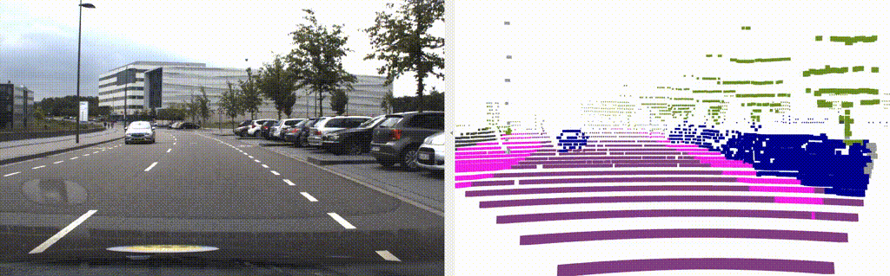

# Perform Deep Learning Based Semantic Point Cloud Segmentation




In this workshop, we will perform __semantic point cloud segmentation__ on raw LiDAR data using the deep learning model from the notebooks. In particular, we will take a recording from our test vehicle which is equipped with a Velodyne VLP-32C and we will apply our detection model on the raw sensor data.


The  learning goals of this workshop are
- Inspect a rosbag which contains point cloud data
- Learn about ROS2' standard point cloud message definition `points2`
- Learn about a simple Python inference node for semantic point cloud segmentation
- Implement a ROS2 publisher which publishes the segmented point cloud

## Start the Docker Environment

Navigate to the local directory `${REPOSITORY}/docker` and execute `./ros2_run.sh`. This will start the Docker container, in which ROS and all required libraries are preinstalled. You can stop the container by pressing <kbd>Ctrl</kbd>+<kbd>C</kbd> in the terminal. If everything is setup correctly you will see the following:

```
Starting new container...
================================================================================

=== CONTAINER INFORMATION ======================================================
Architecture: x86_64
Ubuntu: 22.04.2 LTS (Jammy Jellyfish)
Python: 3.10.6
ROS: humble
CMake: 3.22.1
CUDA: 12.1.105
cuDNN: 8.9.2
TensorRT: 8.6.1
TensorFlow Python: 2.13.0
TensorFlow C/C++: 
PyTorch Python: 
PyTorch C/C++: 
Available GPUs: 1
  name               driver_version   utilization.gpu [%]   utilization.memory [%]   memory.used [MiB]   memory.total [MiB]
  NVIDIA TITAN RTX   470.182.03       0 %                   2 %                      552 MiB             24217 MiB
===============================================================================

root@******:/home/rosuser/ws/colcon_workspace# 
```

The `acdc` folder is mounted from your host into the container. Note that your current working directory inside the container is `/home/rosuser/ws/colcon_workspace`.

## Download and inspect bag file
Download the file `lidar_campus_melaten.db3` from [here (1.5 GB)](https://rwth-aachen.sciebo.de/s/YALin3OaIdRjmhQ). 

Save this file to your local directory `${REPOSITORY}/bag`. This directory will be mounted into the docker container to the path `/home/rosuser/ws/bag`.

You can start the docker container now with `./ros2_run.sh` (if you haven't already).


Inside the container, you can navigate to `/home/rosuser/ws/bag` and execute `ros2 bag info lidar_campus_melaten.db3` to inspect the rosbag:
```
~/bag$ ros2 bag info lidar_campus_melaten.db3
Files:             lidar_campus_melaten.db3
Bag size:          1.5 GiB
Storage id:        sqlite3
Duration:          119.955s
Start:             Feb  5 2020 16:25:31.409 (1580916331.409)
End:               Feb  5 2020 16:27:31.365 (1580916451.365)
Messages:          1200
Topic information: 
    Topic: /points2 | Type: sensor_msgs/msg/PointCloud2 | Count: 1199 | 
    Serialization Format: cdr
    Topic: /tf_static | Type: tf2_msgs/msg/TFMessage | Count: 1 | 
    Serialization Format: cdr

```
You can see that the rosbag has a duration of 1 minute and 59 seconds and contains 1199 frames of type `sensor_msgs/PointCloud2`. We will use these point cloud data in this assignment in order to apply semantic point cloud segmentation.


## ROS2's `sensor_msgs/msg/PointCloud2` Message
The message definition [sensor_msgs/PointCloud2](https://docs.ros2.org/foxy/api/sensor_msgs/msg/PointCloud2.html) is ROS' standard point cloud message format. 
Each message contains a collection of XYZ points, which may also contain additional information such as timestamp, intensity or ring number. Feel free to read the documentation of [sensor_msgs/msg/PointCloud2](https://docs.ros2.org/foxy/api/sensor_msgs/msg/PointCloud2.html) to learn more details about it. 


## Build and source the package
The code for the image segmentation inference node can be found in the directory `src/section_2/pointcloud_segmentation_r2`. The structure of this __Python package__ is illustrated in the following:


```
pointcloud_segmentation_r2/
├── package.xml
├── setup.cfg
├── setup.py
├── config
    └── params.yaml
├── assets
│   ├── image1.png
│   ├── image2.png
│   ├── video1.gif
│   └── video2.gif
├── launch
│   └── start_all.launch
├── models
│   ├── class_id_to_rgb.xml
│   └── miou62_squeezeseg
│       ├── saved_model.pb
        ├── keras_metadata.pb
│       └── variables
│           ├── variables.data-00000-of-00001
│           └── variables.index
└── pointcloud_segmentation_r2
│   |── pointcloud_segmentation.py
|   └── __init__.py
├── resource
└── test    
```
The inference node source code is located in `pointcloud_segmentation_r2/pointcloud_segmentation.py`. The pretrained model is located in the directory `models`. The launch file and parameters are located in directory `launch`. The conversion between RGB encoding and class IDs are defined in `class_id_to_rgb.xml`. Feel free to read all the code, parameters and launch files to get a in-depth understanding how this inference node is working.

Note that the provided point cloud segmentation model is quite similar to the one you have trained in the assignment, but it was trained on a much larger dataset consisting of 40000 training samples.

Now, let's build the package with with `colcon build`
```bash
colcon build --packages-select pointcloud_segmentation_r2 --symlink-install
```

and source the workspace

```bash
source install/setup.bash
```

Perfect! Now you will be able to perform inference on point cloud data with this package. Let's go to the next section.

# Replay rosbag and run pointcloud segmentation

We have already prepared a launch file for you to execute the image segmentation. Please read carefully through the following lines of code. 

Contents of the file `image_segmentation_r2.launch.py`:

```py
import os

from ament_index_python.packages import get_package_share_directory
from launch import LaunchDescription
from launch.actions import DeclareLaunchArgument
from launch_ros.actions import Node
from launch.actions import ExecuteProcess

def generate_launch_description():

    # Get the package and params directory
    image_segmentation_dir = get_package_share_directory('pointcloud_segmentation_r2')
    config = os.path.join(image_segmentation_dir, "config","params.yaml")
    
    # Declare launch arguments
    use_sim_time = DeclareLaunchArgument(
        'use_sim_time',
        default_value='true',
        description='Use simulation clock time')
        
    # ROSBAG PLAY node
    rosbag_play_node = ExecuteProcess(
        cmd=['ros2', 'bag', 'play','--rate', '0.75', '-l',
             '/home/rosuser/bag/lidar_campus_melaten',
        ],
        output='screen'
    )
        # CAMERA SEGMENTATION NODE
    pointcloud_segmentation_node = Node(
        package='pointcloud_segmentation_r2',
        name='pointcloud_segmentation',
        executable='pointcloud_segmentation',
        output='screen',
        parameters=[config]
    )

    # Create the launch description and populate
    ld = LaunchDescription()

    # Add the actions to the launch description
    ld.add_action(use_sim_time)
    ld.add_action(rosbag_play_node)
    ld.add_action(pointcloud_segmentation_node)

    return ld

```

This launch file will start the following tasks:
- __Replay the rosbag__ with a speed of 0.75. Feel free to adjust this replay speed depending on the performance of your hardware.
- __Start the `pointcloud_segmentation_py`__ node with the parameters__ that are necessary for the `pointcloud_segmentation_py` node.
Note, that `params.yaml` contains the parameter
```yml
do_visualizations: True
```
which will enable an internal visualization of the segmented point cloud. You can also set this value to `False` and visualize the point cloud with RVIZ.


We can now start the launch file with:
```bash
ros2 launch pointcloud_segmentation_r2 pointcloud_segmentation_r2.launch.py 
```

You should see now the model's prediction as shown in the image below. 


## Review of file pointcloud_segmentation.py
Before we start with the programming exercise, lets get an overview about the point cloud segmentation node [`pointcloud_segmentation.py`](https://github.com/ika-rwth-aachen/acdc/blob/main/colcon_workspace/src/section_2/pointcloud_segmentation_r2/image_segmentation_r2/image_segmentation.py).Note, the segmentation node is quite complex and we do not require you to implement any in-depth function. We would like to encourage you to read the code and try to understand what each function is doing. To help you we have generated a little summary about the structure of the inference node.


The inference node is implemented as a Python class called `PCLSegmentation`. The class has the following member functions. We will give here a short description of each class so you can understand what each class is doing.

- __class PCLSegmentation__

    *Class which implements the point cloud segmentation task. Listens on a topic of type `PointCloud2` converts the point cloud to a 2D representation, applies point cloud segmentation and publishes the segmented point cloud on a `PointCloud2` topic.*

    - __`__init__(self)`__

    *Calls all necessary functions for the initialization of the node*

    - __`def setup(self)`__
    
    *Loads and initializes the segmentation model from a file. Creates subscriber `self.sub_pcl` and publisher `self.pub_seg` which listen and send `PointCloud2`*

    - __`load_parameters(self)`__

    *Loads all ROS params and stores them as class members attributes,*

    - __`parse_convert_xml(self, conversion_file_path)`__

    *Reads the xml file from directory `convert_xml` and constructs all necessary variables for the class ID to color association.*

    - __`def predict(self, pcl_msg)`__

    *Callback function which is triggered when a new message of type `PointCloud2` arrives at the subscriber `self.sub_pcl`*

    - __`make_point_field(self)`__

    *Helper function to create a `PointCloud2` with several fields.*

    - __`rgb_to_float(self, color)`__

    *Helper function which can convert a RGB value to a packed float value*

    - __`hv_in_range(self, x, y, z, fov, fov_type='h')`__

    *Function which can apply a field of view (FOV) to points with X, Y, Z values.*

    - __`pcl_spherical_projection(self, pcl, height, width, num_channels, leftPhi, rightPhi)`__

    *Function which does a spherical projection of a 3D point cloud to a 2D representation*


## Task 1: Instantiate `PointCloud2` publisher for the segmented point cloud
In this task, you will have the easy task to implement a publisher for the segmented point cloud. As you may know, the publisher takes specific messages and sends them via the ROS Framework to other processing or visualization nodes. 


Read the function `setup()` in the file `pointcloud_segmentation.py`. Here all important class members are created that will be called in later during the inference. You can see that we instantiate the segmentation model as `self.model`.

We also instantiate the subscriber for the `/points2` topic as `self.sub_pcl`. The subscriber is connected with the function `self.predict`. Whenever a new message of type `PointCloud2` arrives on `/point2`, then the callback `self.predict` is called. 

```python
def setup(self):
    # load inference model
    self.model = tf.keras.models.load_model(self.model_path)

    # create point field for cloud_creator
    self.point_field = self.make_point_field()

    ### START TASK 1 CODE HERE ###
    # create publisher for the segmented point cloud, publish on topic "points2_segmented"
    # Publish type PointCloud2 data format

    ### END TASK 1 CODE HERE ###

    # create points2 subcriber and listen to topic /points2
    self.sub_pcl = self.create_subscription(PointCloud2, "/points2", self.predict, 1)
```

Your task is now to implement a `PointCloud2` publisher.

*Hints:*
- Have a look how a [self.create_publisher()](https://docs.ros.org/en/humble/Tutorials/Beginner-Client-Libraries/Writing-A-Simple-Py-Publisher-And-Subscriber.html) works
- We want to send messages on topic `/points2_segmented`
- We want to send messages of type `PointCloud2` which are already imported by `from sensor_msgs.msg import PointCloud2`
- Use a `queue_size` of 1
- Save the publisher as a class member attribute


## Task 2: Publish a `PointCloud2` message containing the segmented point cloud with the publisher
Ok, now you should have setup the publisher. Now, we need to call the publisher after we perform inference in order to publish the segmented point cloud on topic `/points2_segmented`. The following code block is a snippet from function `def predict(self, pcl_msg)` in the file `pointcloud_segmentation.py`.

You will now have to call the publisher here

```python
[ ... ]
# create list of points
points = list(zip(x, y, z, i, l, rgb_float))

segmented_pcl_msg = pc2.create_cloud(header=pcl_msg.header,
                                     fields=self.point_field,
                                     points=points)

### START TASK 2 CODE HERE ###

# call publisher to publish "segmented_pcl_msg"

### END TASK 2 CODE HERE###

```

*Hints:*
- Use `.publish()`


## Run Node and use RVIZ for visualization
Great, so now our inference node also publishes the segmented point cloud and we can now use RVIZ to visualize the segmented point cloud. You can open another terminal and start RVIZ:

```
ros2 run rviz2 rviz2
```

In RVIZ you could try to visualize the segmented point cloud to obtain an image as shown below. 


*Hints:*
* Add -> By Topic -> `/points2_segmented` - `PointCloud2` -> OK
* Set the parameter `Global Options / Fixed Frame` to `vlp16_link`
* Increase the `Size` of the points


## Wrap-up
- You learned about the ROS2 standard definition for point cloud data which is called `sensor_msgs/PointCloud2`
- You learned about a simple ROS2 package for semantic point cloud segmentation 
- You learned how to write a ROS2 publisher which publishes point cloud data 

## ROS1 Instructions


<!-- omit in toc -->
#### Perform Deep Learning based Semantic Point Cloud Segmentation

In this workshop, we will perform __semantic point cloud segmentation__ on raw LiDAR data using the deep learning model from the notebooks. In particular, we will take a recording from our test vehicle which is equipped with a Velodyne VLP-32C and we will apply our detection model on the raw sensor data.


The  learning goals of this workshop are
- Inspect a rosbag which contains point cloud data
- Learn about ROS' standard point cloud message definition `points2`
- Learn about a simple Python inference node for semantic point cloud segmentation
- Implement a ROS publisher which publishes the segmented point cloud

<!-- /MarkdownTOC -->


<!-- omit in toc -->
## Use the Docker Environment
Navigate to the local directory `acdc/docker` and execute `./ros1_run.sh`. This will start the Docker container, in which ROS and all required libraries are preinstalled. You can stop the container by pressing <kbd>Ctrl</kbd>+<kbd>C</kbd> in the terminal. If everything is setup correctly you will see the following:

```
Starting container ...
Starting container in mode: gpu
non-network local connections being added to access control list
Container setup:
- Ubuntu: 20.04.2 LTS (Focal Fossa) (user: rosuser, password: rosuser)
- CUDA: Cuda compilation tools, release 11.2, V11.2.152
- cuDNN: 8.1.0
- TensorRT: 8.0.3
- TensorFlow Python3: 2.6.0 (GPUs available: 1)
- TensorFlow C/C++: 2.6
- ROS: noetic
- CMake: cmake version 3.12.3

Template Commands:
- Create new ROS package:            ros-add-package
  - Add node to package:               ros-add-node
  - Add nodelet to package:            ros-add-nodelet
- Initialize ROS GitLab repository:  ros-init-repo

https://gitlab.ika.rwth-aachen.de/automated-driving/docker#templates

The container is running. Execute the run script again from another terminal to open a shell in the container or press `CTRL-C` to stop the container.
```

From another terminal, execute `./ros1_run.sh` again to open a shell in the running container. You should see this:

```
Attaching to running container ...
===================================================================
= ROS Docker Container                                            =
===================================================================

This is the image.
rosuser@******:~/ws/catkin_workspace$
```

The `acdc` folder is mounted from your host into the container. Note that your current working directory in the container is `/home/rosuser/ws/catkin_workspace`.


<!-- omit in toc -->
## Download and inspect bag file
Download the file `lidar_campus_melaten.bag` from [here (1.7 GB)](https://rwth-aachen.sciebo.de/s/udlMYloXpCdVtyp). 

Save this file to your local directory `${REPOSITORY}/bag`. This directory will be mounted into the docker container to the path `/home/rosuser/bag`.

You can start the docker container now with `./ros1_run.sh` (if you haven't already).


Inside the container, you can navigate to `/home/rosuser/bag` and execute `rosbag info lidar_campus_melaten.bag` to inspect the rosbag:
```
~/bag$ rosbag info lidar_campus_melaten.bag 
path:        lidar_campus_melaten.bag
version:     2.0
duration:    1:59s (119s)
start:       Feb 05 2020 16:25:31.41 (1580916331.41)
end:         Feb 05 2020 16:27:31.37 (1580916451.37)
size:        1.5 GB
messages:    1200
compression: none [1199/1199 chunks]
types:       sensor_msgs/PointCloud2 [1158d486dd51d683ce2f1be655c3c181]
             tf2_msgs/TFMessage      [94810edda583a504dfda3829e70d7eec]
topics:      /points2     1199 msgs    : sensor_msgs/PointCloud2
             /tf_static      1 msg     : tf2_msgs/TFMessage
```
You can see that the rosbag has a duration of 1 minute and 59 seconds and contains 1199 frames of type `sensor_msgs/PointCloud2`. We will use these point cloud data in this assignment in order to apply semantic point cloud segmentation.


<!-- omit in toc -->
## ROS's `sensor_msgs/PointCloud2` Message
The message definition [sensor_msgs/PointCloud2](http://docs.ros.org/en/melodic/api/sensor_msgs/html/msg/PointCloud2.html) is ROS' standard point cloud message format. 
Each message contains a collection of XYZ points, which may also contain additional information such as timestamp, intensity or ring number. Feel free to read the documentation of [sensor_msgs/PointCloud2](http://docs.ros.org/en/melodic/api/sensor_msgs/html/msg/PointCloud2.html) to learn more details about it. 


<!-- omit in toc -->
## Build and source the package
The code for the point cloud segmentation inference node can be found in the directory `catkin_workspace/src/workshops/section_2/pointcloud_segmentation_py`. The structure of this __Python package__ is illustrated in the following:

```
pointcloud_segmentation_py/
├── CMakeLists.txt
├── package.xml
├── README.md
├── assets
│   ├── image1.png
│   ├── image2.png
│   ├── video1.gif
│   └── video2.gif
├── convert_xml
│   └── class_id_to_rgb.xml
├── launch
│   ├── params.yaml
│   └── start_all.launch
├── models
│   └── miou62_squeezeseg
│       ├── saved_model.pb
│       └── variables
│           ├── variables.data-00000-of-00001
│           └── variables.index
└── src
    └── pointcloud_segmentation.py
```
The inference node source code is located in `src/pointcloud_segmentation.py`. The pretrained model is located in the directory `models`. The launch file and parameters are located in directory `launch`. The conversion between RGB encoding and class IDs are defined in `class_id_to_rgb.xml`. Feel free to read all the code, parameters and launch files to get a in-depth understanding how this inference node is working.

Note that the provided point cloud segmentation model is quite similar to the one you have trained in the assignment, but it was trained on a much larger dataset consisting of 40000 training samples.


Now, let's build the package with `catkin build`
```bash
catkin build pointcloud_segmentation_py
```

and source the workspace
```bash
source devel/setup.bash
```

Perfect! Now you will be able to perform inference on point cloud data with this package. Let's go to the next section.


<!-- omit in toc -->
## Replay rosbag and run point cloud segmentation
We have already prepared a launch file for you to execute the point cloud segmentation model. Please read carefully through the following lines of code.

Contents of the file `start_all.launch`:
```xml
<launch>
    <param name ="/use_sim_time" value="true"/>

    <!-- PLAY ROSBAG-->
    <node 
        pkg="rosbag"
        type="play"
        args="--clock -l -r 0.75 /home/rosuser/bag/lidar_campus_melaten.bag"
        name="player">
    </node>

    <!--- PCL SEGMENTATION NODE Parameters -->
    <rosparam
      command="load"
      file="$(find pointcloud_segmentation_py)/launch/params.yaml">
    </rosparam>

    <!-- PCL SEGMENTATION NODE -->
    <node
        name="pointcloud_segmentation"
        pkg="pointcloud_segmentation_py"
        type="pointcloud_segmentation.py"
        output="screen">
    </node>
</launch>
```

This launch file will start the following tasks:
- __Replay the rosbag__ with a speed of 0.75. Feel free to adjust this replay speed depending on the performance of your hardware.
- __Load the parameters__ that are necessary for the `pointcloud_segmentation_py` node
- __Start the `pointcloud_segmentation_py`__ node

Note, that `params.yaml` contains the parameter
```yml
do_visualizations: True
```
which will enable an internal visualization of the segmented point cloud. You can also set this value to `False` and visualize the point cloud with RVIZ.


We can now start the launch file with:
```bash
roslaunch pointcloud_segmentation_py start_all.launch
```

You should see now the model's prediction as shown in the image below. 


<!-- omit in toc -->
## Review of file pointcloud_segmentation.py
Before we start with the programming exercise, lets get an overview about the point cloud segmentation node [`pointcloud_segmentation.py`](https://github.com/ika-rwth-aachen/acdc/blob/main/catkin_workspace/src/workshops/section_2/pointcloud_segmentation_py/src/pointcloud_segmentation.py). Note, the segmentation node is quite complex and we do not require you to implement any in-depth function. We would like to encourage you to read the code and try to understand what each function is doing. To help you we have generated a little summary about the structure of the inference node.


The inference node is implemented as a Python class called `PCLSegmentation`. The class has the following member functions. We will give here a short description of each class so you can understand what each class is doing.

- __class PCLSegmentation__

    *Class which implements the point cloud segmentation task. Listens on a topic of type `PointCloud2` converts the point cloud to a 2D representation, applies point cloud segmentation and publishes the segmented point cloud on a `PointCloud2` topic.*

    - __`__init__(self)`__

    *Calls all necessary functions for the initialization of the node*

    - __`def setup(self)`__
    
    *Loads and initializes the segmentation model from a file. Creates subscriber `self.sub_pcl` and publisher `self.pub_seg` which listen and send `PointCloud2`*

    - __`load_parameters(self)`__

    *Loads all ROS params and stores them as class members attributes,*

    - __`parse_convert_xml(self, conversion_file_path)`__

    *Reads the xml file from directory `convert_xml` and constructs all necessary variables for the class ID to color association.*

    - __`def predict(self, pcl_msg)`__

    *Callback function which is triggered when a new message of type `PointCloud2` arrives at the subscriber `self.sub_pcl`*

    - __`make_point_field(self)`__

    *Helper function to create a `PointCloud2` with several fields.*

    - __`rgb_to_float(self, color)`__

    *Helper function which can convert a RGB value to a packed float value*

    - __`hv_in_range(self, x, y, z, fov, fov_type='h')`__

    *Function which can apply a field of view (FOV) to points with X, Y, Z values.*

    - __`pcl_spherical_projection(self, pcl, height, width, num_channels, leftPhi, rightPhi)`__

    *Function which does a spherical projection of a 3D point cloud to a 2D representation*


<!-- omit in toc -->
## Task 1: Instantiate `PointCloud2` publisher for the segmented point cloud
In this task, you will have the easy task to implement a publisher for the segmented point cloud. As you may know, the publisher takes specific messages and sends them via the ROS Framework to other processing or visualization nodes. 


Read the function `setup()` in the file `pointcloud_segmentation.py`. Here all important class members are created that will be called in later during the inference. You can see that we instantiate the segmentation model as `self.model`.

We also instantiate the subscriber for the `/points2` topic as `self.sub_pcl`. The subscriber is connected with the function `self.predict`. Whenever a new message of type `PointCloud2` arrives on `/point2`, then the callback `self.predict` is called. 

```python
def setup(self):
    # load inference model
    self.model = tf.keras.models.load_model(self.model_path)

    # create point field for cloud_creator
    self.point_field = self.make_point_field()

    ### START TASK 1 CODE HERE ###
    # create publisher for the segmented point cloud, publish on topic "points2_segmented"
    # Publish type PointCloud2 data format

    ### END TASK 1 CODE HERE ###

    # create points2 subcriber and listen to topic /points2
    self.sub_pcl = rospy.Subscriber("/points2", PointCloud2, self.predict, queue_size=1)
```

Your task is now to implement a `PointCloud2` publisher.

*Hints:*
- Have a look how a [rospy.Publisher()](https://wiki.ros.org/rospy/Overview/Publishers%20and%20Subscribers) works
- We want to send messages on topic `/points2_segmented`
- We want to send messages of type `PointCloud2` which are already imported by `from sensor_msgs.msg import PointCloud2`
- Use a `queue_size` of 1
- Save the publisher as a class member attribute


<!-- omit in toc -->
## Task 2: Publish a `PointCloud2` message containing the segmented point cloud with the publisher
Ok, now you should have setup the publisher. Now, we need to call the publisher after we perform inference in order to publish the segmented point cloud on topic `/points2_segmented`. The following code block is a snippet from function `def predict(self, pcl_msg)` in the file `pointcloud_segmentation.py`.

You will now have to call the publisher here

```python
[ ... ]
# create list of points
points = list(zip(x, y, z, i, l, rgb_float))

segmented_pcl_msg = pc2.create_cloud(header=pcl_msg.header,
                                     fields=self.point_field,
                                     points=points)

### START TASK 2 CODE HERE ###

# call publisher to publish "segmented_pcl_msg"

### END TASK 2 CODE HERE###

```

*Hints:*
- Use `.publish()`


<!-- omit in toc -->
## Run Node and use RVIZ for visualization
Great, so now our inference node also publishes the segmented point cloud and we can now use RVIZ to visualize the segmented point cloud. You can open another terminal and start RVIZ. In RVIZ you could try to visualize the segmented point cloud to obtain an image as shown below. 

*Hints:*
* Add -> By Topic -> `/points2_segmented` - `PointCloud2` -> OK
* Set the parameter `Global Options / Fixed Frame` to `vlp16_link`
* Increase the `Size` of the points


<!-- omit in toc -->
## Wrap-up
- You learned about the ROS standard definition for point cloud data which is called `sensor_msgs/PointCloud2`
- You learned about a simple ROS package for semantic point cloud segmentation 
- You learned how to write a ROS publisher which publishes point cloud data 
