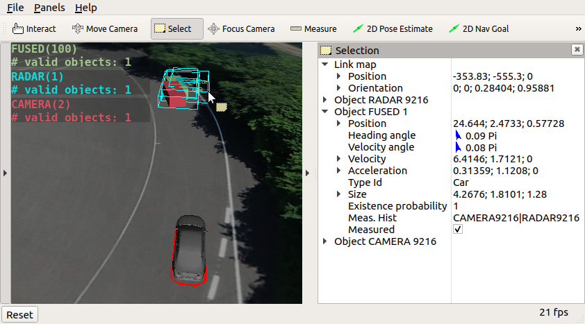

# Object Prediction


In this session, you will be guided through the process of programming a **Multi-Instance Kalman Filter** within a **ROS** node. This comprehensive workshop is designed to equip you with both foundational and advanced skills in object prediction, association, and fusion using ROS1.

## Learning Objectives

By the end of this workshop, you will:

### Implement Core Tracking Components
- **Object Prediction:** Forecast the future states of detected objects based on their current states.
- **Object Association:** Match detected objects across different sensor frames to maintain consistent tracking.
- **Object Fusion:** Combine information from multiple sensors to improve tracking accuracy.

### Gain Practical Skills
- **Inspect and Visualize Data:** Learn to work with rosbag files containing object data.
- **Utilize the Eigen Library:** Perform efficient matrix and vector computations.
- **Leverage Advanced RViz Features:** Enhance your visualization capabilities for better data analysis.

## Introduction to the Workshop

In this workshop, we utilize simulated data from a vehicle equipped with both a camera and a radar. These sensors provide complementary data:

- **Camera:** Offers high accuracy in the lateral (side-to-side) direction but exhibits higher uncertainty in the longitudinal (front-to-back) direction.
- **Radar:** Contrarily, provides precise longitudinal measurements but less accurate lateral data.

The simulated environment is based on the **ika test track**, ensuring realistic scenarios for object detection and tracking.

### Downloading the Rosbag File

To begin, download the required rosbag file from the following link:

**[Download Rosbag](https://rwth-aachen.sciebo.de/s/F2M2P4G63aaRryB)**

**Instructions:**
1. Save the downloaded file to the local directory `acdc/bag` on your host machine.
2. Start Docker by navigating to the `acdc/docker` directory and executing the startup script:
   ```bash
   cd acdc/docker
   ./ros1_run.sh
   ```
3. Inspect the contents of the rosbag using the `rosbag info` command:
   ```bash
   rosuser@docker:~/ws/bag$ rosbag info acdc_fusion_guidance_noise.bag
   path:        acdc_fusion_guidance_noise.bag
   version:     2.0
   duration:    9:59s (599s)
   start:       Jan 01 1970 01:00:02.51 (2.51)
   end:         Jan 01 1970 01:10:02.50 (602.50)
   size:        77.4 MB
   messages:    125992
   compression: none [102/102 chunks]
   types:       definitions/IkaEgoMotion  [e0618c9f9aa211f416eed80f5aa9a953]
                definitions/IkaGPS        [be18f6276d518be76f37af636e04fd9f]
                definitions/IkaObjectList [a997953d24fa0f3e837de98bfab1882a]
   topics:      /ikaGPS                               59993 msgs    : definitions/IkaGPS
                /sensors/camera_front/ikaObjectList   12000 msgs    : definitions/IkaObjectList
                /sensors/radar_front/ikaObjectList    12000 msgs    : definitions/IkaObjectList
                /sensors/reference/ikaObjectList      12000 msgs    : definitions/IkaObjectList
                /sensors/vehicleCAN/ikaEgoMotion      29999 msgs    : definitions/IkaEgoMotion
   ```

### Understanding the Rosbag Contents

The rosbag file includes the following key topics:

- **Object Detection Topics:**
  - `/sensors/camera_front/ikaObjectList`
  - `/sensors/radar_front/ikaObjectList`
  
  These topics publish lists of detected objects from the front camera and radar sensors, respectively. For more details on the `ikaObjectList` message type, refer to [Section 2: Object Detection](https://github.com/ika-rwth-aachen/acdc/wiki/Section-2-Object-Detection).

- **Vehicle State Topics:**
  - `/ikaGPS`
  - `/sensors/vehicleCAN/ikaEgoMotion`
  
  These topics provide the positional data of the ego vehicle, essential for accurate object tracking and fusion.

## Visualizing Object Detections

Visualization is crucial for understanding how object detections and tracking behave over time. This section guides you through setting up and visualizing the object detections using RViz.

### Building the Workspace

Within the Docker container, execute the following commands to build the workspace and set up the environment:

```bash
catkin build
source devel/setup.bash  # Ensure this is run in each new terminal session
```

### Launching Visualization and Playback

Open multiple terminals and execute the following commands to launch RViz and play back the rosbag:

```bash
# Terminal 1: Launch the preconfigured RViz window
roslaunch acdc_launchpack bag_playback.launch
```

```bash
# Terminal 2: Play the rosbag file in a loop
rosbag play -l ~/ws/bag/acdc_fusion_guidance_noise.bag
```

### Expected Visualization

Upon successful execution, RViz will display the simulated environment with detected objects visualized in real-time. The visualization should resemble the following output:


*Note: Ensure that the Docker container is running and the rosbag is correctly placed in the specified directory.*

## Introduction to the Eigen Library

[Eigen](https://eigen.tuxfamily.org/dox/GettingStarted.html) is a high-performance C++ library for linear algebra, including matrices, vectors, and related algorithms. It is widely used in robotics and computer vision for efficient mathematical computations.

### Basic Usage Examples

Here are some fundamental operations using the Eigen library:

```cpp
#include <Eigen/Dense>

// Create a copy of an existing matrix of floating-point numbers
Eigen::MatrixXf myNewMatrix1 = myExistingMatrixOfEqualDimensions;

// Create a 3x3 matrix of zeros
Eigen::MatrixXf myNewMatrix2 = Eigen::MatrixXf::Zero(3, 3); 

// Edit a specific matrix entry
myNewMatrix2(0, 0) = 5.678; 

// Multiply, add, and subtract matrices or vectors (dimensions must align)
A = B * C * (d + e - f); 

// Create a vector of floating-point numbers
Eigen::VectorXf myNewVector = someMatrix * someVector;

// Transpose or invert matrices
A = B.transpose() + C.inverse();
```

### Exploring Eigen Further

To delve deeper into Eigen's capabilities, you can:

- **Search for Specific Operations:** Use search terms like "Eigen identity matrix" to find relevant functions and examples.
- **Refer to Documentation:** Utilize the [Eigen Documentation](https://eigen.tuxfamily.org/dox/) for comprehensive guides and references.
- **Utilize IDE Features:** Use <kbd>Ctrl</kbd>+<kbd>F</kbd> to quickly navigate through the documentation or your codebase.

## Introduction to the Fusion Code

Understanding the structure and components of the fusion code is essential for implementing the Multi-Instance Kalman Filter effectively.

### Workspace Structure

The overall modular structure of the tracking code template is outlined in the [README.md of the section_3 folder](https://github.com/ika-rwth-aachen/acdc/tree/main/catkin_workspace/src/workshops/section_3). While it's beneficial to review this structure, the exercises can be completed without deep familiarity with these files.

### Object Fusion Package

A critical component is the [README.md of the object_fusion package](https://github.com/ika-rwth-aachen/acdc/tree/main/catkin_workspace/src/workshops/section_3/object_fusion). This document provides detailed information on how mathematical symbols from the ACDC slides correspond to variables and functions within the codebase. Understanding this mapping is crucial for implementing and debugging the fusion algorithms.

### Running the Fusion Node

Before implementing any prediction logic, it's important to observe the current state of the fusion node:

1. **Launch the Fusion Node:**
   ```bash
   roslaunch object_fusion_wrapper fusion.launch
   ```
   
2. **Ensure RViz and Rosbag Playback are Active:**
   ```bash
   roslaunch acdc_launchpack bag_playback.launch
   rosbag play -l ~/ws/bag/acdc_fusion_guidance_noise.bag
   ```

### Observing the Current Output

With the fusion node running, you should observe RViz displaying "shooting" objects at intervals, which disappear shortly after. This indicates that while parts of the object tracking are implemented, the system is not yet fully functional.


*Note: Before making any changes, ensure that the workspace is rebuilt using `catkin build`.*

## Task 1: Implement Object Prediction

Your first task involves enhancing the `StatePredictor.cpp` module to enable accurate prediction of object states using the Kalman Filter. This section provides a step-by-step guide to implementing the object prediction functionality.

### Overview

The goal is to predict the future states of detected objects based on their current states, leveraging the Kalman Filter's prediction capabilities. This involves updating the state vectors and error covariances for each tracked object.

### Step-by-Step Implementation

#### 1. Accessing and Overwriting Global Object List

For both prediction and measurement updates, you need to **overwrite** the global object list `data_->object_list_fused.objects` instead of using `return` statements. This approach ensures that any modifications made to the Eigen data structures directly affect the original `IkaObject` instances.

**Important Consideration:**
- Utility functions like `IkaUtilities::getEigenStateVec(myIkaObject)` return Eigen vectors or matrices that reference the original memory. Therefore, modifying these Eigen structures will automatically update the corresponding `IkaObject`.

#### 2. Constructing the Motion Model Matrix ($\mathbf{F}$)

The motion model matrix $\mathbf{F}$ predicts the next state of an object based on its current state and motion assumptions.

- **Constant Velocity Model:**
  - **Constant Entries:** Provided in `data_->F_const_`.
  - **Time-Variant Entries:** Provided in `data_->F_timevar_`.
  
- **Time Step ($\Delta t$):**
  - Given in `data_->prediction_gap_in_seconds`.
  
- **Assembly of $\mathbf{F}$:**
  ```cpp
  Eigen::MatrixXf F = data_->F_const_ + data_->prediction_gap_in_seconds * data_->F_timevar_;
  ```

- **Configuration:**
  - The matrices `F_const_` and `F_timevar_` are defined in the file `section_3/object_fusion_wrapper/param/kalman_filter.yaml`.

#### 3. Constructing the Motion Noise Matrix ($\mathbf{Q}$)

The motion noise matrix $\mathbf{Q}$ accounts for the uncertainty in the motion model.

- **Dependence on Time Step:**
  - $\mathbf{Q} = \Delta t \times \mathbf{Q}_{timevar}$
  
- **Implementation:**
  ```cpp
  Eigen::MatrixXf Q = data_->prediction_gap_in_seconds * data_->Q_timevar_;
  ```
  
- **Configuration:**
  - The matrix `Q_timevar_` is defined in `section_3/object_fusion_wrapper/param/kalman_filter.yaml`.

#### 4. Performing the Kalman Filter Prediction Step

Loop through each global object and apply the Kalman Filter's prediction equations.

**Implementation Steps:**

1. **Iterate Over Global Objects:**
   ```cpp
   for(auto &globalObject : data_->object_list_fused.objects) {
       // Access and modify each globalObject
   }
   ```
   
2. **Retrieve State Vector and Error Covariance:**
   ```cpp
   auto x_hat_G = IkaUtilities::getEigenStateVec(&globalObject);  // State vector
   auto P = globalObject.P();  // Error covariance matrix
   ```
   
3. **Apply Prediction Equations:**
   The standard Kalman Filter prediction step involves:
   - **State Prediction:** $\hat{x}_G' = \mathbf{F} \hat{x}_G$
   - **Covariance Prediction:** $\mathbf{P}' = \mathbf{F} \mathbf{P} \mathbf{F}^T + \mathbf{Q}$
   
   **Code Implementation:**
   ```cpp
   // State prediction
   x_hat_G = F * x_hat_G;
   
   // Covariance prediction
   P = F * P * F.transpose() + Q;
   
   // Update the global object with the predicted state and covariance
   IkaUtilities::setEigenStateVec(x_hat_G, &globalObject);
   globalObject.setP(P);
   ```
   
4. **Update Time Stamps:**
   After prediction, the time stamps of both the global object list and individual objects should reflect the latest measurements.
   
   ```cpp
   // Update global object list time stamp
   data_->object_list_fused.header.stamp = data_->object_list_measured.header.stamp;
   
   // Update individual object time stamps
   globalObject.header.stamp = data_->object_list_measured.header.stamp;
   ```

#### 5. Finalizing the Prediction Module

After implementing the above steps, ensure that the prediction module is correctly integrated into the fusion pipeline.

### Verifying the Implementation

1. **Rebuild the Workspace:**
   ```bash
   catkin build
   ```
   
2. **Run the Fusion Node:**
   ```bash
   roslaunch object_fusion_wrapper fusion.launch
   ```
   
3. **Play the Rosbag:**
   ```bash
   roslaunch acdc_launchpack bag_playback.launch
   rosbag play -l ~/ws/bag/acdc_fusion_guidance_noise.bag
   ```
   
4. **Observe the Predictions in RViz:**
   The fused objects should now be predicted based on their current states. Although they are not yet updated with new measurements, the predictions should closely follow the actual object movements, gradually diverging as time progresses.

   

*Note: If discrepancies are observed, revisit the prediction equations and ensure that the matrices $\mathbf{F}$ and $\mathbf{Q}$ are correctly configured.*

## Advanced: Introspection in RViz

Understanding the internal states and properties of tracked objects can provide deeper insights into the tracking performance and potential issues. RViz offers advanced features that facilitate this introspection.

### Steps to Inspect Object Properties

1. **Focus on the RViz Window:**
   - Click inside the RViz window to ensure it is the active window for interaction.

2. **Activate Selection Mode:**
   - Press the <kbd>S</kbd> key. The cursor will change to yellow, indicating that selection mode is active.

3. **Select Objects:**
   - **Single Selection:** Click on individual objects to select them.
   - **Multiple Selection:** Click and drag to draw a rectangle around multiple objects for batch selection.

4. **View Object Properties:**
   - Once objects are selected, navigate to the **Selection Panel** on the right side of RViz.
   - This panel will display real-time updates of the selected objects' properties, such as position, velocity, and covariance.

5. **Exit Selection Mode:**
   - **Deselect All Objects:** Click on an empty area within the RViz window.
   - **Deactivate Selection Mode:** Press the <kbd>S</kbd> key again.

### Visual Guide



*Figure: RViz Selection Panel displaying object properties after selecting objects.*

### Benefits of Introspection

- **Debugging:** Quickly identify anomalies or inconsistencies in object states.
- **Performance Analysis:** Assess the accuracy and reliability of the tracking algorithms.
- **Educational Insight:** Gain a deeper understanding of how different components of the Kalman Filter influence object tracking.

## Conclusion

This workshop has guided you through the foundational steps of implementing a Multi-Instance Kalman Filter for object prediction within a ROS1 environment. By leveraging the Eigen library for efficient computations and utilizing advanced visualization tools like RViz, you've built a robust framework for multi-object tracking.
