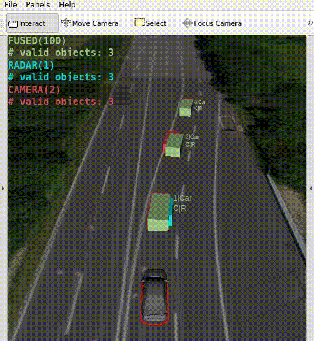

In this task, we will complete the Kalman Filter with the **Object Fusion** step. 

## Task 3: Implement Object Fusion

Your task is to fill gaps in the C++ code of the [object fusion](https://github.com/ika-rwth-aachen/acdc/blob/main/catkin_workspace/src/workshops/section_3/object_fusion/src/modules/fuser/StateFuser.cpp#L65) module: `workshops/section_3/object_fusion/src/modules/fuser/StateFuser.cpp`

#### Fusion code

As usual, we already implemented the less interesting parts of the fusion. The core functionality is still missing though. Implement the Kalman filter measurement update formulas for each dynamic object as described in the slides.

As in the object predicition you need to *overwrite* the global object list `data_->object_list_fused.objects` instead of using `return` statements.
Note: when you use the utility functions like `IkaUtilities::getEigenStateVec(myIkaObject)`, they will return an `Eigen` vector or matrix that points to the *original* memory, so by modifying this Eigen data structure, you will automatically overwrite the corresponding `myIkaObject`.

After completing the task, rebuild the workspace with `catkin build`. You should finally see a fully functional object fusion similar to the video below.

## Bonus Task: Explore fusion parameters

#### Parameter tuning

We have finished the fusion, however sometimes there still occur some glitches. This indicates that the fusion parameters are not ideally chosen.

Play with the process noise matrix $\mathbf{Q}$ entries by manipulating the diagonal of `time_variant_process_noise_matrix` in the config file `object_fusion_wrapper/param/kalman_filter.yaml`. Try out the following values for each diagonal entry:

* 0.001
* 0.1
* 100

What effect does it have on the fused object? Can you explain why?

Also, play with the association parameters in `object_fusion_wrapper/param/fusion.yaml`. For the Mahalanobis distance, set the `fusion_passat:constants:mahalanobis_threshold` to

* 2.0 (standard deviations)
* 3.0 (standard deviations)
* 4.0 (standard deviations)
* 5.0 (standard deviations)

For the Intersection over Union set the `fusion_passat:constants:iou_overlap_threshold` to

* 0.1
* 0.2
* 0.5

What effect does it have on the fused object list? Can you explain why? Which association criterion do you see as more robust?

There are many more parameters in the mentioned files. Can you manage to perfectly tune the parameters and achieve a perfect object fusion?

## Wrap-up

- You learned the fundamentals and challenges of Object Fusion and Tracking
- You learned what a **Multi-Instance Kalman filter** is
- You got a deeper understanding of the steps **Object Prediction**, **Object Association** and **Object Fusion**
- You explored the effects of **fusion parameters**
- You deepened your knowledge of **ROS**
- You learned how to inspect properties in **RViz**

## References

- [ROS](https://www.ros.org)
- [Flatland](https://github.com/avidbots/flatland)
- [Eigen](https://eigen.tuxfamily.org)
