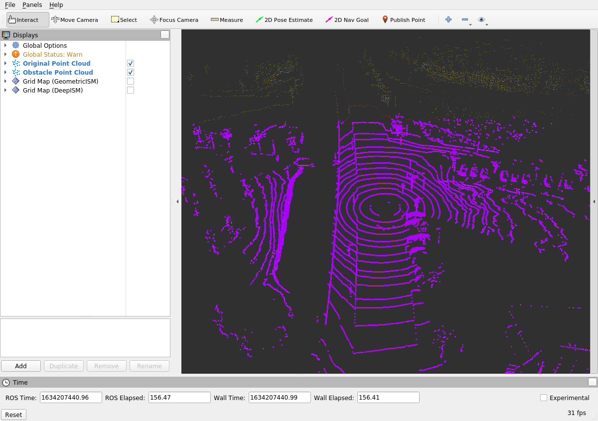
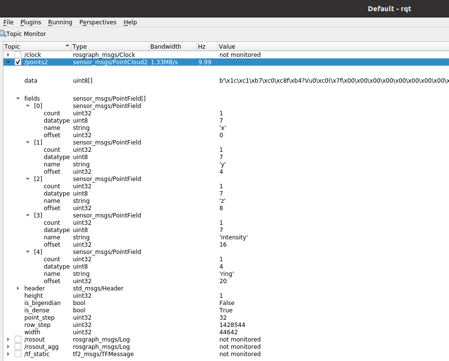

# Object Fusion


## Overview

In autonomous vehicle systems, **object fusion** is a critical component that integrates information from multiple sensors to produce a coherent and accurate representation of the surrounding environment. By fusing data from various sources, such as LiDAR, radar, and cameras, vehicles can achieve reliable object detection, tracking, and classification, essential for safe and efficient navigation.

This workshop focuses on implementing the **Object Fusion** step within a **Kalman Filter** framework using ROS. Participants will gain hands-on experience in completing the Kalman Filter's measurement update phase, which integrates sensor measurements to refine object states. Additionally, the workshop covers parameter tuning to optimize fusion performance, ensuring accurate and robust object tracking.

## Learning Objectives

By the end of this workshop, participants will be able to:

- **Understand Object Fusion Fundamentals:** Grasp the principles of integrating sensor data using Kalman Filters.
- **Implement Measurement Updates in Kalman Filters:** Complete the Kalman Filter's measurement update equations in C++.
- **Utilize ROS for Object Fusion:** Leverage ROS packages and tools to manage and visualize fused objects.
- **Tune Fusion Parameters:** Adjust and understand the impact of fusion parameters on tracking performance.
- **Visualize Fused Objects in RViz:** Use RViz to inspect and analyze the results of object fusion.

## Prerequisites

- **Basic Knowledge of ROS:** Familiarity with ROS concepts, including nodes, topics, and messages.
- **C++ Programming Skills:** Ability to read and modify C++ code.
- **Understanding of Kalman Filters:** Basic comprehension of Kalman Filter principles and state estimation.
- **Experience with RViz:** Prior experience using RViz for visualization is beneficial but not mandatory.
- **Docker Environment Setup:** Knowledge of using Docker containers to manage ROS environments.

## Setup Instructions

### 1. Clone the Repository and Navigate to the Workspace

Ensure you have access to the necessary ROS workspace. Navigate to your workspace directory:

```bash
cd ~/catkin_workspace/src
```

### 2. Clone the Necessary Packages

Clone the `object_fusion` package along with its dependencies:

```bash
git clone https://github.com/ika-rwth-aachen/acdc.git
cd acdc/catkin_workspace/src
git clone https://github.com/ika-rwth-aachen/acdc.git
```

*Note:* Replace the repository URL with the correct one if different.

### 3. Download the Required Bag File

Download the LiDAR data recording from Campus Melaten in Aachen:

```bash
wget -O lidar_campus_melaten.bag https://rwth-aachen.sciebo.de/s/udlMYloXpCdVtyp/download
```

Alternatively, access the bag file directly [**here**](https://rwth-aachen.sciebo.de/s/udlMYloXpCdVtyp) (approx. 1.5 GB). Save the file to the local directory `${REPOSITORY}/bag` on your host machine, which is mounted to `~/bag` within the Docker container.

### 4. Build the Workspace

Navigate to your workspace and build the packages:

```bash
cd ~/catkin_workspace
catkin build
source devel/setup.bash
```

*Note:* If you encounter a compilation error similar to `g++: internal compiler error: Killed (program cc1plus)`, it indicates excessive resource consumption. To resolve this, disable parallel building:

```bash
catkin build -j 1
source devel/setup.bash
```

### 5. Launch the ROS Environment with RViz and Rosbag

To streamline the process of launching `roscore`, `rviz`, and `rosbag play` simultaneously, utilize the provided launch file:

```bash
roslaunch object_fusion GeometricISM.launch
```

This command performs the following actions:

- **Rosbag Playback:** Plays the `lidar_campus_melaten.bag` file.
- **RViz Visualization:** Launches RViz with pre-configured displays for point clouds and occupancy grids.

#### Expected Terminal Output:

```bash
rosuser@******:~/ws/catkin_workspace$ roslaunch object_fusion GeometricISM.launch
... logging to /home/rosuser/.ros/log/52caca3c-4495-11ec-82b7-b49691b9ac50/roslaunch-I2102656-linux-14791.log
Checking log directory for disk usage. This may take a while.
Press Ctrl-C to interrupt
Done checking log file disk usage. Usage is <1GB.

started roslaunch server http://******:34069/
ros_comm version 1.15.11
...
started core service [/rosout]
rosbag play --loop ../bag/lidar_campus_melaten.bag
[ INFO] [1636816879.584949638]: Opening ../bag/lidar_campus_melaten.bag

Waiting 0.2 seconds after advertising topics... done.

Hit space to toggle paused, or 's' to step.
 [RUNNING]  Bag Time: 1580916332.230592   Duration: 0.820823 / 119.955245
```

#### Expected RViz Visualization:



- **PointCloud2 Display:** Visualizes the raw LiDAR point cloud data.
- **Obstacle Point Cloud:** Colored in purple.
- **Ground Points:** Visualized separately, toggleable via the RViz interface.

*Note:* Adjust visualization settings such as `Size`, `Style`, `Decay Time`, and `Color Transformer` in the `PointCloud2` tab for enhanced clarity.

#### RViz Navigation Controls:

- **Left Mouse Button:** Rotate the view around the Z-axis.
- **Middle Mouse Button:** Pan the camera along the XY plane.
- **Right Mouse Button:** Zoom in and out.
- **Scroll Wheel:** Incremental zoom in and out.

**Congratulations!** You have successfully visualized the raw LiDAR data and are ready to implement the occupancy grid mapping algorithms in the subsequent tasks.

## Tasks

### Task 1: Set Up and Test the ROS Workspace

**Objective:** Initialize the ROS workspace, build the necessary packages, and launch the geometric inverse sensor model to visualize LiDAR point clouds and occupancy grids.

#### Steps:

1. **Start the Docker Container:**

   If not already running, start the Docker container by executing the `docker/run.sh` script:

   ```bash
   ./docker/run.sh
   ```

2. **Open a Shell in the Container:**

   Execute the `docker/run.sh` script again from another terminal to open a new shell within the container.

3. **Build the ROS Package and Source the Workspace:**

   Inside the Docker container, navigate to the ROS workspace and build the `object_fusion` package:

   ```bash
   catkin build object_fusion
   source devel/setup.bash
   ```

4. **Start `roscore` and Play the Rosbag:**

   Launch `roscore` in the background and start playing the recorded LiDAR data:

   ```bash
   roscore&
   rosbag play --loop ../bag/lidar_campus_melaten.bag
   ```

   **Expected Terminal Output:**

   ```bash
   rosuser@:/home/rosuser/bag# rosbag info lidar_campus_melaten.bag 
   path:        lidar_campus_melaten.bag 
   version:     2.0
   duration:    1:59s (119s)
   start:       Feb 05 2020 15:25:31.41 (1580916331.41)
   end:         Feb 05 2020 15:27:31.37 (1580916451.37)
   size:        1.5 GB
   messages:    1200
   compression: none [1199/1199 chunks]
   types:       sensor_msgs/PointCloud2 [1158d486dd51d683ce2f1be655c3c181]
                tf2_msgs/TFMessage      [94810edda583a504dfda3829e70d7eec]
   topics:      /points2     1199 msgs    : sensor_msgs/PointCloud2
                /tf_static      1 msg     : tf2_msgs/TFMessage
   ```

5. **Launch the Geometric Inverse Sensor Model:**

   Open another shell within the Docker container and execute the launch file to start the geometric inverse sensor model:

   ```bash
   source devel/setup.bash
   roslaunch object_fusion GeometricISM.launch
   ```

   **Expected RViz Visualization:**

   

   - **Original Point Cloud:** Colored by the intensity of reflections.
   - **Obstacle Point Cloud:** Colored in purple.
   - **Ground Points:** Visualized separately, toggleable via the RViz interface.

*Note:* Adjust visualization settings in RViz to enhance clarity and focus on specific aspects of the point cloud data.

---

### Task 2: Separate Obstacles from Ground

**Objective:** Utilize the `PassThrough` filter from the PointCloudLibrary (PCL) to preprocess LiDAR point clouds by distinguishing ground points from obstacles, enhancing the accuracy of occupancy grid mapping.

#### Steps:

1. **Understand the Data Structure:**

   The LiDAR point clouds are published as ROS messages of type `sensor_msgs/PointCloud2`, containing points described by `x`, `y`, `z` coordinates, `intensity` of reflection, and the vertical sensor `ring` number.

   

2. **Use the `PassThrough` Filter:**

   The `PassThrough` filter allows setting parameters to determine which points to retain or discard based on specified criteria.

3. **Locate the Filter Configuration:**

   The `PassThrough` filter is configured in the `GeometricISM.launch` file:

   ```xml
   <node pkg="nodelet" type="nodelet" name="GroundExtraction" args="load pcl/PassThrough $(arg nodelet_manager)" output="screen">
     <remap from="~input" to="/points2" />
     <remap from="~output" to="/points2_obstacles" />
     <rosparam>
       filter_limit_negative: False
       filter_field_name: x
       filter_limit_min: -50
       filter_limit_max: 50
     </rosparam>
   </node>
   ```

4. **Adjust Filter Parameters:**

   Modify the parameters to effectively extract ground points while retaining obstacle points.

   **Example Configuration:**

   To filter out ground points based on the `z` axis:

   ```xml
   <node pkg="nodelet" type="nodelet" name="GroundExtraction" args="load pcl/PassThrough $(arg nodelet_manager)" output="screen">
     <remap from="~input" to="/points2" />
     <remap from="~output" to="/points2_obstacles" />
     <rosparam>
       filter_limit_negative: False
       filter_field_name: z
       filter_limit_min: 0.2
       filter_limit_max: 10.0
     </rosparam>
   </node>
   ```

   - **filter_field_name:** `z` to target vertical positioning.
   - **filter_limit_min:** `0.2` meters to exclude points very close to the ground.
   - **filter_limit_max:** `10.0` meters to include points within a reasonable detection range.

5. **Apply the Changes:**

   - **Kill the Running Launch File:** Press `CTRL-C` in the terminal where the launch file is running.
   - **Restart the Launch File:** Apply the updated filter parameters by relaunching:

     ```bash
     roslaunch object_fusion GeometricISM.launch
     ```

6. **Verify in RViz:**

   - **Toggle Point Clouds:** In RViz, (de-)activate the visualization of ground and obstacle point clouds by toggling the checkboxes.
   - **Assess Filtering Effectiveness:** Ensure that ground points are effectively separated from obstacle points, reducing noise and enhancing occupancy grid accuracy.

   

*Note:* Fine-tuning filter parameters may require iterative adjustments based on the specific environment and LiDAR characteristics.

---

### Task 3: Implement Object Fusion

**Objective:** Complete the Kalman Filter's measurement update phase by implementing the **Object Fusion** step, integrating sensor measurements to refine object states.

#### Understanding the Kalman Filter Measurement Update

The **Kalman Filter** is an optimal recursive data processing algorithm used for estimating the state of a dynamic system from a series of incomplete and noisy measurements. In the context of object fusion, the Kalman Filter integrates sensor data to produce a refined estimate of each object's state (e.g., position, velocity).

The measurement update phase (also known as the **correction step**) adjusts the predicted state based on the new measurements, taking into account the uncertainties in both the prediction and the measurements.

#### Implementation Steps:

1. **Navigate to the Fusion Module:**

   Open the `StateFuser.cpp` file located at:

   ```
   workshops/section_3/object_fusion/src/modules/fuser/StateFuser.cpp
   ```

2. **Locate the Fusion Code Snippet:**

   Identify the section marked for Task 3, responsible for implementing the Kalman Filter's measurement update:

   ```cpp
   // START TASK 3 CODE HERE
   // ADD YOUR CODE HERE...
   // END TASK 3 CODE HERE
   ```

3. **Understand the Existing Code Structure:**

   The fusion process involves the following steps:

   - **Prediction:** Estimate the current state based on the previous state and motion model.
   - **Measurement Update (Fusion):** Incorporate new measurements to refine the state estimate.
   - **Overwrite the Global Object List:** Update the `data_->object_list_fused.objects` with the fused states.

4. **Implement the Kalman Filter Measurement Update:**

   Complete the measurement update equations to integrate the new measurements. Below is an example implementation:

   ```cpp
   // START TASK 3 CODE HERE
   // Implement Kalman Filter Measurement Update for each dynamic object

   for (size_t i = 0; i < data_->object_list_fused.objects.size(); ++i) {
       IkaObject& fused_object = data_->object_list_fused.objects[i];
       
       // Retrieve the predicted state vector (mean)
       Eigen::VectorXd predicted_mean = IkaUtilities::getEigenStateVec(fused_object);
       
       // Retrieve the predicted covariance matrix
       Eigen::MatrixXd predicted_covariance = IkaUtilities::getEigenCovariance(fused_object);
       
       // Measurement vector (from sensor)
       Eigen::VectorXd measurement = IkaUtilities::getEigenMeasurement(data_->object_list_measured.objects[i]);
       
       // Measurement noise covariance matrix
       Eigen::MatrixXd R = getMeasurementNoiseCovariance();
       
       // Observation matrix
       Eigen::MatrixXd H = getObservationMatrix();
       
       // Compute Kalman Gain
       Eigen::MatrixXd S = H * predicted_covariance * H.transpose() + R;
       Eigen::MatrixXd K = predicted_covariance * H.transpose() * S.inverse();
       
       // Update state estimate
       Eigen::VectorXd y = measurement - H * predicted_mean; // Innovation
       Eigen::VectorXd updated_mean = predicted_mean + K * y;
       
       // Update covariance estimate
       Eigen::MatrixXd I = Eigen::MatrixXd::Identity(predicted_covariance.rows(), predicted_covariance.cols());
       Eigen::MatrixXd updated_covariance = (I - K * H) * predicted_covariance;
       
       // Overwrite the fused object's state vector and covariance
       IkaUtilities::setEigenStateVec(fused_object, updated_mean);
       IkaUtilities::setEigenCovariance(fused_object, updated_covariance);
   }
   // END TASK 3 CODE HERE
   ```

   **Explanation:**

   - **Loop Through Fused Objects:**
     Iterate over each object in the fused object list to perform the measurement update.
   
   - **Retrieve Predicted State and Covariance:**
     Obtain the predicted state vector (`predicted_mean`) and covariance matrix (`predicted_covariance`) from the fused object.
   
   - **Measurement Vector:**
     Extract the measurement vector (`measurement`) from the newly received sensor data corresponding to the same object.
   
   - **Measurement Noise Covariance (`R`):**
     Define the measurement noise covariance matrix based on sensor characteristics.
   
   - **Observation Matrix (`H`):**
     Define the observation matrix that maps the state space to the measurement space.
   
   - **Compute Kalman Gain (`K`):**
     Calculate the Kalman Gain, which determines the weight given to the new measurement.
   
   - **Update State Estimate (`updated_mean`):**
     Adjust the predicted state based on the innovation (`y`), which is the difference between the actual measurement and the predicted measurement.
   
   - **Update Covariance Estimate (`updated_covariance`):**
     Refine the covariance estimate to reflect the reduced uncertainty after incorporating the measurement.
   
   - **Overwrite Fused Object State:**
     Update the fused object's state vector and covariance matrix with the refined estimates.

5. **Define Helper Functions:**

   Ensure that helper functions like `getMeasurementNoiseCovariance()` and `getObservationMatrix()` are defined to provide the necessary matrices for the Kalman Filter.

   ```cpp
   Eigen::MatrixXd StateFuser::getMeasurementNoiseCovariance() {
       Eigen::MatrixXd R(4, 4); // Example for position and velocity
       R << 0.1, 0,   0,   0,
            0,   0.1, 0,   0,
            0,   0,   0.1, 0,
            0,   0,   0,   0.1;
       return R;
   }

   Eigen::MatrixXd StateFuser::getObservationMatrix() {
       Eigen::MatrixXd H(4, 7); // Example dimensions
       H << 1, 0, 0, 0, 0, 0, 0, // x position
            0, 1, 0, 0, 0, 0, 0, // y position
            0, 0, 0, 1, 0, 0, 0, // velocity
            0, 0, 0, 0, 1, 0, 0; // acceleration
       return H;
   }
   ```

   *Note:* Adjust the dimensions and values of `R` and `H` based on the specific state and measurement vectors used in your implementation.

6. **Rebuild the ROS Workspace:**

   After implementing the fusion logic, rebuild the `object_fusion` package:

   ```bash
   cd ~/catkin_workspace
   catkin build object_fusion
   source devel/setup.bash
   ```

7. **Launch the Object Fusion Node:**

   Restart the launch file to apply the changes:

   ```bash
   roslaunch object_fusion GeometricISM.launch
   ```

8. **Visualize the Fused Objects in RViz:**

   - **Enable Fused Object Visualization:** In RViz, ensure that the "Fused Objects" display is activated.
   - **Inspect Fused Object States:** The fused objects should now display refined positions, velocities, and classifications based on the integrated sensor data.

   

   *Observation:* The occupancy grid maps and fused objects should reflect accurate and consistent tracking, demonstrating effective sensor data integration.

---

### Bonus Task: Explore Fusion Parameters

**Objective:** Enhance the object fusion performance by tuning the fusion parameters, understanding their impact on tracking accuracy and reliability.

#### Understanding Fusion Parameters

Fusion parameters govern how sensor data is integrated and influence the Kalman Filter's responsiveness to new measurements. Key parameters include:

- **Process Noise Matrix (`Q`):** Represents the uncertainty in the system's motion model.
- **Mahalanobis Distance Threshold:** Determines the acceptance criteria for associating measurements with existing tracks.
- **Intersection over Union (IoU) Overlap Threshold:** Defines the overlap required between predicted and measured bounding boxes for association.

#### Steps:

1. **Locate the Configuration Files:**

   The fusion parameters are defined in YAML configuration files located at:

   ```
   object_fusion_wrapper/param/kalman_filter.yaml
   object_fusion_wrapper/param/fusion.yaml
   ```

2. **Tune the Process Noise Matrix (`Q`):**

   The process noise matrix (`Q`) influences the filter's trust in the motion model. Adjusting its diagonal entries affects the estimated uncertainty.

   - **Parameters to Adjust:**
     - `time_variant_process_noise_matrix[0][0]`: Position uncertainty.
     - `time_variant_process_noise_matrix[1][1]`: Velocity uncertainty.
     - *(Add other relevant entries based on your state vector.)*

   - **Values to Test:**
     - **0.001:** Low uncertainty, high confidence in the motion model.
     - **0.1:** Moderate uncertainty.
     - **100:** High uncertainty, low confidence in the motion model.

   - **Effects:**
     - **Low (`0.001`):** The filter heavily relies on the motion model, potentially ignoring measurements that deviate significantly.
     - **Moderate (`0.1`):** Balanced trust between the motion model and measurements.
     - **High (`100`):** The filter is more responsive to measurements, allowing rapid state corrections but may be susceptible to noise.

   - **Implementation:**
     Edit `kalman_filter.yaml`:

     ```yaml
     time_variant_process_noise_matrix:
       - [0.001, 0,     0,    0]
       - [0,     0.001, 0,    0]
       - [0,     0,     0.001,0]
       - [0,     0,     0,    0.001]
     ```

     *(Adjust the dimensions and values based on your specific state vector.)*

3. **Tune the Association Parameters:**

   **a. Mahalanobis Distance Threshold:**

   - **Parameter to Adjust:**
     - `fusion_passat:constants:mahalanobis_threshold`

   - **Values to Test:**
     - **2.0 (Standard Deviations):** Conservative association, reducing false positives.
     - **3.0 (Standard Deviations):** Slightly more lenient.
     - **4.0 (Standard Deviations):** Even more lenient.
     - **5.0 (Standard Deviations):** Highly lenient, increasing potential false associations.

   - **Effects:**
     - **Lower Threshold (`2.0`):** Stricter association criteria, minimizing incorrect associations but may miss valid ones.
     - **Higher Threshold (`5.0`):** More permissive, allowing more associations but increasing the risk of false positives.

   - **Implementation:**
     Edit `fusion.yaml`:

     ```yaml
     fusion_passat:
       constants:
         mahalanobis_threshold: 3.0
     ```

   **b. Intersection over Union (IoU) Overlap Threshold:**

   - **Parameter to Adjust:**
     - `fusion_passat:constants:iou_overlap_threshold`

   - **Values to Test:**
     - **0.1:** Very lenient, allowing minimal overlap for association.
     - **0.2:** Slightly stricter.
     - **0.5:** Moderate, requiring significant overlap.
   
   - **Effects:**
     - **Lower Threshold (`0.1`):** Allows more associations with minimal overlap, increasing the chance of false positives.
     - **Higher Threshold (`0.5`):** Requires substantial overlap, reducing false associations but may miss valid ones with slight misalignments.

   - **Implementation:**
     Edit `fusion.yaml`:

     ```yaml
     fusion_passat:
       constants:
         iou_overlap_threshold: 0.3
     ```

4. **Apply the Parameter Changes:**

   - **Edit the YAML Files:**
     Use a text editor to modify the parameters as per the values to test.

   - **Rebuild the ROS Workspace:**
     After adjusting parameters, rebuild the `object_fusion` package to apply changes:

     ```bash
     cd ~/catkin_workspace
     catkin build object_fusion
     source devel/setup.bash
     ```

   - **Relaunch the Fusion Node:**
     Restart the launch file to incorporate the updated parameters:

     ```bash
     roslaunch object_fusion GeometricISM.launch
     ```

5. **Observe the Effects in RViz:**

   - **Enable Fused Object Visualization:** Ensure that the "Fused Objects" display is active.
   - **Assess Tracking Performance:** Monitor how changes to fusion parameters affect object tracking, including the accuracy of position estimates and the occurrence of false positives or missed detections.
   - **Iterate as Necessary:** Continue adjusting parameters to achieve a balance between sensitivity and specificity in object fusion.

6. **Evaluate Association Criteria Robustness:**

   - **Mahalanobis Distance vs. IoU Threshold:**
     - **Mahalanobis Distance:** Measures the distance between the predicted and measured states, considering the covariance. It's effective for handling measurement uncertainties.
     - **IoU Threshold:** Assesses the overlap between predicted and measured bounding boxes. It's straightforward but may not account for measurement uncertainties as effectively as Mahalanobis Distance.

   - **Robustness Analysis:**
     - **Mahalanobis Distance:** Generally more robust in handling noisy measurements and varying object dynamics.
     - **IoU Threshold:** Simpler but can be less reliable in cluttered environments or with imperfect bounding box estimates.

   - **Conclusion:** Combining both criteria often yields better association performance, leveraging the strengths of each method.

7. **Advanced Parameter Tuning:**

   Experiment with other parameters in the YAML configuration files to further refine fusion performance. Document the effects of each change to build an intuitive understanding of the fusion process.

   *Note:* Achieving "perfect" object fusion is challenging due to inherent sensor noise, dynamic environments, and computational limitations. Strive for a balance that minimizes false positives and negatives while maintaining real-time performance.

---

## Wrap-up

In this workshop, you have:

- **Implemented Object Fusion:**
  - Completed the Kalman Filter's measurement update phase to integrate sensor measurements and refine object states.
  
- **Understood Fusion Parameters:**
  - Explored the impact of process noise and association thresholds on tracking performance.
  
- **Utilized ROS for Fusion:**
  - Leveraged ROS packages and launch files to manage and visualize fused objects.
  
- **Visualized Fused Objects in RViz:**
  - Inspected and analyzed the results of object fusion using RViz, enhancing your understanding of tracking accuracy.
  
- **Tuned Fusion Performance:**
  - Adjusted and evaluated fusion parameters to optimize tracking reliability and accuracy.
  
These skills are foundational for developing robust perception systems in autonomous vehicles, enabling accurate object tracking and informed decision-making in dynamic environments.

## References

- **PointCloudLibrary (PCL):** [https://pointclouds.org](https://pointclouds.org)
  
  PCL is a standalone, large scale, open project for 2D/3D image and point cloud processing, widely used in robotics and computer vision applications.

- **Eigen Library:** [https://eigen.tuxfamily.org](https://eigen.tuxfamily.org)
  
  Eigen is a C++ template library for linear algebra, including matrices, vectors, numerical solvers, and related algorithms.

- **Kalman Filter Theory:** [https://en.wikipedia.org/wiki/Kalman_filter](https://en.wikipedia.org/wiki/Kalman_filter)
  
  Comprehensive overview of Kalman Filters, including their mathematical foundations and applications.

- **PointPillars Paper:** [https://arxiv.org/abs/1812.05784](https://arxiv.org/abs/1812.05784)
  
  The original research paper detailing the PointPillars model used for efficient and accurate object detection in LiDAR point clouds.

- **PCL PassThrough Filter Tutorial:** [https://wiki.ros.org/pcl_ros/Tutorials/filters#PassThrough](https://wiki.ros.org/pcl_ros/Tutorials/filters#PassThrough)
  
  Step-by-step guide on using the `PassThrough` filter in PCL for point cloud preprocessing.
