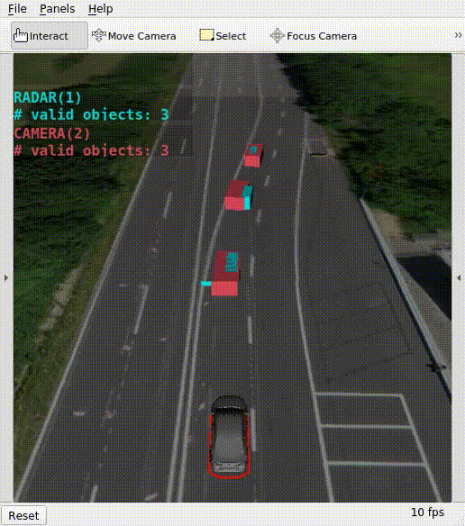
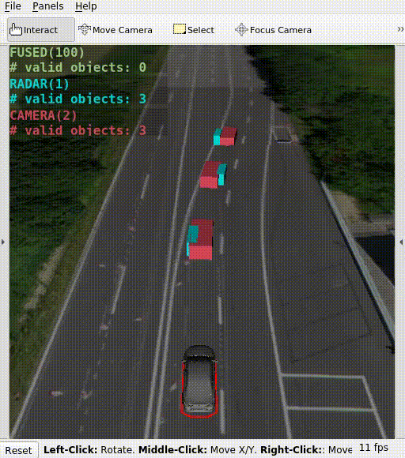
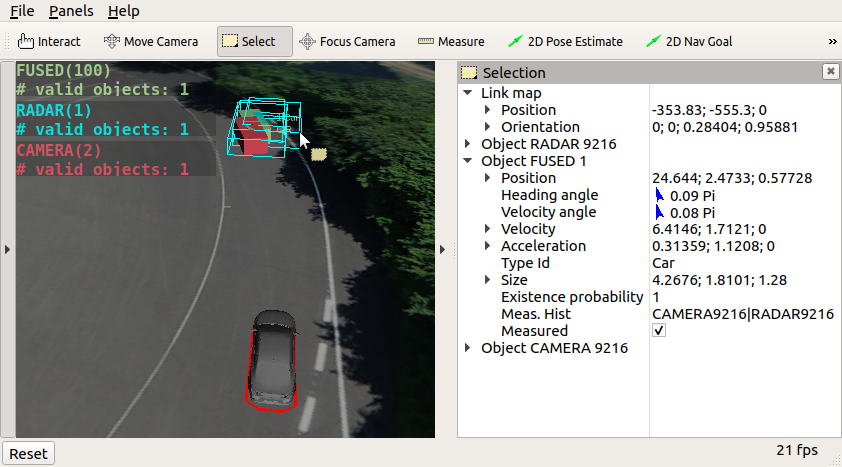

In this workshop, we will program a **Multi-Object Tracking** step-by-step. We prepared a **ROS** node for this task, in which you have to implement parts of a **Multi-Instance Kalman Filter**.

The learning goals of this workshop are to implement the steps...
- **Object Prediction**
- **Object Association**
- **Object Fusion**

Furthermore you will learn to...
- inspect and visualize a rosbag containing object data
- use the Eigen library
- utilize advanced RViz features

## Contents

- [Contents](#contents)
- [Introduction to this workshop](#introduction-to-this-workshop)
- [Visualize the object detections](#visualize-the-object-detections)
- [Introduction to the Eigen library](#introduction-to-the-eigen-library)
- [Introduction to the fusion code](#introduction-to-the-fusion-code)
- [Task 1: Implement Object Prediction](#task-1-implement-object-prediction)
    - [Updating IkaObjects "in place"](#updating-ikaobjects-in-place)
    - [Prediction code](#prediction-code)
- [Advanced: Introspection in RViz](#advanced-introspection-in-rviz)


## Introduction to this workshop
For this workshop we provide simulated data from a vehicle equipped with a camera and a radar. The camera detects the surrounding objects with a high accuracy in lateral direction but a high uncertainty in longitudinal direction while the radar behaves in exactly the opposite way. The data were simulated on the ika test track.

**You can download the bag file for this workshop here** **[Link](https://rwth-aachen.sciebo.de/s/F2M2P4G63aaRryB)**.

Save the file to the local directory `acdc/bag` on your host. Now start docker (`cd acdc/docker` and `./ros1_run.sh`) and inspect the bag file with the command `rosbag info`

```bash
rosuser@docker:~/ws/bag$ rosbag info acdc_fusion_guidance_noise.bag
path:        acdc_fusion_guidance_noise.bag
version:     2.0
duration:    9:59s (599s)
start:       Jan 01 1970 01:00:02.51 (2.51)
end:         Jan 01 1970 01:10:02.50 (602.50)
size:        77.4 MB
messages:    125992
compression: none [102/102 chunks]
types:       definitions/IkaEgoMotion  [e0618c9f9aa211f416eed80f5aa9a953]
             definitions/IkaGPS        [be18f6276d518be76f37af636e04fd9f]
             definitions/IkaObjectList [a997953d24fa0f3e837de98bfab1882a]
topics:      /ikaGPS                               59993 msgs    : definitions/IkaGPS
             /sensors/camera_front/ikaObjectList   12000 msgs    : definitions/IkaObjectList
             /sensors/radar_front/ikaObjectList    12000 msgs    : definitions/IkaObjectList
             /sensors/reference/ikaObjectList      12000 msgs    : definitions/IkaObjectList
             /sensors/vehicleCAN/ikaEgoMotion      29999 msgs    : definitions/IkaEgoMotion
```

As you can see the file contains the two topics `/sensors/camera_front/ikaObjectList` and `/sensors/radar_front/ikaObjectList`. You already learnt about the definition of an `ikaObjectList` in [section 2](https://github.com/ika-rwth-aachen/acdc/wiki/Section-2-Object-Detection).

Furthermore the ros bag contains the topics `/ikaGPS` and `/sensors/vehicleCAN/ikaEgoMotion` which are responsible for publishing the position of the ego vehicle.


## Visualize the object detections

In the docker container, build the workspace:
```bash
catkin build
source devel/setup.bash # make sure to execute this line in each of the following terminals!
```
Then, execute in different terminals:
```bash
roslaunch acdc_launchpack bag_playback.launch
```
```bash
rosbag play -l ~/ws/bag/acdc_fusion_guidance_noise.bag
```
This first command opens a preconfigured RViz window showing the visualization of this tasks data. The second commands plays the bag file with the simulated object detections.

You should see the following in the RViz window with a similar output:





## Introduction to the Eigen library

We use the linear algebra library [Eigen](https://eigen.tuxfamily.org/dox/GettingStarted.html) for matrix-vector computations. You can use it for example like this:

```cpp
#include <Eigen/Dense>
// create a copy of an existing matrix of floating point numbers
Eigen::MatrixXf myNewMatrix1 = myExistingMatrixOfEqualDimensions;

// create a 3x3 matrix of zeros
Eigen::MatrixXf myNewMatrix2 = Eigen::MatrixXf::Zero(3,3); 

// edit a specific matrix entry
myNewMatrix2(0,0) = 5.678; 

// multiply, add, and substract matrices or vectors
// the dimensions have to fit!
A = B * C * (d + e - f); 

// create a vector of floating point numbers
Eigen::VectorXf myNewVector = someMatrix * someVector;

// transpose or invert matrices
A = B.transpose() + C.inverse();
```

Further commands within the Eigen library can be easily found by googling e.g. "Eigen identity matrix", and using <kbd>Ctrl</kbd>+<kbd>F</kbd> on the documentation page.


## Introduction to the fusion code

The overall modular structure of the tracking code template is explained in the [README.md of the section_3 folder](https://github.com/ika-rwth-aachen/acdc/tree/main/catkin_workspace/src/workshops/section_3). You may have a look, but you can probably solve the exercise also without this information.

In contrast, it is important to understand the [README.md of object_fusion package](https://github.com/ika-rwth-aachen/acdc/tree/main/catkin_workspace/src/workshops/section_3/object_fusion). It contains more specific information about how the mathematical symbols from the ACDC slides are named or should be named in the code.

Large parts of the object tracking are already implemented, however the code is not functional yet! You can have a look at the current state by starting the fusion node.
```bash
roslaunch object_fusion_wrapper fusion.launch
```
Don't forget to start RViz and play the bag file beforehand.
```bash
roslaunch acdc_launchpack bag_playback.launch
```
```bash
rosbag play -l ~/ws/bag/acdc_fusion_guidance_noise.bag
```
You sould see that the code outputs "shooting" objects every five seconds, which disappear after one second.




## Task 1: Implement Object Prediction 

Your task is to fill gaps in the C++ code of the [object prediction](https://github.com/ika-rwth-aachen/acdc/blob/main/catkin_workspace/src/workshops/section_3/object_fusion/src/modules/predictor/StatePredictor.cpp#L9) module: `workshops/section_3/object_fusion/src/modules/predictor/StatePredictor.cpp`

#### Updating IkaObjects "in place"

For the prediction and measurement update code, you need to *overwrite* the global object list `data_->object_list_fused.objects` instead of using `return` statements. Note: when you use the utility functions like `IkaUtilities::getEigenStateVec(myIkaObject)`, they will return an `Eigen` vector or matrix that points to the *original* memory, so by modifying this Eigen data structure, you will automatically overwrite the corresponding `myIkaObject`.

#### Prediction code

Predict the latest global objects to the time stamp of the measured objects. In detail:

* Construct the constant velocity motion model matrix $\mathbf{F} = \mathbf{F}\_{const} + \Delta t\ \mathbf{F}\_{timevar}$ as shown in the slides.
  * Its constant entries are already given in `data_->F_const_`
  * Its time variant entries are already given in `data_->F_timevar_`
  * $\Delta t$ is given in `data_->prediction_gap_in_seconds`
  * You can check these matrices in the file `section_3/object_fusion_wrapper/param/kalman_filter.yaml`
* Construct the motion noise matrix $\mathbf{Q}$.
  * The longer the predicted $\Delta t$, the more noise we expect --> $\mathbf{Q} = \Delta t\, \mathbf{Q}_{timevar}$
  * You can use `data_->Q_timevar_`
  * Check out $\mathbf{Q}$ in the file `section_3/object_fusion_wrapper/param/kalman_filter.yaml`
* Perform the Kalman filter prediction step for each global object.
  * Loop over `data_->object_list_fused.objects`, which is a `std::vector` of global `IkaObject.msg` objects
  * Use the global object's state vector $\hat{x}_G$ in the code as an `Eigen::VectorXf` called `x_hat_G` with `auto x_hat_G = IkaUtilities::getEigenStateVec(&globalObject);`
  * Use the global object's error covariance as an Eigen matrix in the code: `globalObject.P()`
  * Compute the prediction formulas inside the loop
* Update the ROS time stamps of the global objects: The new global time stamp is the measured time stamp. Overwrite both the global object list time stamp and the individual global objects' time stamps.
  * For object lists, you can use `data_->object_list_fused.header.stamp` and `data_->object_list_measured.header.stamp`
  * For objects, you can use `globalObject.header.stamp` or `measuredObject.header.stamp`.

After successfully implementing the prediction code you should see the following output. Don't forget to rebuild the workspace with `catkin build` beforehand! The fused objects are now predicted but not updated yet. You can see that the prediction derives from the reality as the fused objects slowly move away from the detected objects.


## Advanced: Introspection in RViz

You can see object properties in RViz like this:

* Click into the RViz window to focus it.
* Hit <kbd>S</kbd>, and your cursor turns yellow for selection.
* Select the objects you want to analyze (click or draw rectangle around).
* Open the selection panel on the right to see live updates of the object properties.
* To leave this selection mode:
  * Click into an empty location to unselect all objects.
  * Hit <kbd>S</kbd> again.


