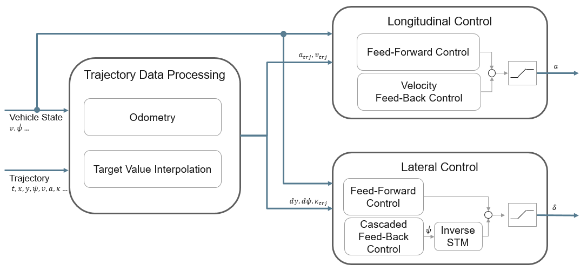
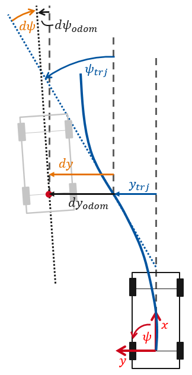
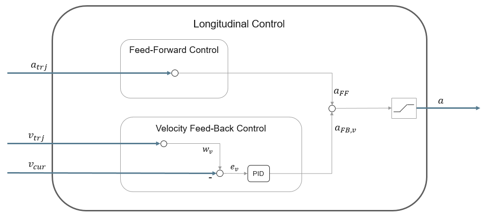
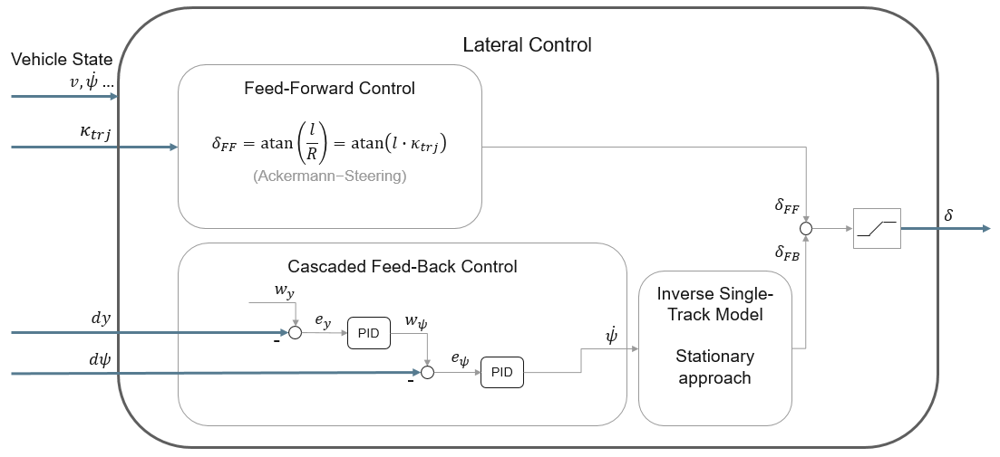
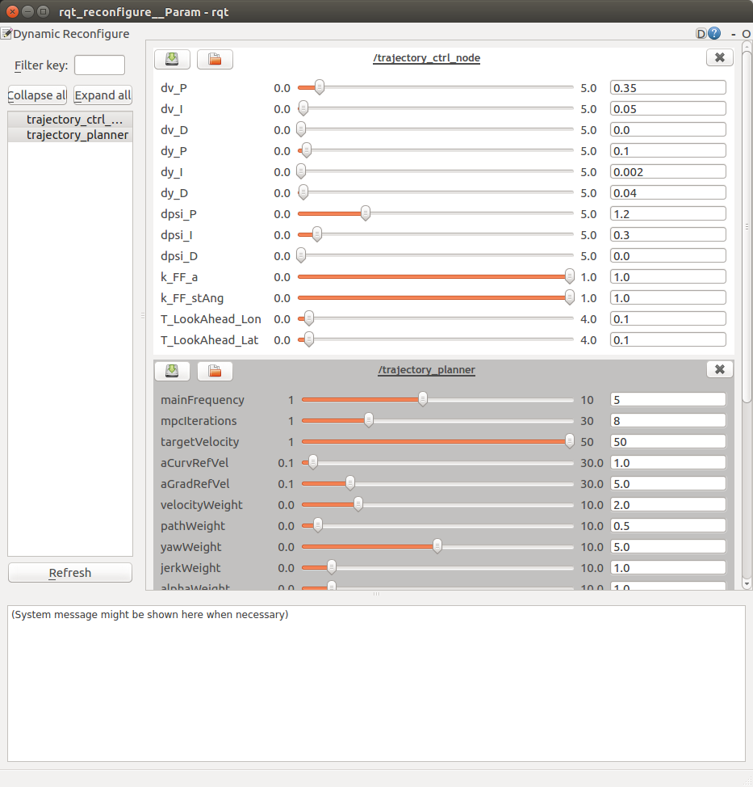

In the previous workshop you may have noticed that the vehicle sometimes slowly deviates from the planned trajectory. If the deviation to the trajectory gets too large, the trajectory jumps into the center of the rear axis. This behaviour is due to the fact that the vehicle guidance system is implemented using the concept of Bi-Level-Stabilization. However, **the low-level stabilization controller was not yet implemented in the previous workshop**. Therefore, the vehicle was not able to correctly follow the trajectory given by the high-level stabilization of the trajectory planner. When the deviation became too large, the MPC was reinitialized with the current measured vehicle data - hence the jump back to the center of the rear axis.

The learning goals of this workshop are...
- learn to implement the odometry equations to calculate the lateral and heading deviation of the vehicle to the trajectory.
- calculate the control deviations using target values given by the trajectory and the current vehicle state.
- derive the output equation of the discrete PID-Controller.
- implement a longitudinal velocity controller and a cascaded lateral controller which outputs the desired yaw-rate.
- utilize an inverse single-track model to calculate the desired steering angle from the desired yaw-rate.

## Introduction to this workshop

The implementation of the compensatory feedback controller as low-level stabilization is the goal of this section.

In this exercise you have to formulate some parts of the controller structure for longitudinal and lateral control.
The architecture of the controller is given by the following illustration:



The gaps for the tasks are located in the [TrajectoryCtrl.cpp](https://github.com/ika-rwth-aachen/acdc/blob/main/catkin_workspace/src/workshops/section_4/trajectory_ctrl/src/TrajectoryCtrl.cpp) and in the [PID.cpp](https://github.com/ika-rwth-aachen/acdc/blob/main/catkin_workspace/src/workshops/section_4/trajectory_ctrl/src/PID.cpp)-file.

## Task 1: Implementation of odometry equations
In this task you have to implement the odometry equations to calculate the lateral and heading deviation of the vehicle to the trajectory. Therefore, open the [TrajectoryCtrl.cpp at Line 242](https://github.com/ika-rwth-aachen/acdc/blob/main/catkin_workspace/src/workshops/section_4/trajectory_ctrl/src/TrajectoryCtrl.cpp#L242) and fill in the gaps.

```c++
// START TASK 1 CODE HERE
// use helping comments from Wiki
double yawRate = cur_vehicle_state_.yaw_rate;
double velocity = cur_vehicle_state_.velocity;
odom_dy_ += ?;
odom_dpsi_ += ?;
// END TASK 1 CODE HERE
```

*Hints:*
* the vehicle yaw-rate can be accessed by the variable ```yawRate```
* the vehicle velocity can be accessed by the variable ```velocity```
* the time-step since the last odometry update can be accessed by the variable ```dt```
* the lateral movement can be calculated by $dy=sin(d\psi + 0.5 \cdot \dot{\psi} \cdot dt) \cdot ds$
* $ds$ is the travelled distance of the vehicle since the last odometry calculation step

## Task 2: Calculate the control deviations

Now that you've implemented the odometry equations, we can use the odometry output to calculate the deviations of the vehicle to the current trajectory. Therefore, open the [TrajectoryCtrl.cpp at Line 196](https://github.com/ika-rwth-aachen/acdc/blob/main/catkin_workspace/src/workshops/section_4/trajectory_ctrl/src/TrajectoryCtrl.cpp#L196) and fill in the gaps. Use the following illustration as a hint for the implementation.



```c++
// START TASK 2 CODE HERE
// calculate vehicle deviations from the trajectory
// use helping comments from Wiki
dy_ = ?;
dpsi_ = ?;
// END TASK 2 CODE HERE
```

## Task 3: Implement the output equation of a discrete PID-Controller

Now that the deviations of the vehicle from the given trajectory are computed, you are ready to implement a feedback control loop. In this section we will use discrete PID-Controllers. In this task you have to implement the output equation of a discrete PID-Controller. Therefore, open the [PID.cpp at Line 44](https://github.com/ika-rwth-aachen/acdc/blob/main/catkin_workspace/src/workshops/section_4/trajectory_ctrl/src/PID.cpp#L44) and fill in the gaps.

```c++
// START TASK 3 CODE HERE
// use helping comments from Wiki
return ?;
// END TASK 3 CODE HERE
```

*Hints*:
* the controller error is given by ```e```
* the discrete integral value of the controller error is given by ```i_val_```
* the discrete derivative value of the controller error is given by ```d_val```
* the P-Gain of the controller is given by ```Kp_```
* the I-Gain of the controller is given by ```Ki_```
* the D-Gain of the controller is given by ```Kd_```

## Task 4: Longitudinal velocity controller

With the PID-Controller done, we can start implementing the actual control loop. We will start with an easy example which implements a longitudinal velocity controller. Therefore, open the [TrajectoryCtrl.cpp at Line 345](https://github.com/ika-rwth-aachen/acdc/blob/main/catkin_workspace/src/workshops/section_4/trajectory_ctrl/src/TrajectoryCtrl.cpp#L345) and fill in the gaps. Use the shown illustration as a hint for the implementation.



```c++
// START TASK 4 CODE HERE
// use helping comments from Wiki
double dt = ros::Time::now().toSec() - vhcl_ctrl_output_.header.stamp.toSec();
double velocity = cur_vehicle_state_.velocity;
double w_v = v_tgt_;
double e_v = ?;
double a_fb_v = ?;
// END TASK 4 CODE HERE
```

*Hints:*
* the desired velocity is given by ```w_v```
* the current vehicle velocity is given by ```velocity```
* the discrete time-step is given by ```dt```
* we've already implemented a velocity PID-Controller instance called ```dv_pid``` (using the class from PID.cpp)
* the PID-Controller offers the method ```Calc(double e, double dt)``` which returns the controller output. Input values are the controller error ```e``` and the discrete time-step ```dt```.
* Given an exemplary PID-Controller instance named ```pid```, you can then access the method by typing ```double output = pid->Calc(e,dt)```

## Task 5: Cascaded lateral controller

Now that the basic implementation of the PID controller is done, we can start with implementing the cascaded lateral feedback-controller. Open the [TrajectoryCtrl.cpp at Line 262](https://github.com/ika-rwth-aachen/acdc/blob/main/catkin_workspace/src/workshops/section_4/trajectory_ctrl/src/TrajectoryCtrl.cpp#L262) and fill in the gaps. Use the following illustration as a hint for the implementation.



```c++
// START TASK 5 CODE HERE
// use helping comments from Wiki
double dt = (ros::Time::now() - vhcl_ctrl_output_.header.stamp).toSec();
double w_y = ?;
double e_y = ?;
double w_psi = ?;
double e_psi = ?;
double psi_dot_des = ?;
// END TASK 5 CODE HERE
```

*Hints:*
* the discrete time-step is given by ```dt```
* the lateral deviation of the vehicle from the trajectory is given by ```dy_```
* the heading deviation of the vehicle from the trajectory is given by ```dpsi_```
* we've already created the dpsi- and dy-PID-Controller instances (called ```dpsi_pid``` and ```dy_pid```, using the class from PID.cpp)
* the PID-Controller offers the method ```Calc(double e, double dt)``` which returns the controller output. Input values are the controller error ```e``` and the discrete time-step ```dt```.
* Given an exemplary PID-Controller instance named ```pid```, you can then access the method by typing ```double output = pid->Calc(e,dt)```


## Task 6: Inverse single-track model

The cascaded lateral controller implemented in task 4.5 computes the desired yaw-rate, but in our case, the output of the lateral controller should be the steering angle. Therefore, you have to implement an inverse single-track model to calculate the steering angle from a desired yaw-rate. Open the [TrajectoryCtrl.cpp at Line 287](https://github.com/ika-rwth-aachen/acdc/blob/main/catkin_workspace/src/workshops/section_4/trajectory_ctrl/src/TrajectoryCtrl.cpp#L287) and fill in the gaps.

```c++
// START TASK 6 CODE HERE
// use helping comments from Wiki
double st_ang_pid = ?;
// END TASK 6 CODE HERE
```

*Hints:*
* the vehicles self-steering-gradient is given by ```self_st_gradient_```
* the vehicles wheelbase is given by ```wheelbase_``` 
* the vehicles velocity is given by ```velocity```
* the desired yaw-rate is given by ```psi_dot_des```
* the inverse single-track model (stationary approach) is defined by: $\delta = \dot{\psi} \cdot \frac{(l + EG \cdot v^2)}{v}$ (the self-steering-gradient is denoted as $EG$)

## Result

When you are done with the implementation start the docker container (`cd acdc/docker` and `./ros1_run.sh`) and build the workspace:
```bash
catkin build
source devel/setup.bash # make sure to execute this line in each of the following terminals!
```

Now you're ready to start the simulation:
```bash
roslaunch trajectory_planner vehicle_guidance.launch
```

If you need a dynamic object which you can follow, play the bag-file from the previous workshops in another terminal (inside the docker container) when the first trajectory appears:
```bash
rosbag play ~/ws/bag/acdc_fusion_guidance_noise.bag
```

The overall result should look like this:


As you can see, the vehicle follows the given trajectory significantly better than using only the result of the previous workshop.

## Bonus Task

While running the simulation, open a new terminal and enter the following:
```bash
source devel/setup.bash # make sure to execute this line in each of the following terminals!
rosrun rqt_reconfigure rqt_reconfigure
```
A new window will open:




By moving the sliders you can adjust various parameters of the trajectory planner and the trajectory controller. By setting all controller gains (`dv_P`, `dv_I`, `dv_D`, ...) to 0, the vehicle will behave like in the previous workshop, as the output of the feedback controllers is always 0.
Moreover, you can also set the `deviationMax...` parameters of the trajectory planner to 0. The planner then acts as a pure MPC, as it is reinitialized every optimization step. Both methods therefore disable the low-level stabilization and only the high-level stabilization of the trajectory planner is used.

Furthermore, you can adjust the weight and reference factors of the cost function you implemented in section the previous workshop.
Feel free to play with the parameters and observe how the vehicle behaves.

## Wrap-up

In this workshop you learned...
- how to implement the odometry equations to calculate the lateral and heading deviation of the vehicle to the trajectory.
- to calculate the control deviations using target values given by the trajectory and the current vehicle state.
- how to derive the output equation of the discrete PID-Controller.
- to implement a longitudinal velocity controller and a cascaded lateral controller which outputs the desired yaw-rate.
- how to utilize an inverse single-track model to calculate the desired steering angle from the desired yaw-rate.

## References

- [Control Toolbox](s)

```
@article{adrlCT,
  title={The control toolbox — An open-source C++ library for robotics, optimal and model predictive control},
  author={Markus Giftthaler and Michael Neunert and Markus St{\"a}uble and Jonas Buchli},
  journal={2018 IEEE International Conference on Simulation, Modeling, and Programming for Autonomous Robots (SIMPAR)},
  year={2018},
  pages={123-129}
}
```
- [Flatland](https://github.com/avidbots/flatland)
- [ROS](https://www.ros.org)
