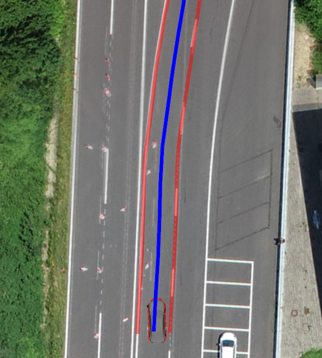
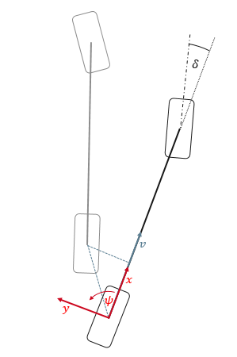
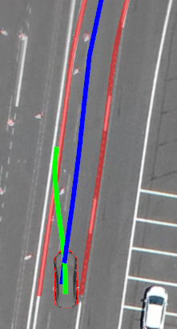

In this workshop, we will implement a trajectory-planning approach using the [Control Toolbox](https://github.com/ethz-adrl/control-toolbox). We prepared a **ROS** node for this task, in which you have to implement parts of the optimal-control-problem.

The learning goals of this workshop are...
- the implementation of the system dynamics model.
- the integration of different cost terms that penalize
  - high lateral and longitudinal jerk values,
  - high steering-rates,
  - deviations from a given reference-velocity.


The gaps for all tasks are located in the [trajectory_planner.cpp](https://github.com/ika-rwth-aachen/acdc/blob/main/catkin_workspace/src/workshops/section_4/trajectory_planner/src/trajectory_planner.cpp)-file; you don't need to make any changes in other files.


## Contents
<!-- MarkdownTOC autolink="true" -->

- [Contents](#contents)
- [Introduction to this workshop](#introduction-to-this-workshop)
- [Task 1: Implementation of the system dynamics](#task-1-implementation-of-the-system-dynamics)
- [Task 2: Penalize high control- and lateral jerk values](#task-2-penalize-high-control--and-lateral-jerk-values)
- [Task 3: Implement propulsive velocity term](#task-3-implement-propulsive-velocity-term)
- [Task 4: Collision avoidance with dynamic objects](#task-4-collision-avoidance-with-dynamic-objects)
- [Result](#result)
- [Wrap-up](#wrap-up)
- [References](#references)

<!-- /MarkdownTOC -->

## Introduction to this workshop

For this section we will use the acdc_fusion_guidance_noise.bag file, from the previous section.

**If you haven't downloaded this bag file yet, you can get it** [**here**](https://rwth-aachen.sciebo.de/s/1weBryyNoDRIhFS). Save the file to the local directory `acdc/bag` on your host.

Start the docker container (`cd acdc/docker` and `./ros1_run.sh`) and try to build the workspace:

```bash
catkin build
source devel/setup.bash
```

In case the compilation fails with an error similiar to `g++: internal compiler error: Killed (program cc1plus)`, the compilation is most likely consuming to many resources. Try rerunning the compilation with `catkin build -j 1` to disable parallel building.

If the compilation was successful, you are now ready to start the simulation:

```bash
roslaunch trajectory_planner vehicle_guidance.launch
```

The control toolbox uses automatic differentiation. That's why it takes a few seconds to initialize the trajectory planner. When the initialization is finished, the terminal will output the following message:

```bash
Initialization of Trajectory Planner done!
Trajectory optimization SUCCESSFUL after [...]s.
Trajectory optimization SUCCESSFUL after [...]s.
...
```

The visualization in RVIZ should look like this:



The blue line represents the reference path for the trajectory optimization. This reference is generated from lane markings shown as red lines. You may have noticed that the vehicle does not move. The reason for that is that the output trajectory is missing (it should be represented by a green line) - there is some work to be done first!

## Task 1: Implementation of the system dynamics

As already mentioned, you will implement the system dynamics in this task:

$\dot{\mathbf{x}}(t) = f(\mathbf{x}(t),\mathbf{u}(t),t)$

For this case, the system state vector is defined as follows:

$\mathbf{x} = \begin{pmatrix} x \\\ y \\\ s \\\ v \\\ a \\\ \psi \\\ \delta \end{pmatrix}$

$x, y$ denote the vehicle position, $s$ describes the travelled distance, $v$ denotes the vehicle velocity while $a$ characterizes the vehicle's longitudinal acceleration. The angle $\psi$ describes the orientation of the vehicle and $\delta$ denotes the steering angle.

The system controls are choosen as:

$\mathbf{u} = \begin{pmatrix} j \\\ \alpha \end{pmatrix}$

$j$ describes the longitudinal jerk and $\alpha$ denotes the steering rate.

We want to use a kinematic single-track model. Use the following illustration and the hints to derive the equations for $\dot{\mathbf{x}}$.



*Hints:*
* $\tan(\delta) = \frac{l}{R}$ (Ackermann steered vehicle)
* $v = \dot{\psi} \cdot R$
* You can access the wheel-base $l$ by the following class variable: `wheelBase`

When you have derived all necessary equations, you can start with the implementation in [trajectory_planner.cpp Line 179](https://github.com/ika-rwth-aachen/acdc/blob/main/catkin_workspace/src/workshops/section_4/trajectory_planner/src/trajectory_planner.cpp#L179):

```cpp
    // START TASK 1 CODE HERE
    // System Dynamics
    // use helping comments from Wiki

    // System State Vector:
    // state(0): x -> Position X
    // state(1): y -> Position Y
    // state(2): s -> Distance
    // state(3): v -> Vehicle Velocity
    // state(4): a -> Vehicle Acceleration
    // state(5): psi -> Vehicle Heading
    // state(6): delta -> Steering Angle

    // Control Vector:
    // control(0): j_lon -> longitudinal jerk
    // control(1): alpha -> Steering Rate

    // The vehicles wheel-base is defined by the class variable wheelBase

    derivative(0) = ?; // derivative of x
    derivative(1) = ?; // derivative of y
    derivative(2) = ?; // derivative of s
    derivative(3) = ?; // derivative of v
    derivative(4) = ?; // derivative of a
    derivative(5) = ?; // derivative of psi
    derivative(6) = ?; // derivative of delta
    // END TASK 1 CODE HERE
```

When you are done with your implementation, _save_ your code and run the following commands inside the `catkin_workspace`:

```bash
catkin build trajectory_planner
source devel/setup.bash
roslaunch trajectory_planner vehicle_guidance.launch
```

You should see output like this in RViz:



The green line represents the trajectory resulting from the optimization process. You may have noticed that the vehicle now moves; however, not the way it should. If you check the terminal output you will see something like this:

```bash
[ WARN] [...]: TrajectoryControl: Longitudinal jerk limited!
[ WARN] [...]: TrajectoryControl: Steering-rate limited!
...
```

The trajectory controller complains about high longitudinal jerk and steering rates. We should tackle this problem with an adaptation of the cost function. We will do this in Task 2.

## Task 2: Penalize high control- and lateral jerk values

In the previous task, we encountered high steering rates and jerk values. We will now add three cost terms which penalize high values for these variables.

Open the [trajectory_planner.cpp at Line 69](https://github.com/ika-rwth-aachen/acdc/blob/main/catkin_workspace/src/workshops/section_4/trajectory_planner/src/trajectory_planner.cpp#L69). This part of the code shows the exemplary implementation of the cost term regarding the deviation from the reference path:

```cpp
// Ref path term
SC pathRef = x[MPC_NODE::WEIGHTS::PATH_REF];
SC pathCost = distance / pathRef;
SC pathWeight = x[MPC_NODE::WEIGHTS::PATH];
SC pathTerm = CppAD::pow(pathCost * pathWeight, 2);
```

You will use this implementation as a template for the implementation of the other cost terms `jerkLonTerm`, `jerkLatTerm` and `alphaTerm`. Open the [trajectory_planner.cpp at Line 75](https://github.com/ika-rwth-aachen/acdc/blob/main/catkin_workspace/src/workshops/section_4/trajectory_planner/src/trajectory_planner.cpp#L75) and fill the gaps:

```cpp
// START TASK 2 CODE HERE
// use helping comments from Wiki and README.md

//System State Vector:
// x[0]: x -> Position X
// x[1]: y -> Position Y
// x[2]: s -> Distance
// x[3]: v -> Vehicle Velocity
// x[4]: a -> Vehicle Acceleration
// x[5]: psi -> Vehicle Heading
// x[6]: delta -> Steering Angle

//Control Vector:
// u[0]: j_lon -> longitudinal jerk
// u[1]: alpha -> Steering Rate

// if necessary use CppAD::sin(...), CppAD::cos(...), CppAD::tan(...), CppAD::pow(...), CppAD::sqrt(...)
// Longitudinal jerk term
SC jerkRef = x[MPC_NODE::WEIGHTS::JERK_REF];
SC jerkLonCost = ?;
SC jerkLonWeight = x[MPC_NODE::WEIGHTS::JERK];
SC jerkLonTerm = ?;

// Alpha term
SC alphaRef = x[MPC_NODE::WEIGHTS::ALPHA_REF];
SC alphaCost = ?;
SC alphaWeight = x[MPC_NODE::WEIGHTS::ALPHA];
SC alphaTerm = ?;

// Lateral jerk term
//The vehicles wheel-base is defined by the variable wheelBase
double wheelBase = MPC_NODE::systemDynamics::wheelBase;
SC jLat = ?;
SC jerkLatCost = ?;
SC jerkLatWeight = x[MPC_NODE::WEIGHTS::JERK];
SC jerkLatTerm = ?;
// END TASK 2 CODE HERE
```

You can access the vehicle state vector with `x[...]` and the control vector with `u[...]`. Please note the following hints:

*Hints:*
* use the variable `jerkRef` for both, lateral and longitudinal jerk
* if you need to use some mathematical functions, use `CppAD::sin(...)`, `CppAD::cos(...)`, `CppAD::tan(...)` or `CppAD::pow(...)`
* while the steering rate and the longitudinal jerk is given by the vehicle controls, you have to calculate the lateral jerk. Use the following equations to do so:
  * $a_y = \frac{v^2}{l} \cdot \tan(\delta)$
  * $j_{lat} = \frac{\partial a_y}{\partial t} = ( \frac{\partial a_y}{\partial v} \cdot \frac{\partial v}{\partial t} + \frac{\partial a_y}{\partial l} \cdot \frac{\partial l}{\partial t} + \frac{\partial a_y}{\partial \delta} \cdot \frac{\partial \delta}{\partial t} )$
  * $\frac{\partial}{\partial x} \tan(x) = 1+\tan(x)^2$

When you are done with your implementation, _save_ your code and run the following commands:

```bash
catkin build trajectory_planner
source devel/setup.bash
roslaunch trajectory_planner vehicle_guidance.launch
```

If you've done everything correctly, you will now observe that the vehicle drives rather slowly. The reason for that is the missing cost term for the velocity deviation which acts as the propulsive cost term. Go to Task 3 where you have to implement a cost term which penalizes the deviation from a target velocity.

## Task 3: Implement propulsive velocity term

To implement the cost term which penalizes the deviation from a target velocity, open the [trajectory_planner.cpp at Line 113](https://github.com/ika-rwth-aachen/acdc/blob/main/catkin_workspace/src/workshops/section_4/trajectory_planner/src/trajectory_planner.cpp#L113) and fill in the gaps. Basically, the implementation is done the same as in Task 2. Use the variable `vScale` to normalize the velocity deviation. The velocity deviation can be calculated with the target velocity given by the variable `velocity`. Keep in mind that the vehicle velocity is given by the vehicle state vector.

```cpp
// START TASK 3 CODE HERE
// Velocity Term
// if necessary use CppAD::sin(...), CppAD::cos(...), CppAD::tan(...), CppAD::pow(...), CppAD::sqrt(...)
SC vScale = CppAD::CondExpGt(velocity, SC(10.0 / 3.6), velocity, SC(10.0 / 3.6));
SC vCost = ?;
SC vWeight = x[MPC_NODE::WEIGHTS::VEL];
SC velTerm = ?;
// END TASK 3 CODE HERE
```

When you are done with your implementation, _save_ your code and run the following commands:

```bash
catkin build trajectory_planner
source devel/setup.bash
roslaunch trajectory_planner vehicle_guidance.launch
```

If you've done everything right, you will see the vehicle correctly following the road course. Now, let's add a dynamic object. We need to play the bag-file you've downloaded previously for that. Open an additional terminal window, source the workspace and navigate to the folder containing the bag-file:

```bash
source devel/setup.bash
```

Now start the simulation:

```bash
roslaunch trajectory_planner vehicle_guidance.launch
```

Now open a new terminal within the docker container and navigate to the folder where you placed the bag-File. When the first trajectory appears play this bag-file:

```bash
rosbag play acdc_fusion_guidance_noise.bag
```

The result should look like this:


As you can see, the automated vehicle doesn't react to the detected object. We need to implement a cost term to avoid collisions with dynamic objects. Therefore, go on to Task 4.

## Task 4: Collision avoidance with dynamic objects

Open the [trajectory_planner.cpp at Line 122](https://github.com/ika-rwth-aachen/acdc/blob/main/catkin_workspace/src/workshops/section_4/trajectory_planner/src/trajectory_planner.cpp#L122) and fill in the gaps. You need to implement the calculation of the variable `dynObjDist` which describes the euclidean distance of the vehicle position (described by `x[0]`,`x[1]`) to the position of the dynamic object (described by `dynObjX`,`dynObjY`). The actual `dynObjTerm` can be implemented as in the previous tasks.

```cpp
// START TASK 4 CODE HERE
// Dyn obj
// if necessary use CppAD::sin(...), CppAD::cos(...), CppAD::tan(...), CppAD::pow(...), CppAD::sqrt(...)
SC dynObjX = x[MPC_NODE::DYNOBJCOORDS::X];
SC dynObjY = x[MPC_NODE::DYNOBJCOORDS::Y];
SC dynObjRef = x[MPC_NODE::WEIGHTS::DYNOBJ_REF];
SC dynObjDist = ?;
SC dynObjCost = CppAD::CondExpLt(dynObjDist, dynObjRef, CppAD::cos(SC(M_PI) * CppAD::pow(dynObjDist, 2) / CppAD::pow(dynObjRef, 2)) + 1, SC(0.0));
SC dynObjWeight = x[MPC_NODE::WEIGHTS::DYNOBJ];
SC dynObjTerm = ?;
// END TASK 4 CODE HERE
```

When you are ready with your implementation, _save_ your code and run the following commands:

```bash
catkin build trajectory_planner
source devel/setup.bash
```

Now start the simulation:

```bash
roslaunch trajectory_planner vehicle_guidance.launch
```

When the first trajectory appears, play the bag-file in the other terminal (inside the docker container):

```bash
rosbag play acdc_fusion_guidance_noise.bag
```

## Result

The overall result should look like this:


You may have noticed that the vehicle sometimes slowly deviates from the planned trajectory. If the deviation to the trajectory gets too large, the trajectory jumps into the center of the rear axis. This behaviour is due to the fact that the vehicle guidance system is implemented using the concept of Bi-Level-Stabilization. Since there is no compensatory feed-back controller implemented yet, the deviations occur. More on this topic in the upcoming workshop!

## Wrap-up

In this workshop you learned...
- how to implement the system dynamics model for a car-like vehicle.
- how to integrate different cost terms that penalize
  - high lateral and longitudinal jerk values,
  - high steering-rates,
  - deviations from a given reference-velocity.

## References

- [Control Toolbox](s)
```
@article{adrlCT,
  title={The control toolbox — An open-source C++ library for robotics, optimal and model predictive control},
  author={Markus Giftthaler and Michael Neunert and Markus St{\"a}uble and Jonas Buchli},
  journal={2018 IEEE International Conference on Simulation, Modeling, and Programming for Autonomous Robots (SIMPAR)},
  year={2018},
  pages={123-129}
}
```
- [Flatland](https://github.com/avidbots/flatland)
- [ROS](https://www.ros.org)
