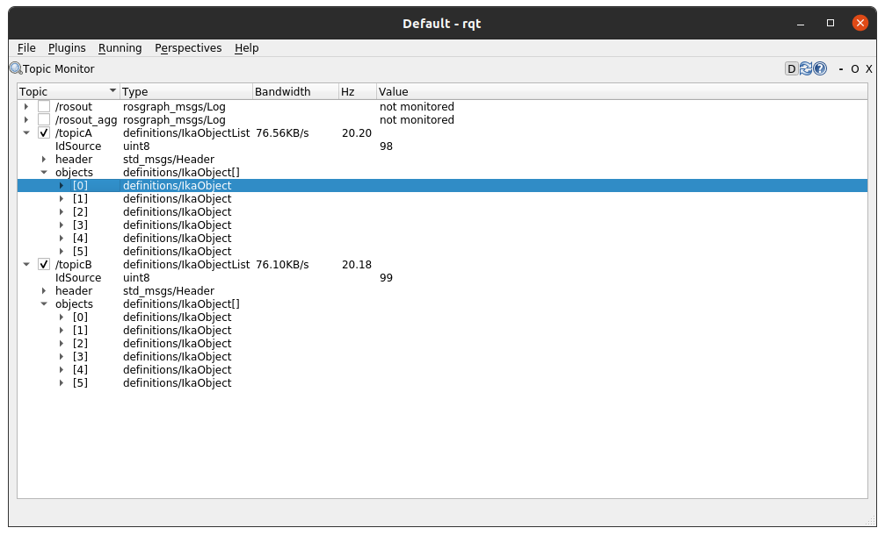
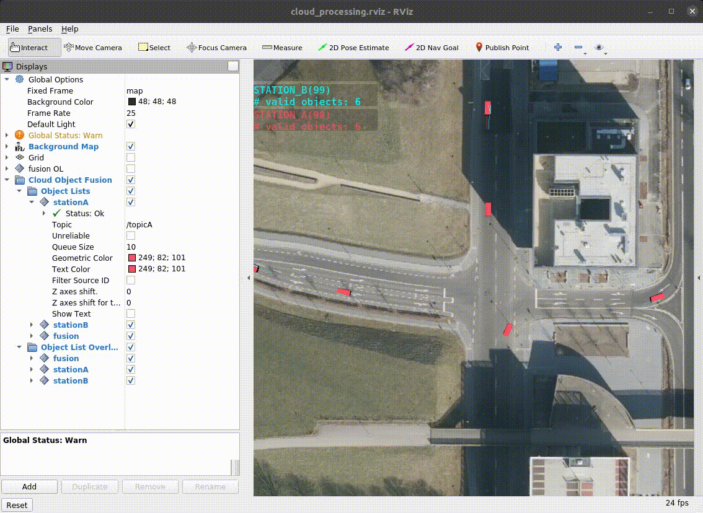
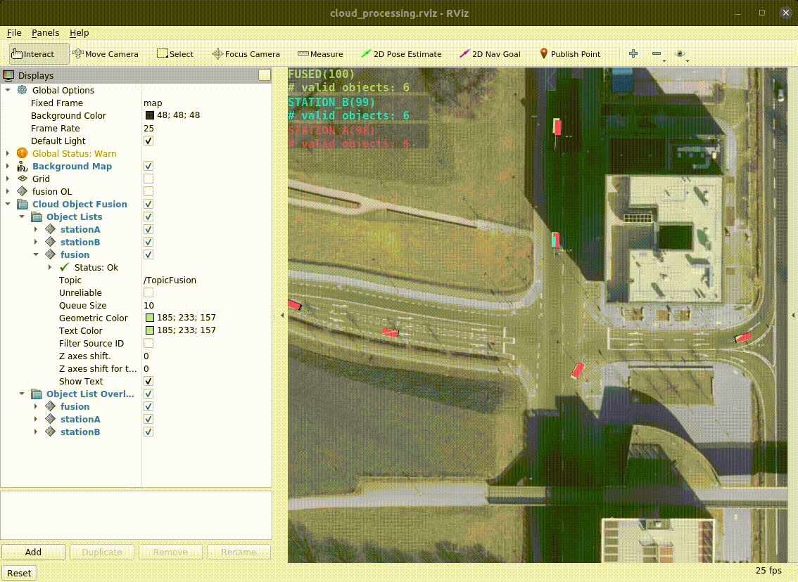

# Cloud Based Object Fusion


In this workshop, you will learn to receive V2X messages and process them correctly. You will use your knowledge from the previous two sections to adapt the existing nodes so that they can handle the received messages. In this section, two use cases for V2X communication are implemented:
- **Cloud-based object fusion** (Section 3)
- **SPaT/MAP processing for trajectory planning** (Section 4)

In both use cases, the message protocol [MQTT](https://mqtt.org/) with the associated broker [mosquitto](https://mosquitto.org/) is used to transmit the messages.

The repository should contain the directory `${REPOSITORY}/catkin_workspace/src/workshops/section_5` with three ROS packages inside.
In this first subsection you will only need the `mqtt_launchpack` and the packages from Section 3. For this reason, it is important that you have completed the tasks from Section 3 (or pulled the solution).

Then let's start with the **Cloud-based object fusion**!

## Cloud-based Object Fusion

The global goal of this first task is to fuse the object lists of two infrastructure sensors using the object fusion algorithm from Section 3. The two infrastructure sensors - Station A and Station B - are positioned at the intersection of Campus-Boulevard and Forckenbeckstraße.

Both publish their detected objects in the form of an `ikaObjectList` (known from [Section 2](https://github.com/ika-rwth-aachen/acdc/wiki/Section-2-Object-Detection#ika-ros-object-lists-definition)) via MQTT to a broker.

To receive the messages from the infrastructure sensors and convert them into ROS messages we use the open-source ROS package [mqtt_client](https://github.com/ika-rwth-aachen/mqtt_client). This is installed already in your docker image as a ros-package and provides a functionality to bridge between ROS and MQTT in bidirectional.

## Task 1: Configure the bridge so that you receive the two object lists

First you should build the workspace:
```bash
catkin build
source devel/setup.bash # make sure to execute this line in each of the following terminals!
```

The **mqtt_launchpack** package contains an example launch file with a demo configuration (`section_5/mqtt_launchpack/launch/example.launch`). The launch file starts the nodelet and loads the required parameter files. TLS stands for *Transport Layer Security* and is an additional authentication option, which is not used in our use case.

```xml
<launch>
  <arg name="load_params" default="true" /> <!-- flag if parameter file is used -->
  <arg name="params_file" default="$(find mqtt_launchpack)/config/example_params.yaml" /> <!-- path to default parameter file, which will be used -->

  <node pkg="nodelet" type="nodelet" name="mqtt_client" args="standalone mqtt_client/MqttClient" output="screen"> <!-- starts the nodelet -->
    <rosparam command="delete" param="" if="$(arg load_params)" /> <!-- removes old parameter -->
    <rosparam command="load" file="$(arg params_file)" if="$(arg load_params)" /> <!-- loads the parameter file -->
  </node>
</launch>
```

Your task is to create a new parameter file to receive the object lists of the infrastructure sensors. The best way to do this is to use the demo configuration file (`section_5/mqtt_launchpack/config/example_params.yaml`) as a reference. More information can be found in the [git repository of the **mqtt_client**](https://github.com/ika-rwth-aachen/mqtt_client#configuration).
Use the following information for setting the parameters:
- the broker runs on a public server with this address `broker.hivemq.com`
- you don't need any credentials to connect to the broker
- you can subscribe to the object lists on the following topics:
  - Station A: `ika_acdc_22/objectList_a`
  - Station B: `ika_acdc_22/objectList_b`

------------
**Additional hints:**

Make sure you have chosen the right bridge type to convert from MQTT to ROS (`mqtt2ros`).

-----------

If you are done with that, you can start your launch file by:
```bash
roslaunch mqtt_launchpack ${YourLaunchFile}.launch # make sure you have included the right parameter file
```

If everything was done correctly, the node should have started with the information `Connected to broker at 'tcp://broker.hivemq.com:1883'`. Afterwards you can check with `rqt` if the messages arrive on the ROS topics you have chosen. This should look like this:



On each of the topics you have chosen you should receive an object list with six objects.


## Task 2: Visualize the received object lists
For this task we prepared a RVIZ configuration, which can be started by:

```bash
roslaunch acdc_launchpack cloud_processing_vizu.launch
```
To visualize the object lists you only have to change the topics on which RVIZ will subscribe.
You can do this either directly in RVIZ on the left panel, or you edit the RVIZ file (`dependencies/acdc_launchpack/rviz/cloud_processing.rviz`) and replace the topics `/topicA` and `/topicB` with your chosen ones.

If everything was done correctly, the visualization should look like this:




## Task 3: Fuse the object lists with the object fusion nodes from Section 3
For this task you must have successfully completed Section 3 or already pulled the solution. To use the object fusion from Section 3 with your received object lists, you have to modify the config of the *object_fusion_wrapper* (`workshops/section_3/object_fusion_wrapper/param/config_inout.yaml`) as described in the following:

```yaml
input_topics:
    object_lists: [
        /sensors/camera_front/ikaObjectList,
        /sensors/radar_front/ikaObjectList
    ]

    ego_motion: /sensors/vehicleCAN/ikaEgoMotion

output_topics:
    object_list_fused:
        publish: true
        topic: /sensors/fusion/ikaObjectList
        frame_id: base_link
```
You have to change the input object list topics to your chosen ones. Also there is no ego vehicle, therefore the parameter for the `ego_motion` is not needed and can be deleted. After that choose an output topic for the fused object list.

Since there is no ego vehicle, the fused object list does not have to be converted into the coordinate system of a vehicle (`base_link`). Instead, the fused list should also be published in the `map` frame. Also consider this in the config file.

If everything was done correctly, you can start the object fusion by:

```bash
catkin build
roslaunch object_fusion_wrapper fusion.launch
```
and add the fused object list to the RVIZ Configuration as you did with the other two object lists (change `/TopicFusion` to the chosen output topic of the object fusion). The visualization should look like this (the fused object list will be displayed in green):



You can also stop displaying the individual object lists by unchecking their checkboxes.

## Wrap-up
In this workshop you learned...
- how to receive MQTT messages and use them in ROS.
- how to visualize object lists in RVIZ with your chosen topic.
- how to apply the fusion algorithm from section 3 to other use cases, like cloud processing.


## References
- [mqtt_client](https://github.com/ika-rwth-aachen/mqtt_client)
- [broker.hivemq.com](https://broker.hivemq.com/)
- [ETSI standards](https://www.etsi.org/committee/its)
- [ROS](https://www.ros.org)