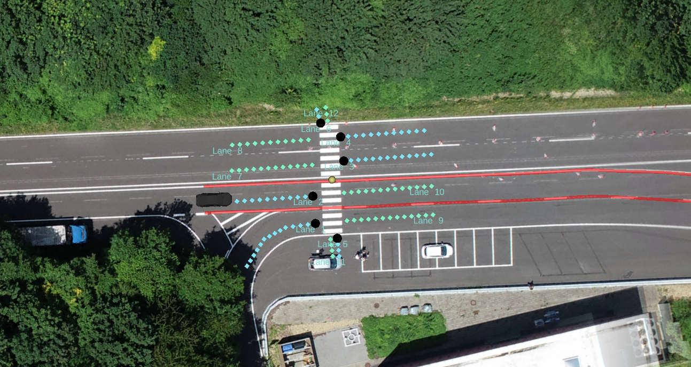
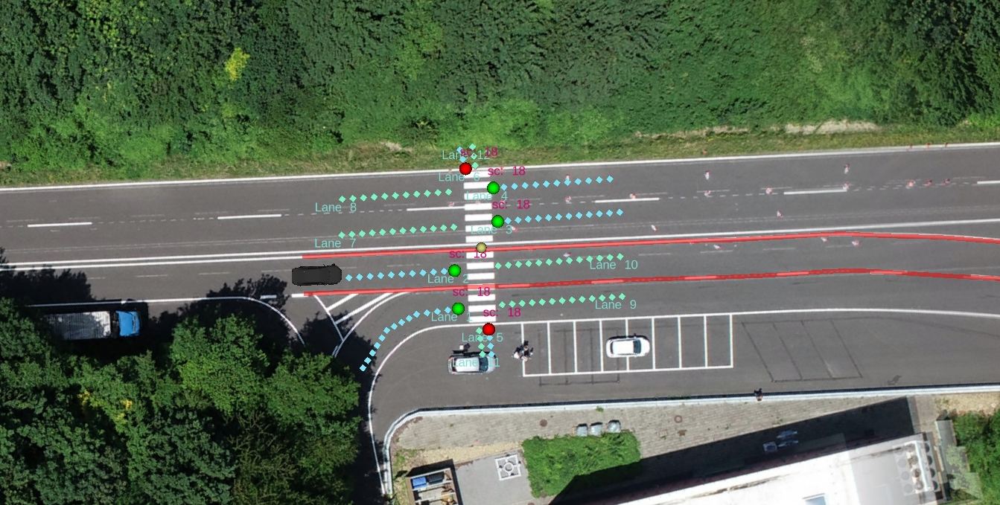
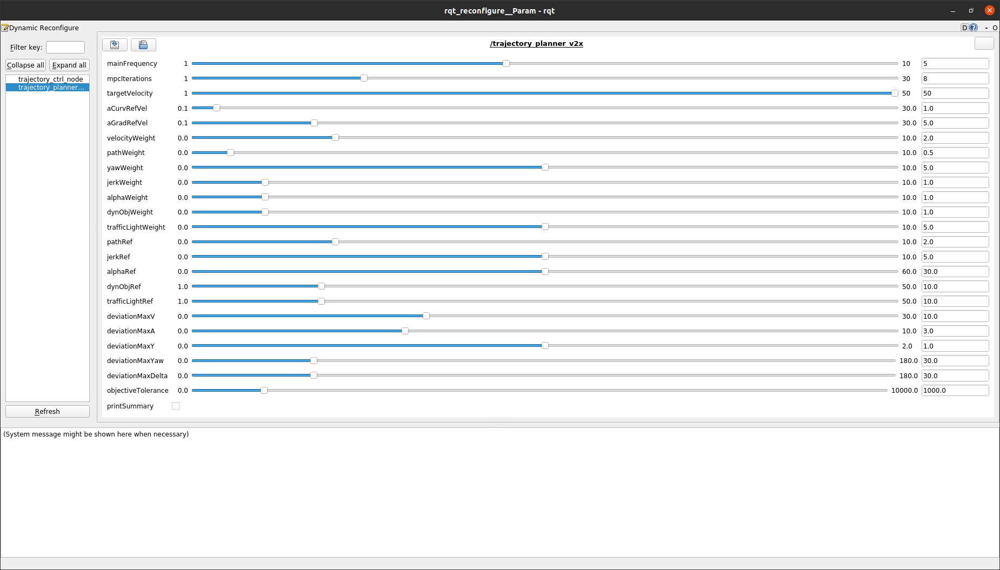

# SPaT/MAP Processing for Trajectory Planning


## Introduction

In the realm of autonomous driving, effective trajectory planning is paramount for ensuring safe and efficient navigation. Trajectory planning must dynamically adapt to real-time traffic conditions, including traffic light states. This documentation delves into the integration of Signal Phase and Timing (SPaT) and Map (MAP) data into trajectory planning using the Robot Operating System (ROS1). By leveraging SPaT/MAP messages, the trajectory planner can make informed decisions based on the current and future states of traffic signals.

### Objectives

- **Visualize SPaT/MAP Data:** Display traffic light states and intersection topologies in RViz.
- **Integrate Traffic Light Data:** Modify the trajectory planner to respond to traffic light states.
- **Enhance Situational Awareness:** Visualize Cooperative Awareness Messages (CAM) from other vehicles to improve decision-making.

This guide is structured to cater to both beginners and advanced users, providing step-by-step instructions, in-depth explanations, and relevant code snippets to facilitate seamless implementation.

## Prerequisites

Before diving into SPaT/MAP processing, ensure that you have the following set up:

- **ROS1:** Familiarity with ROS1 and its fundamental concepts.
- **Catkin Workspace:** Properly configured ROS workspace.
- **Dependencies:** Required ROS packages and dependencies as outlined in the [dependencies](https://github.com/ika-rwth-aachen/acdc/tree/main/catkin_workspace/src/dependencies/definitions/msg) repository.
- **IKA Test Track Setup:** Access to the IKA test track environment with a pedestrian traffic light integrated.

## Task 1: Configure the Bridge to Receive SPaT/MAP Messages from the Traffic Light

### Overview

To enable trajectory planning to respond to traffic lights, you first need to configure a bridge that subscribes to SPaT and MAP messages published by the traffic light system. These messages are transmitted via MQTT to a broker and decoded into ROS message formats.

### Steps

1. **Build Your Workspace**

   Ensure that your ROS workspace is built and sourced correctly.

   ```bash
   catkin build
   source devel/setup.bash # Execute this line in each terminal you open subsequently
   ```

2. **Understand Message Formats**

   The traffic light publishes its state and intersection topology as SPaT (`v2x_SPAT`) and MAP (`v2x_MAP`) messages via MQTT. Detailed ROS message definitions can be found in the [definitions](https://github.com/ika-rwth-aachen/acdc/tree/main/catkin_workspace/src/dependencies/definitions/msg) directory.

3. **Configure the MQTT Client**

   Utilize the **mqtt_client** package to subscribe to the relevant MQTT topics. You can either create a new configuration or extend an existing one based on your setup.

   - **Broker Details:**
     - **Address:** `broker.hivemq.com`
     - **Port:** Default MQTT port (1883)
     - **Credentials:** Not required for this public broker

   - **Topics to Subscribe:**
     - **SPaT Messages:** `ika_acdc_22/SPATEM`
     - **MAP Messages:** `ika_acdc_22/MAPEM`

   Update your MQTT configuration file with the above parameters.

4. **Launch the MQTT Bridge**

   Start the MQTT bridge using your configured launch file.

   ```bash
   roslaunch mqtt_launchpack your_launch_file.launch # Replace 'your_launch_file' with your actual launch file name
   ```

   **Expected Output:**

   ```
   Connected to broker at 'tcp://broker.hivemq.com:1883'
   ```

5. **Verify Message Reception**

   Use `rqt` to inspect the subscribed ROS topics and confirm that SPaT and MAP messages are being received.

   ```bash
   rqt
   ```

   Navigate to the **Topics** section and verify the incoming messages on `ika_acdc_22/SPATEM` and `ika_acdc_22/MAPEM`.

### Code Snippet

```bash
catkin build
source devel/setup.bash
roslaunch mqtt_launchpack your_launch_file.launch
```

## Task 2: Visualize SPaT/MAP Messages in RViz

### Overview

Visualization of SPaT and MAP messages is crucial for understanding the current traffic signal states and intersection layouts. RViz, ROS's powerful visualization tool, will be used to display this information.

### Steps

1. **Prepare Visualization Nodes**

   Nodes required for visualization have been pre-configured in the Section 4 & Section 5 folders. Your task involves implementing specific parts to handle SPaT and MAP messages.

2. **Configure ETSI Visualization Node**

   The `etsi_visualization` node needs to be configured with the appropriate ROS topics for SPaT and MAP messages. Modify the `start_ETSIViz.launch` file to set the correct topics.

   ```xml
   <!-- Example parameter setting in start_ETSIViz.launch -->
   <param name="spat_topic" value="ika_acdc_22/SPATEM"/>
   <param name="map_topic" value="ika_acdc_22/MAPEM"/>
   ```

   Refer to the [start_ETSIViz.launch](https://github.com/ika-rwth-aachen/acdc/blob/main/catkin_workspace/src/workshops/section_5/etsi_visualization/launch/start_ETSIViz.launch#L4) for exact parameter placements.

3. **MAPEM Visualization**

   Implement the MAPEM visualization by modifying the `MAPViz.cpp` file.

   - **File to Modify:** [MAPViz.cpp](https://github.com/ika-rwth-aachen/acdc/blob/main/catkin_workspace/src/workshops/section_5/etsi_visualization/src/MAPViz.cpp#L29)
   
   - **Task:** Identify the number of intersections in the MAPEM message.

   ```c++
   // ### START CODE HERE ###
   // Identify number of intersections in message
   int n_intersections = msg.intersections.size(); // Task
   // ### END CODE HERE ###
   ```

   - **Reference Materials:**
     - [v2x_MAP.msg Definitions](https://github.com/ika-rwth-aachen/acdc/tree/main/catkin_workspace/src/dependencies/definitions/msg/v2x_MAP.msg)
     - [ETSI MAP Standard](https://www.etsi.org/deliver/etsi_ts/103300_103399/103301/01.03.01_60/ts_103301v010301p.pdf)

4. **Rebuild and Launch Trajectory Planner**

   After implementing the MAPEM visualization:

   ```bash
   catkin build
   roslaunch trajectory_planner vehicle_guidance_v2x.launch
   ```

   **Expected Visualization:**

   

   The RViz window should display traffic light positions as black circles, indicating that SPaT messages are yet to influence the trajectory planner.

5. **SPATEM Visualization**

   Implement the SPATEM visualization by modifying the `SPATViz.cpp` file.

   - **File to Modify:** [SPATViz.cpp](https://github.com/ika-rwth-aachen/acdc/blob/main/catkin_workspace/src/workshops/section_5/etsi_visualization/src/SPATViz.cpp#L57)
   
   - **Tasks:**
     - Populate the `SignalGroup` struct with SPaT data.
     - Visualize the current state of traffic lights based on SPaT messages.

   ```c++
   // ### START CODE HERE ###
   sg.current_state = spat_intsctn.states[m].state_time_speed[0].eventState; // Get first element of state_time_speed
   sg.sg_id = spat_intsctn.states[m].signalGroup; // Task: Assign signal group ID
   sg.next_change = spat_intsctn.states[m].state_time_speed[0].eventTime; // Task: Assign time for next state change
   // ### END CODE HERE ###
   ```

   - **Color Coding Traffic Lights:**

   ```c++
   // ### START CODE HERE ###
   // Set marker color depending on signal group state
   // The signal group state is given by the function variable "state"
   if (state == RED) {
       marker.color.r = 1.0;
       marker.color.g = 0.0;
       marker.color.b = 0.0;
   } else if (state == GREEN) {
       marker.color.r = 0.0;
       marker.color.g = 1.0;
       marker.color.b = 0.0;
   } else if (state == YELLOW) {
       marker.color.r = 1.0;
       marker.color.g = 1.0;
       marker.color.b = 0.0;
   } else {
       marker.color.r = 0.0;
       marker.color.g = 0.0;
       marker.color.b = 0.0;
   }
   // ### END CODE HERE ###
   ```

6. **Rebuild and Relaunch**

   After completing the SPATEM visualization:

   ```bash
   catkin build
   roslaunch trajectory_planner vehicle_guidance_v2x.launch
   ```

   **Expected Visualization:**

   

   Traffic lights should now display colors corresponding to their current states, along with timers indicating the time until the next state change.

## Task 3: Modify the Trajectory Planner to React to Traffic Lights

### Overview

With SPaT and MAP messages now visualized, the next step is to enable the trajectory planner to make decisions based on traffic light states. This involves interpreting SPaT/MAP data and adjusting the vehicle's trajectory accordingly.

### Steps

1. **Adjust Topics in Launch File**

   Update the `vehicle_guidance_v2x.launch` file to include the SPaT and MAP ROS topics.

   - **File to Modify:** [vehicle_guidance_v2x.launch](https://github.com/ika-rwth-aachen/acdc/blob/main/catkin_workspace/src/workshops/section_4/trajectory_planner/launch/vehicle_guidance_v2x.launch#L59)

   ```xml
   <!-- Example parameter settings -->
   <param name="spat_topic" value="ika_acdc_22/SPATEM"/>
   <param name="map_topic" value="ika_acdc_22/MAPEM"/>
   ```

2. **Implement Message Interpretation in Subscribers**

   Open the `v2x_planner_interface.cpp` file to handle SPaT and MAP messages.

   - **File to Modify:** [v2x_planner_interface.cpp](https://github.com/ika-rwth-aachen/acdc/blob/main/catkin_workspace/src/workshops/section_4/trajectory_planner/src/v2x_planner_interface.cpp)

3. **Process MAPEM Messages**

   - **Locate Callback Function:** Start with the MAPEM callback function around line 73.

   - **Identify Number of Intersections:**

   ```c++
   // ### START CODE HERE ###
   // Identify number of intersections in message
   int n_intersections = msg.intersections.size(); // Task
   // ### END CODE HERE ###
   ```

   - **Loop Through Intersections and Lanes:**

   ```c++
   for(int i = 0; i < n_intersections; i++) {
       definitions::v2x_MAP_Intersection intsctn = msg.intersections[i];

       // Loop all lanes to get signal groups and traffic light positions
       for(int m = 0; m < intsctn.adjacent_lanes.size(); m++) {
           definitions::v2x_MAP_Lane lane = intsctn.adjacent_lanes[m];
           
           // ### START CODE HERE ###
           // Only ingress lanes can consider traffic signals -> skip all egress lanes
           bool is_egress_lane = lane.direction == "egress"; // Task
           if (is_egress_lane){
               continue;
           }
           // ### END CODE HERE ###

           // Further processing...
       }
   }
   ```

   **Explanation:**

   - **Ingress vs. Egress Lanes:** Only ingress lanes (lanes leading into an intersection) are relevant for traffic signal considerations. Egress lanes can be skipped as they are not directly influenced by traffic lights.

4. **Process SPATEM Messages**

   - **Locate Callback Function:** Move to the SPATEM callback function around line 41.

   - **Identify Number of Intersections:**

   ```c++
   // ### START CODE HERE ###
   // Identify number of intersections in message
   int n_intersections = msg.spatData_intersections.size(); // Task
   // ### END CODE HERE ###
   ```

   - **Loop Through Intersections and Signal Groups:**

   ```c++
   for(int i = 0; i < n_intersections; i++) {
       definitions::v2x_SPAT_IntersectionState spat_intsctn = msg.spatData_intersections[i];
       // Loop all movement states to get signal groups
       for(int m = 0; m < spat_intsctn.states.size(); m++) {
           // Loop all traffic lights stored in the map data
           for(int k = 0; k < trafficlights.size(); k++) {
               if(trafficlights[k].stationID == msg.header_stationID && 
                  trafficlights[k].sig_id == spat_intsctn.states[m].signalGroup) {
                   
                   trafficlights[k].last_spat = ros::Time::now();

                   // ### START CODE HERE ###
                   // Check if signal state is red or not
                   if(spat_intsctn.states[m].state_time_speed[0].eventState == RED) {
                       trafficlights[k].red = true;
                   } else {
                       trafficlights[k].red = false;
                   }
                   // ### END CODE HERE ###
               }
           }
       }
   }
   ```

   **Explanation:**

   - **Signal State Interpretation:** The `eventState` indicates the current state of the traffic light. By checking if it's red, the trajectory planner can decide whether to stop or proceed.

5. **Update Traffic Light Struct**

   Ensure that the `TrafficLight` struct accurately reflects the traffic light's state.

   ```c++
   struct TrafficLight
   {
       int stationID;
       std::vector<geometry_msgs::Point> ingress_lane;
       int sig_id;
       int tl_id;
       bool red;
       ros::Time last_spat;
   };
   ```

6. **Rebuild and Relaunch Trajectory Planner**

   After implementing the message interpretation:

   ```bash
   catkin build
   roslaunch trajectory_planner vehicle_guidance_v2x.launch
   ```

   **Expected Behavior:**

   - **Vehicle Stops at Red Lights:** The vehicle should halt before the traffic light when it turns red.
   - **Vehicle Proceeds on Green:** Once the light turns green, the vehicle should resume movement.

   **Visualization:**

   

7. **Adjusting Trajectory Planner Parameters**

   If the trajectory planner exhibits incorrect behavior, fine-tune the cost parameters using dynamic reconfiguration.

   ```bash
   rosrun rqt_reconfigure rqt_reconfigure
   ```

   

## Task 4: Visualize Other Vehicles via Cooperative Awareness Messages (CAM)

### Overview

Cooperative Awareness Messages (CAM) enhance situational awareness by providing real-time information about nearby vehicles. Visualizing CAMs allows the trajectory planner to be aware of other vehicles on the road, fostering safer navigation.

### Steps

1. **Understand CAMs**

   CAMs are broadcasted by vehicles to share their live positions, velocities, and other pertinent data. These messages are published via MQTT and can be visualized in RViz.

2. **Subscribe to CAM Messages**

   Extend your MQTT client configuration to subscribe to the CAM topic.

   - **MQTT Topic:**
     - `ika_acdc_22/CAM`
   
   - **Corresponding ROS Topic:**
     - `/CAM` (modifiable based on preference)

   Update the MQTT configuration accordingly.

3. **Verify CAM Message Reception**

   Launch the MQTT bridge with the updated configuration and verify message reception using `rqt`.

   ```bash
   roslaunch mqtt_launchpack your_launch_file.launch
   ```

   In `rqt`, check the `/CAM` topic to ensure CAM messages are being received.

4. **Implement CAM Visualization**

   Modify the `ETSIViz.cpp` file to interpret and visualize CAM messages.

   - **File to Modify:** [ETSIViz.cpp](https://github.com/ika-rwth-aachen/acdc/blob/main/catkin_workspace/src/workshops/section_5/etsi_visualization/src/ETSIViz.cpp#L84)

   - **Tasks:**
     - Extract vehicle positions and velocities from CAM messages.
     - Convert absolute velocities into x and y components using trigonometric functions.
     - Populate the `obj` structure with CAM data.

   ```c++
   // ### START CODE HERE
   // Fill with information from message
   obj.IdInternal = msg.stationID; // stationID
   float lon = msg.position.longitude; // longitude (x)
   float lat = msg.position.latitude; // latitude (y)
   
   // Convert speed and heading to velocity components
   float speed = msg.speed; // Assuming speed is provided in m/s
   float heading = msg.heading; // Assuming heading is in degrees
   float radians = heading * (M_PI / 180.0); // Convert to radians
   
   float v_x = speed * cos(radians); // velocity in x direction
   float v_y = speed * sin(radians); // velocity in y direction
   // ### END CODE HERE
   ```

   **Explanation:**

   - **Position Extraction:** Obtain the vehicle's current position from the CAM message.
   - **Velocity Calculation:** Convert the vehicle's speed and heading into x and y velocity components for accurate visualization.

5. **Rebuild and Relaunch**

   After implementing CAM visualization:

   ```bash
   catkin build
   roslaunch trajectory_planner vehicle_guidance_v2x.launch
   ```

   **Expected Visualization:**

   

   The RViz window should display other vehicles on the track with their respective velocity vectors. The number of vehicles corresponds to the number of CAMs being broadcasted, including those from other students and the simulation.

6. **Note on Trajectory Planner Behavior**

   - **Visualization Only:** The current implementation visualizes CAMs but does not incorporate them into the trajectory planning logic.
   - **Future Enhancements:** To enable the trajectory planner to react to other vehicles, additional logic needs to be integrated to consider CAM data in decision-making processes.

## Wrap-up

In this workshop, you have acquired the skills to integrate and process SPaT/MAP messages for enhancing trajectory planning in autonomous vehicles. Specifically, you have learned how to:

- **Interpret ETSI Messages:**
  - **SPaT (Signal Phase and Timing):** Understand and utilize traffic signal states and timing information.
  - **MAP (Map):** Grasp intersection topologies and traffic light positions.
  - **CAM (Cooperative Awareness Message):** Visualize and interpret data from other vehicles to improve situational awareness.

- **Enhance Trajectory Planner:**
  - Modify the trajectory planner to respond dynamically to traffic light states.
  - Visualize and incorporate real-time data from the environment to make informed navigation decisions.

By integrating SPaT/MAP/CAM data, the trajectory planner becomes more robust, enabling safer and more efficient autonomous navigation through dynamic traffic conditions.

## References

- [mqtt_client Repository](https://github.com/ika-rwth-aachen/mqtt_client)
- [HiveMQ Public Broker](https://broker.hivemq.com/)
- [ETSI Standards for V2X Communication](https://www.etsi.org/committee/its)
- [Robot Operating System (ROS) Official Website](https://www.ros.org)
- [Flatland Simulator](https://github.com/avidbots/flatland)
- [Control Toolbox](#) <!-- The link seems incomplete in the original content -->
- [SPATEM Definitions](https://github.com/ika-rwth-aachen/acdc/tree/main/catkin_workspace/src/dependencies/definitions/msg/v2x_SPAT.msg)
- [MAPEM Definitions](https://github.com/ika-rwth-aachen/acdc/tree/main/catkin_workspace/src/dependencies/definitions/msg/v2x_MAP.msg)
- [CAM Definitions](https://github.com/ika-rwth-aachen/acdc/tree/main/catkin_workspace/src/dependencies/definitions/msg/v2x_CAM.msg)
- [ETSI SPaT Standard](https://www.etsi.org/deliver/etsi_ts/103300_103399/103301/01.03.01_60/ts_103301v010301p.pdf)
- [ETSI MAP Standard](https://www.etsi.org/deliver/etsi_ts/103300_103399/103301/01.03.01_60/ts_103301v010301p.pdf)
