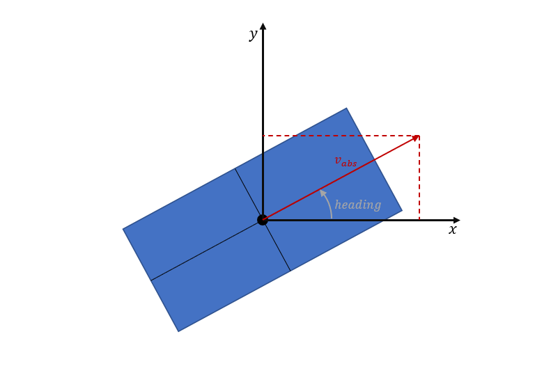

## Contents
<!-- MarkdownTOC autolink="true" -->

- [Contents](#contents)
- [SPaT/MAP processing for trajectory planning](#spatmap-processing-for-trajectory-planning)
- [Task 1: Configure the bridge so that you receive the messages (SPATEM/MAPEM) from the traffic light](#task-1-configure-the-bridge-so-that-you-receive-the-messages-spatemmapem-from-the-traffic-light)
- [Task 2: Visualize the messages (SPATEM/MAPEM) in RVIZ](#task-2-visualize-the-messages-spatemmapem-in-rviz)
  - [MAPEM visualization](#mapem-visualization)
  - [SPATEM visualization](#spatem-visualization)
- [Task 3: Modify the trajectory planner, so it can react to the traffic lights](#task-3-modify-the-trajectory-planner-so-it-can-react-to-the-traffic-lights)
  - [Process MAPEM](#process-mapem)
  - [Process SPATEM](#process-spatem)
- [Task 4: Visualize other vehicles via Cooperative Awareness Messages (CAM)](#task-4-visualize-other-vehicles-via-cooperative-awareness-messages-cam)
- [Wrap-up](#wrap-up)
- [References](#references)

<!-- /MarkdownTOC -->


## SPaT/MAP processing for trajectory planning

In contrast to the previous subsection, where your computer acted as a cloud and implemented a collective function, in the following tasks you will implement a supportive function that allows the trajectory planning to handle traffic lights.

For this purpose, we have added a pedestrian traffic light to the ika test track known from the previous sections. The main goal of this task is to visualize the SPaT/MAP data and adapt the trajectory planning from Section 4 so that it can react to the traffic light.


## Task 1: Configure the bridge so that you receive the messages (SPATEM/MAPEM) from the traffic light
If not already done, you should first build your workspace.
```bash
catkin build
source devel/setup.bash # make sure to execute this line in each of the following terminals!
```

The connected traffic light publishs its state and the corresponding intersection topology as SPATEM resp. MAPEM via MQTT to the broker from the last subsection. The ASN.1 decoding has already been done on the server, so the messages are in the following formats:
- SPATEM: `v2x_SPAT`
- MAPEM: `v2x_MAP`

You can take a closer look at all ROS message formats in this [folder](https://github.com/ika-rwth-aachen/acdc/tree/main/catkin_workspace/src/dependencies/definitions/msg).

To receive the messages you have to use the **mqtt_client**, which you should know from the last subsection.
Analogous to the [procedure](https://github.com/ika-rwth-aachen/acdc/wiki/Section-5-Cloud-Based-Object-Fusion#task-1-configure-the-bridge-so-that-you-receive-the-two-object-lists) described there, you have to create a new configuration or extend your existing one accordingly. Use the following information for setting the parameters:
- the broker runs on a public server with this address `broker.hivemq.com`
- you don't need any credentials to connect to the broker
- you can subscribe to the messages on the following topics:
  - Signal Phase and Timing Message (SPATEM): `ika_acdc_22/SPATEM`
  - MAP Message (MAPEM): `ika_acdc_22/MAPEM`

If you are done with that, you can start your launch file by:
```bash
roslaunch mqtt_launchpack ${YourLaunchFile}.launch # make sure you have included the right parameter file
```

If everything was done correctly, the node should have started with the information `Connected to broker at 'tcp://broker.hivemq.com:1883'`. Afterwards you can check with `rqt` if the messages arrive on the ROS topics you have chosen.


## Task 2: Visualize the messages (SPATEM/MAPEM) in RVIZ
We have already prepared the nodes in the section 4 & section 5 folder, so you only have to implement the relevant parts.

To visualize the messages, you must first configure the `etsi_visualization` node with your chosen SPATEM/MAPEM ROS topic. You can set the necessary parameters in [start_ETSIViz.launch](https://github.com/ika-rwth-aachen/acdc/blob/main/catkin_workspace/src/workshops/section_5/etsi_visualization/launch/start_ETSIViz.launch#L4).

-------
### MAPEM visualization
Now we want to start visualizing our received MAP messages. Therefore you have to fill the gap at [Line 29 in MAPViz.cpp](https://github.com/ika-rwth-aachen/acdc/blob/main/catkin_workspace/src/workshops/section_5/etsi_visualization/src/MAPViz.cpp#L29).
```c++
// ### START CODE HERE ###
// Identify number of intersections in message
int n_intersections = 0; // Task
// ### END CODE HERE ###
```
If you don't know exactly how a MAPEM is structured, it's best to look at the [definitions](https://github.com/ika-rwth-aachen/acdc/tree/main/catkin_workspace/src/dependencies/definitions/msg/v2x_MAP.msg) or the [ETSI standard](https://www.etsi.org/deliver/etsi_ts/103300_103399/103301/01.03.01_60/ts_103301v010301p.pdf).

If you are done with that, you can rebuild your workspace and start the predefined V2X launchfile for the trajectory planner. It already includes the launchfile for the ETSI visualization.
```bash
catkin build
roslaunch trajectory_planner vehicle_guidance_v2x.launch
```
If everything works correctly, the visualization will look like this:


As you can see, the visualization has been extended with some markers for the MAPEM. The position of the traffic lights are shown by the circle markers, which are currently displayed in black, because you have not interpreted the SPaT message yet. The trajectory planner also still acts as in Section 4 and is not influenced by the traffic lights.

--------


### SPATEM visualization
Now you will face the SPaT message. Therefore you have to fill the `SignalGroup` struct with the information from the received SPAT messages.
```c++
struct SignalGroup
{
  uint8_t sg_id; // signal group id
  uint8_t current_state; // current state of signal group
  uint16_t next_change; // time for next signal state change (timing_likelyTime)
};
```
Fill in the correct solution for the [marked lines in SPATViz.cpp](https://github.com/ika-rwth-aachen/acdc/blob/main/catkin_workspace/src/workshops/section_5/etsi_visualization/src/SPATViz.cpp#L57). You can use the expression for the `current_state` as an example. 
```c++
// ### START CODE HERE ###
sg.current_state = spat_intsctn.states[m].state_time_speed[0].eventState; // Get first element of state_time_speed
sg.sg_id = 0; // Task
sg.next_change = 0; // Task
// ### END CODE HERE ###
```
If you don't know exactly how a SPATEM is structured, it's best to look at the [definitions](https://github.com/ika-rwth-aachen/acdc/tree/main/catkin_workspace/src/dependencies/definitions/msg/v2x_SPAT.msg) or the [ETSI standard](https://www.etsi.org/deliver/etsi_ts/103300_103399/103301/01.03.01_60/ts_103301v010301p.pdf).

After that you also have to visualize the current state of the traffic light in place of the black circles. Therefore, solve the task at the [other marked lines in SPATViz.cpp](https://github.com/ika-rwth-aachen/acdc/blob/main/catkin_workspace/src/workshops/section_5/etsi_visualization/src/SPATViz.cpp#L129). If you don't know exactly which values the state of a signal group can take, have a look at the last video.
```c++
// ### START CODE HERE ###
// Set marker color depending on signal group state
// The signal group state is given by the function variable "state"
marker.color.r = 0.0;
marker.color.g = 0.0;
marker.color.b = 0.0;
// ### END CODE HERE ###
```
Afterwards you have to rebuild the workspace and restart the trajectory planner.
```bash
catkin build
roslaunch trajectory_planner vehicle_guidance_v2x.launch
```

If the implementation is successful, the visualization should show the same states for the four lanes and the opposite states for the two pedestrian directions as well as a timer with the time until the next signal change. For example like this:


## Task 3: Modify the trajectory planner, so it can react to the traffic lights
Now that MAPEM and SPATEM of the traffic light have been visualized, you have to let the trajectory planner know how to react to it. For this, you have again to adjust the topics for the messages in [vehicle_guidance_v2x.launch](https://github.com/ika-rwth-aachen/acdc/blob/main/catkin_workspace/src/workshops/section_4/trajectory_planner/launch/vehicle_guidance_v2x.launch#L59).

After that, you have to interpret the messages in their related subscribers. For that, open the [v2x_planner_interface.cpp](https://github.com/ika-rwth-aachen/acdc/blob/main/catkin_workspace/src/workshops/section_4/trajectory_planner/src/v2x_planner_interface.cpp) and fill in the marked gaps. Thereby you can use the implementations from the `etsi_visualization` as a reference. In sum, you have to transfer the received messages into a traffic light struct which is built like this:
```c++
struct TrafficLight
{
  int stationID;
  std::vector<geometry_msgs::Point> ingress_lane;
  int sig_id;
  int tl_id;
  bool red;
  ros::Time last_spat;
};
```

---------


### Process MAPEM
At best, start this task with the MAPEM callback function. With the help of the MAPEM, you can get information about the `ingress_lane`, `sig_id` and `tl_id`. This is important so that the vehicle knows where the traffic lights are and to which lane(s) they refer. So open the [v2x_planner_interface.cpp at line 73](https://github.com/ika-rwth-aachen/acdc/blob/main/catkin_workspace/src/workshops/section_4/trajectory_planner/src/v2x_planner_interface.cpp#L73) and fill the two gaps.

```c++
// ### START CODE HERE ###
// Identify number of intersections in message
int n_intersections = 0; // Task
// ### END CODE HERE ###

// Loop all intersections in message
for(int i = 0; i < n_intersections; i++) {
  definitions::v2x_MAP_Intersection intsctn = msg.intersections[i];

  // Loop all lanes to get signal groups and traffic light positions
  for(int m = 0; m < intsctn.adjacent_lanes.size(); m++) {

    definitions::v2x_MAP_Lane lane = intsctn.adjacent_lanes[m];
    
    // ### START CODE HERE ###
    // only ingress lanes can consider traffic signals -> skip all egress lanes
    bool is_egress_lane = true; // Task          
    if (is_egress_lane){
      continue;
    }
    // ### END CODE HERE ###

    ...

  }
}
```
After solving this first part of the task (and rebuilding the workspace), the vehicle should always stop before the traffic light, but not start again.

----------


### Process SPATEM
The final part of this task is to also interpret the SPaT messages so that the vehicle will move on again. Therefore open the [v2x_planner_interface.cpp at line 41](https://github.com/ika-rwth-aachen/acdc/blob/main/catkin_workspace/src/workshops/section_4/trajectory_planner/src/v2x_planner_interface.cpp#L41) and fill the last two gaps.
```c++
// ### START CODE HERE ###
// Identify number of intersections in message
int n_intersections = 0; // Task
// ### END CODE HERE ###

// Loop all intersections in message
for(int i = 0; i < n_intersections; i++) {
  definitions::v2x_SPAT_IntersectionState spat_intsctn = msg.spatData_intersections[i];
  // Loop all movement states to get signal groups
  for(int m = 0; m < spat_intsctn.states.size(); m++) {
    //Loop all traffic lights stored in the map data
    for(int k = 0; k<trafficlights.size(); k++)
    {
      if(trafficlights[k].stationID == msg.header_stationID && trafficlights[k].sig_id == spat_intsctn.states[m].signalGroup)
      {
        trafficlights[k].last_spat = ros::Time::now();

        // ### START CODE HERE ###
        // Check if signal state is red or not (hint: use an if condition)
        trafficlights[k].red = true; // Task
        // ### END CODE HERE ###
      }
    }
  }
}
```

Remember: If you have problems with the implementation, you can use the [SPATEM](https://github.com/ika-rwth-aachen/acdc/blob/main/catkin_workspace/src/workshops/section_5/etsi_visualization/src/SPATViz.cpp#L27)/[MAPEM subscriber](https://github.com/ika-rwth-aachen/acdc/blob/main/catkin_workspace/src/workshops/section_5/etsi_visualization/src/MAPViz.cpp#L25) from the spat visualization as a reference. You can also look again in the last video how a SPATEM is defined, or look at the received SPATEM/MAPEM in `rqt`.

------

When you are ready with your implementation, save your code rebuild the workspace and start the trajectory planner:
```bash
catkin build
roslaunch trajectory_planner vehicle_guidance_v2x.launch
```

The trajectory planner should now react correctly to the traffic lights! The visualization will look something like this:


If you notice incorrect behavior of the trajectory planner, feel free to adjust the weights of the cost terms and see how the behavior changes. This will let you change the parameterization during the simulation:
```bash
rosrun rqt_reconfigure rqt_reconfigure
```


## Task 4: Visualize other vehicles via Cooperative Awareness Messages (CAM)
In this last task of this workshop, we will focus on the Cooperative Awareness Message (CAM). Therefore you have to know that, using `vehicle_guidance_v2x.launch`, you already start the node which publishes your live position as CAM to the known MQTT broker when driving on the ika test track ([etsi_message_generation](https://github.com/ika-rwth-aachen/acdc/tree/main/catkin_workspace/src/workshops/section_5/etsi_message_generation)). Your task will now be to visualize the CAMs of other students (their live position) in RVIZ.
Since we also have a simulation running permanently and therefore also send a CAM to the broker, you should always see at least one other vehicle on the track - if implemented correctly.

First you have to make sure that you receive the CAMs of the others. For this, extend the `mqtt_client` configuration from [Task 1](#task-1-configure-the-bridge-so-that-you-receive-the-messages-spatemmapem-from-the-traffic-light). You can subscribe to the messages on the following MQTT topic:
-  `ika_acdc_22/CAM`
Set `/CAM` as corresponding ROS topic. You can also chose another one, but then note that you also have to change it in the [start_ETSIViz.launch](https://github.com/ika-rwth-aachen/acdc/blob/main/catkin_workspace/src/workshops/section_5/etsi_visualization/launch/start_ETSIViz.launch#L4) accordingly.

Now start your launchfile from [Task 1](#task-1-configure-the-bridge-so-that-you-receive-the-messages-spatemmapem-from-the-traffic-light) with the extended configuration and check in `rqt` if there are any messages on the CAM ROS topic.
```bash
roslaunch mqtt_launchpack ${YourLaunchFile}.launch # make sure you have included the right parameter file
```
If this is the case, these messages must now be interpreted. For this you have to fill the [marked code lines in ETSIViz.cpp](https://github.com/ika-rwth-aachen/acdc/blob/main/catkin_workspace/src/workshops/section_5/etsi_visualization/src/ETSIViz.cpp#L84) with the content from the received CAMs.

Note: The velocity is only given absolutely in the CAM, but must be split into x and y direction for our object definition. Use trigonometric functions for this. The following picture will help you.



```c++
// ### START CODE HERE
// fill with information from message
// use helping comments from Wiki
obj.IdInternal = 0; // stationID               // Task
float lon = 0;      // longitude (x)           // Task
float lat = 0;      // latitude (y)            // Task
float v_x = 0;      // velocity in x direction // Task
float v_y = 0;      // velocity in y direction // Task
// ### END CODE HERE
```

If you don't know exactly how a CAM is structured, it's best to look at the [definitions](https://github.com/ika-rwth-aachen/acdc/tree/main/catkin_workspace/src/dependencies/definitions/msg/v2x_CAM.msg) or the [ETSI standard](https://www.etsi.org/deliver/etsi_en/302600_302699/30263702/01.04.01_60/en_30263702v010401p.pdf).

If everything was implemented correctly, you should now always see at least one other vehicle including its speed vector (light blue) driving on the track. The more students are driving on the track at the same time, the more vehicles you will see!

Note: The CAMs are only visualized, the trajectory planner does not react to the other vehicles.

Your visualization could look like this, for example:


## Wrap-up
In this workshop you learned...
- how to interpret different ETSI messages.
  - SPAT
  - MAPEM
  - CAM
- how to use these messages to improve the trajectory planner from section 4.


## References
- [mqtt_client](https://github.com/ika-rwth-aachen/mqtt_client)
- [broker.hivemq.com](https://broker.hivemq.com/)
- [ETSI standards](https://www.etsi.org/committee/its)
- [ROS](https://www.ros.org)
- [Flatland](https://github.com/avidbots/flatland)
- [Control Toolbox](s)
```
@article{adrlCT,
  title={The control toolbox — An open-source C++ library for robotics, optimal and model predictive control},
  author={Markus Giftthaler and Michael Neunert and Markus St{\"a}uble and Jonas Buchli},
  journal={2018 IEEE International Conference on Simulation, Modeling, and Programming for Autonomous Robots (SIMPAR)},
  year={2018},
  pages={123-129}
}
```